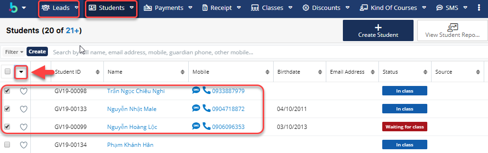
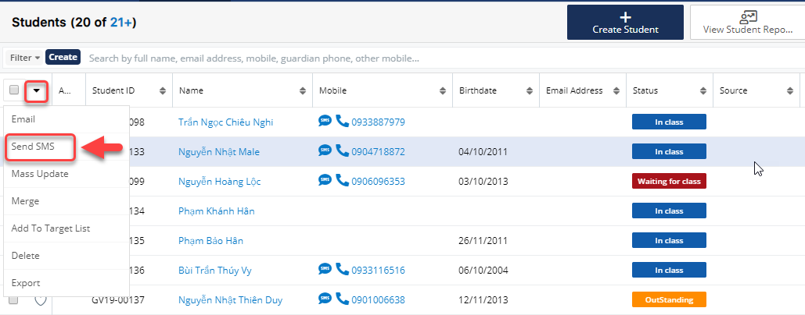
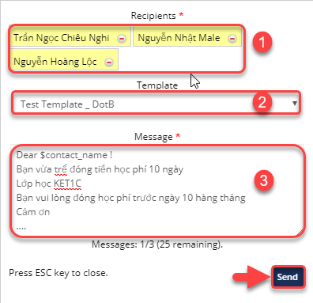
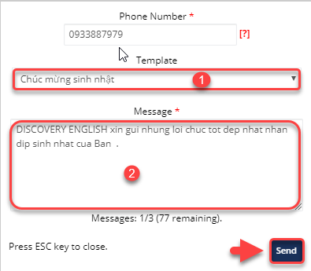
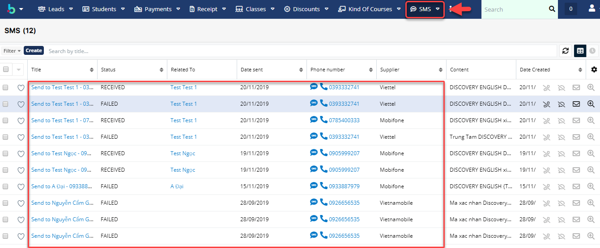
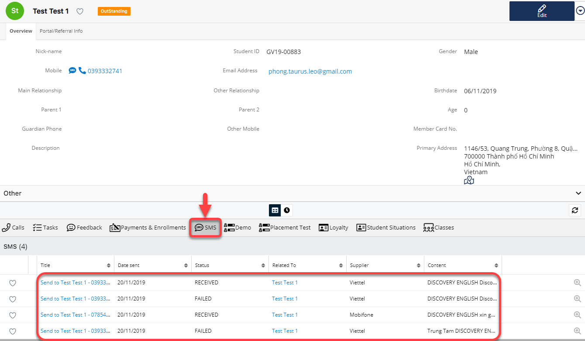

# SMS Marketing

## 👋 Tạo Template SMS chèn tham số

> Bước 1: Đưa chuột vào module Email chọn Create Email Template .

> Bước 2: Tại màn hình tạo mẫu Email Template chọn type là SMS, sau đó nhập/chỉnh sửa đầy đủ thông tin cần thiết, sau đó click vào nút Save.


**Ghi chú:**

1: Tên Template

2: Loại Template \(Email,Campaign ,SMS\)

3: Chèn biến :Tên,Loại,Địa chỉ,…

4: Subject:Tiêu đề của Template

5: Nội dung Template

6: Đính kèm tệp \(Nếu có\)


> Bước 3: Hệ thống hiển thị thông tin mẫu Email Template vừa được tạo.

## 📩 Gửi và xem lại lịch sử gửi

### Gửi SMS hàng loạt

> Bước 1 : Đưa chuột vào module Leads hoặc Student, sau đó chọn học viên mà bạn muốn gửi sms,tiếp theo click vào 

> Bước 2 : 
 Sau đó click chọn **Send SMS.**

> Bước 3 : Hệ thống hiển thị thông tin sms như: người nhận mẫu SMS và nội dung SMS, sau đó chọn Template gửi SMS \(nội dung có thể nhập vào \) ,cuối cùng click **Send** để gửi.


\*\*\*\*🙆♀ **Ghi chú** :

1:Danh sách người nhận SMS

2:Chọn Template SMS gửi tin nhắn 

3:Nội dung gửi tin nhắn \(Người dùng có thể nhập vào thêm nội dung\)


### Gửi SMS đơn lẻ

> Bước 1: Đưa chuột vào module Leads hoặc Student, sau đó chọn học viên mà bạn muốn gửi sms, tiếp theo click vào 

> Bước 2: 
 Tại màn hình gửi SMS, chọn thông tin cần gửi SMS ,sau đó click **Send** để gửi tin nhắn cho học viên.


\*\*\*\*🙆♀ **Ghi chú:**

1:Chọn Template SMS gửi tin nhắn 

2:Nội dung gửi tin nhắn \(Người dùng có thể nhập vào thêm nội dung


### Xem lại lịch sử gửi sms

> Cách 1: Click chuột vào module SMS để xem lại lịch sử đã gửi tin nhắn cho học viên.

> Cách 2: 
 Hoặc bạn có thể vào module Student/Lead, chọn học viên cần xem, click vào supanel **SMS** lịch sử gửi sms cho học viên sẽ được hiển thị.

