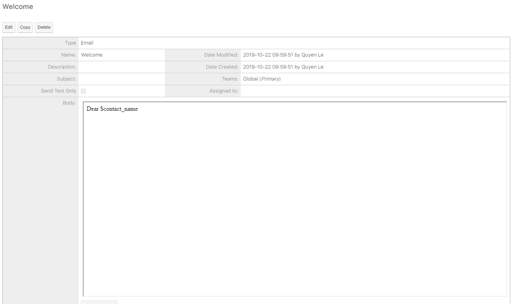

# SMS Marketing

## Tạo Template SMS chèn tham số

| Bước 1 | Đưa chuột vào module Email chọn Create Email Template . |
| :--- | :--- |

| Bước 2 | Tại màn hình tạo mẫu Email Template chọn type là SMS, sau đó nhập/chỉnh sửa đầy đủ thông tin cần thiết, sau đó click vào nút Save. |
| :--- | :--- |


**Ghi chú:**

1:Tên Template

2:Loại Template \(Email,Campaign ,SMS\)

3:Chèn biến :Tên,Loại,Địa chỉ,…

Subject:Tiêu đề của Template

4:Nội dung Template


| Bước 3 | Hệ thống hiển thị thông tin mẫu Email Template vừa được tạo. |
| :--- | :--- |

## Gửi và xem lại lịch sử gửi

### Gửi sms hàng loạt

### Gửi sms đơn lẻ

### Xem lại lịch sử gửi sms

