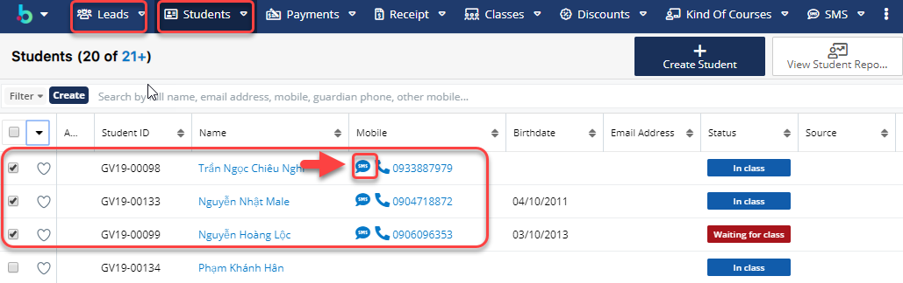

# Gửi SMS đơn lẻ

> **Bước 1:** Ở màn hình danh sách của module **Leads** hoặc **Students**, sau đó chọn học viên mà bạn muốn gửi **SMS**, tiếp theo tiến hành nhấn vào .

> **Bước 2:** Tại màn hình gửi SMS, chọn thông tin cần gửi SMS, sau đó chọn **Send** để gửi tin nhắn cho học viên.

<figure><figcaption></figcaption></figure>


****:woman\_gesturing\_ok: **Ghi chú:**

1. Chọn Template SMS gửi tin nhắn&#x20;
2. Nội dung gửi tin nhắn (Người dùng có thể nhập thêm nội dung)

