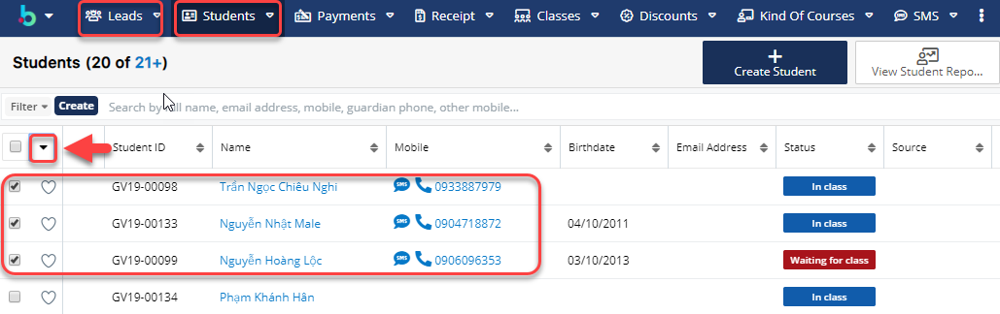
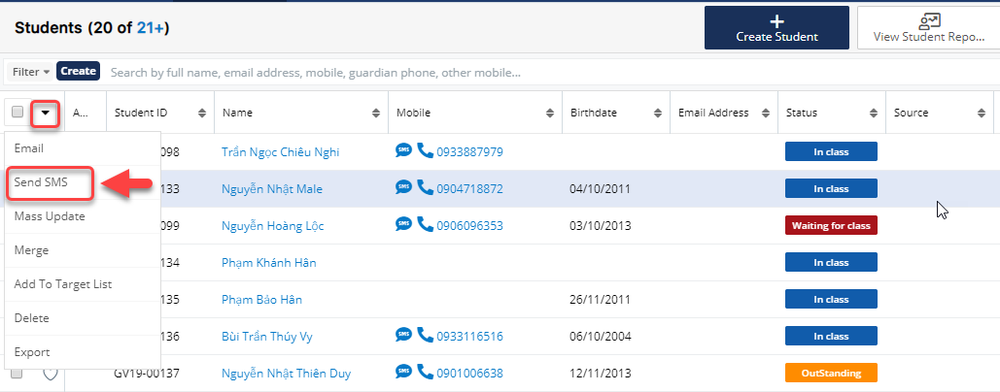

# Gửi SMS hàng loạt

> **Bước 1:** Đưa chuột vào module Leads hoặc Student, sau đó chọn học viên mà bạn muốn gửi sms, tiếp theo nhấn vào  .

> **Bước 2:**&#x20;
> &#x20;Sau đó click chọn **Send SMS.**

> **Bước 3:** Hệ thống hiển thị thông tin sms như: người nhận mẫu SMS và nội dung SMS, sau đó chọn Template gửi SMS (nội dung có thể nhập vào ) ,cuối cùng click **Send** để gửi.


****:woman\_gesturing\_ok: **Ghi chú** :

1. Danh sách người nhận SMS
2. Chọn Template SMS gửi tin nhắn&#x20;
3. Nội dung gửi tin nhắn (Người dùng có thể nhập vào thêm nội dung)

