# Tích hợp Landing Pages /Website

## ✍ Giới thiệu Landing page

> Tích hợp landing page website này làm gì ?

👉 Landing page còn gọi là trang đích, là một trang web độc lập, được tạo riêng cho chiến dịch tiếp thị hoặc quảng cáo, nhằm mục đích thu thập thông tin khách hàng hoặc bán hàng.

👉 Landing page có nhiều mục đích, tuỳ vào doanh nghiệp hoặc mục tiêu quảng cáo của bạn mà nó có nhiều chức năng. Tuy nhiên, nhìn chung thì Landing page có những mục đích sau.

🌟 Thu thập thông tin khách hàng

🌟 Giới thiệu sản phẩm

🌟 Giới thiệu doanh nghiệp

> API là gì ?

 **API** là các phương thức, giao thức kết nối với các thư viện và ứng dụng khác. Nó là viết tắt của **Application Programming Interface** – giao diện lập trình ứng dụng.

 **Web API** là một phương thức dùng để cho phép các ứng dụng khác nhau có thể giao tiếp, trao đổi dữ liệu qua lại. Dữ liệu được Web API trả lại thường ở dạng [JSON](https://topdev.vn/blog/json-la-gi/) hoặc XML thông qua giao thức HTTP hoặc HTTPS.

## ⚡ Tích hợp với Ladipage.vn

> Bước 1 : Chọn **Lưu Data.**

> Bước 2: Chọn **Thêm Mới**

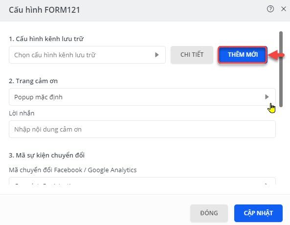

> Bước 3: Đặt tên cấu hình .. Sau đó click chọn Thêm tài khoản liên kết mới.

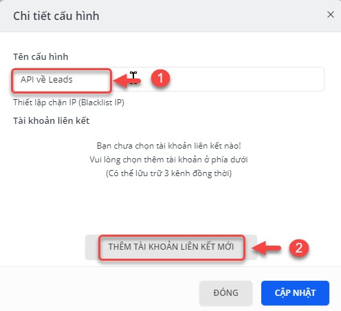


\*\*\*\*🙆♀ **Ghi chú**:

 **Tên cấu hình** : Lưu ý: tên cấu hình nên đặt tên dễ nhớ.


> Bước 4: Chọn option là API và sau đó click vào **Thêm Mới.**

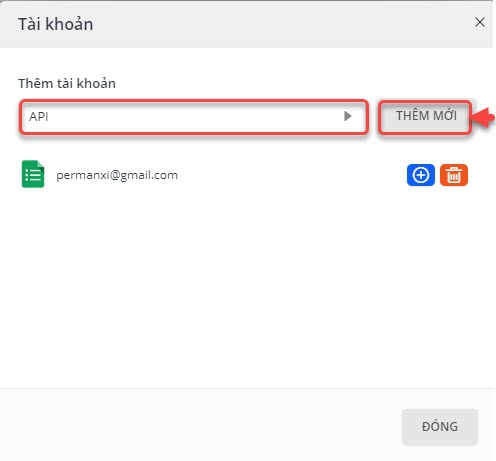

> Bước 5: Maping các trường dữ liệu từ form về API. Sau đó click **Xong.**

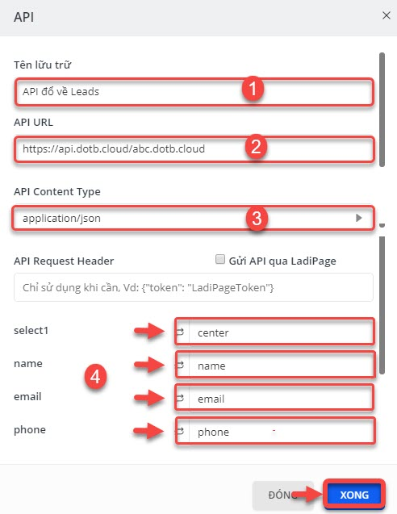


\*\*\*\*🙆♀ **Ghi chú**:

1: Tên lưu trữ: Lưu ý: nên đặt tên dễ nhớ

2: API URL: [**https://api.dotb.cloud/**](https://api.dotb.cloud/) 

VD: ví dụ KH **ABC** English có tên miền sử dụng EMS là **abc.dotb.cloud** thì ==&gt; URL API là: [**https://api.dotb.cloud/abc.dotb.clou**d](https://api.dotb.cloud/abc.dotb.cloud)

3: API Content Type: chọn **application/json.**

4: Mapping các trường dữ liệu từ form về API theo mẫu bên dưới.


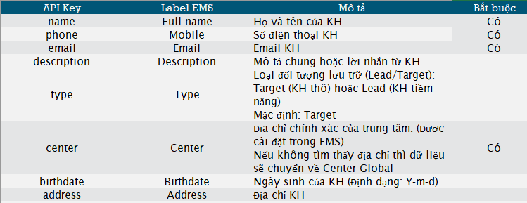

> Bước 6: Nếu thêm tài khoản liên kết là google sheet thì click vào thêm tài khoản liên kết và chọn google sheet. Nếu không thì có thể bỏ qua bước này.

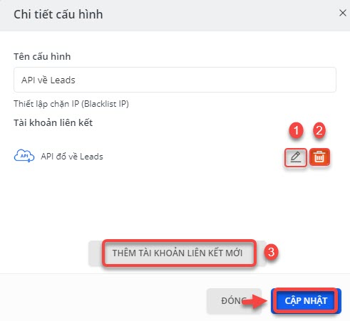


\*\*\*\*🙆♀ **Ghi chú**:

1: Chỉnh sữa

2: Xóa

3: Thêm tài khoản liên kết mới như google sheet, mail,...

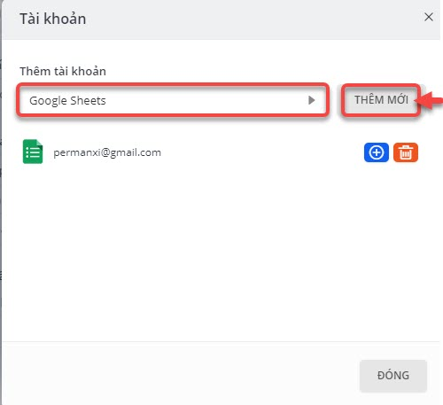 


> Bước 7: Cấu hình API đã được set up và nếu có lời nhắn, cảm ơn đến khách hàng chúng ta có thể chọn ở mục số 2. Cuối cùng click **Cập Nhật.**

## ⚡ Tích hợp với Wordpress - Contact Form 7

> Bước 1: Vào module **Plugins** chọn **Add New.**

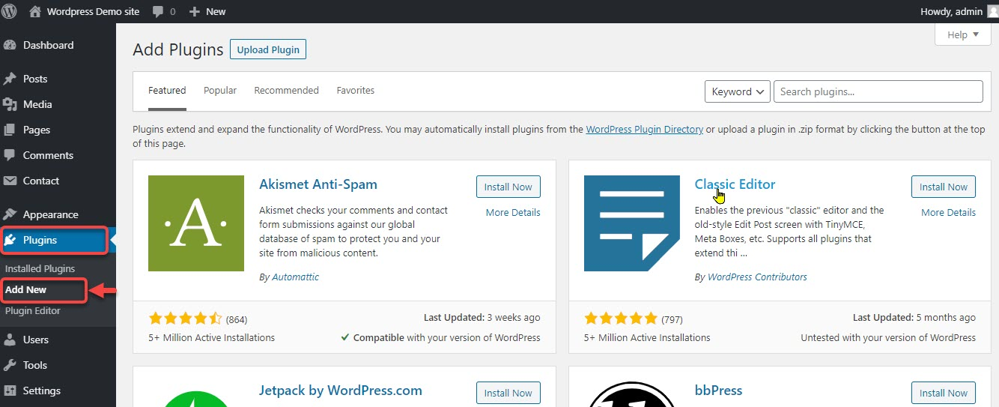

> Bước 2 : Chọn **Tags** cần tìm là **Contact form 7 TO API**, sau đó click chọn **Install Now.**

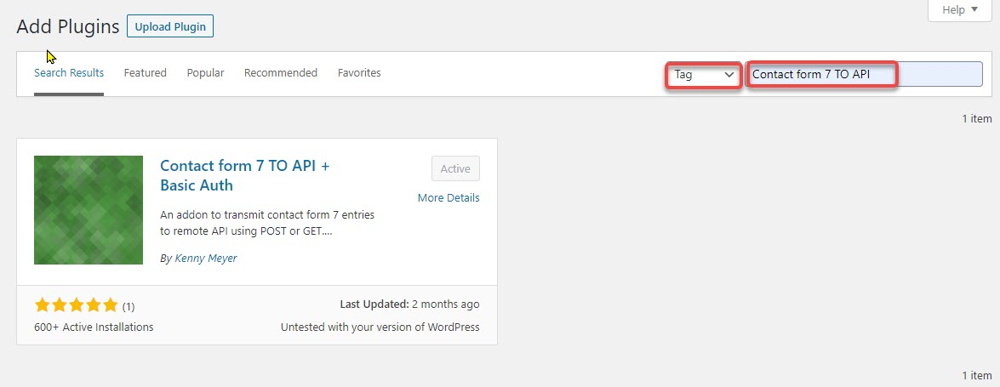

> Bước 3: Sau đó tiếp tục vào module **Plugins** chọn **Installed Plugins** và chọn phần vừa cài đặt xong click chọn **Active.**

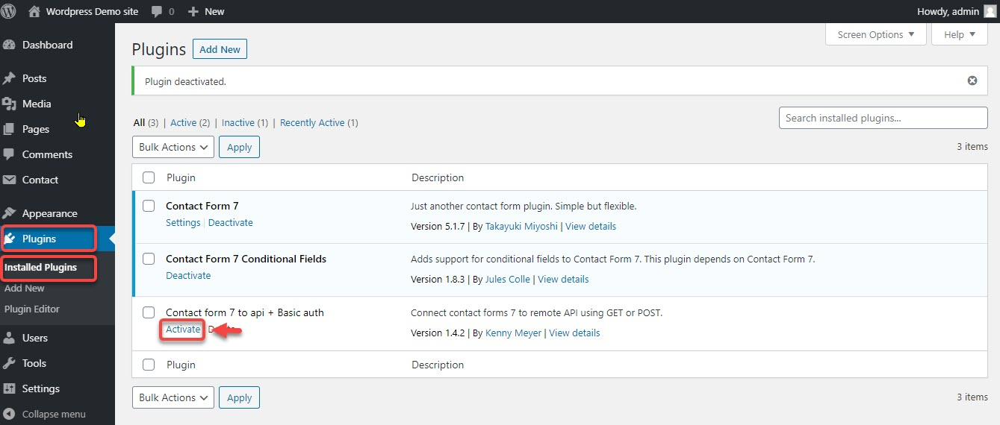

> Bước 4: Tiếp đến vào module Contact click chọn Contact Forms và chọn form cần cấu hình.

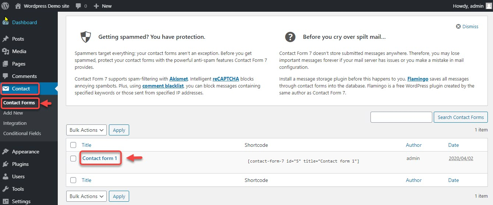

> Bước 4: Tại trang Contact Form click chọn **API Integration**.

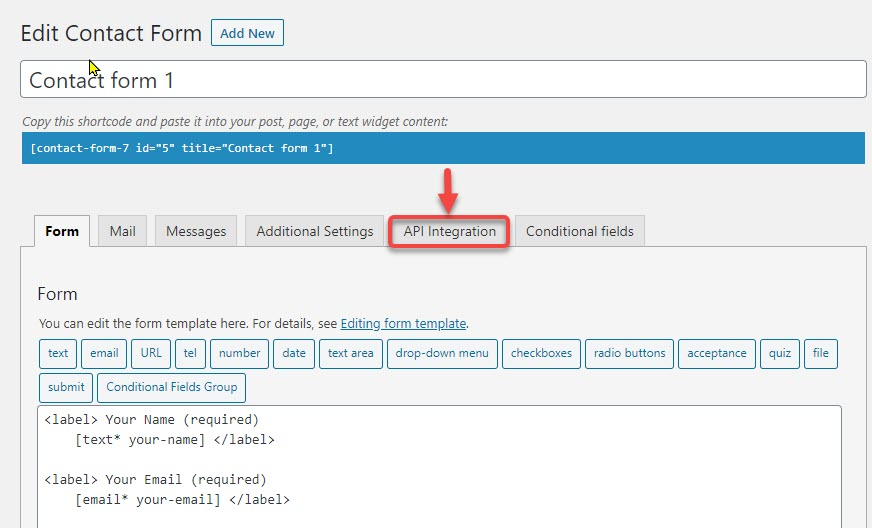

> Bước 5: Maping các trường dữ liệu từ form về API. Cuối cùng click **Save**.


\*\*\*\*🙆♀ **Ghi chú:**

1: API URL: [**https://api.dotb.cloud/**](https://api.dotb.cloud/) 

VD: ví dụ KH **ABC** English có tên miền sử dụng EMS là **abc.dotb.cloud** thì ==&gt; URL API là: [**https://api.dotb.cloud/abc.dotb.clou**d](https://api.dotb.cloud/abc.dotb.cloud).

2: Input type chọn : **Parameters-GET/POST**  như ảnh.

3: Method: Chọn **GET**.

4: Mapping các trường dữ liệu từ form về API theo mẫu bên dưới.



Tương tự cho các Plug-in khác của Wordpress như: WFrom, Gravity .... và các CMS khác như Joomla, Druple.


