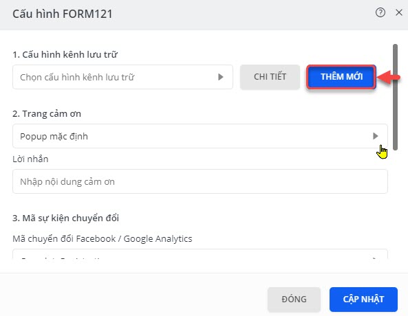
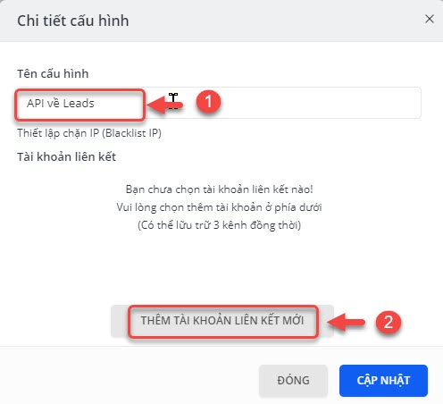
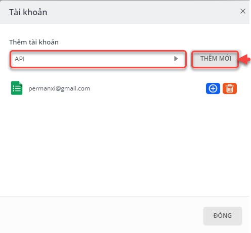
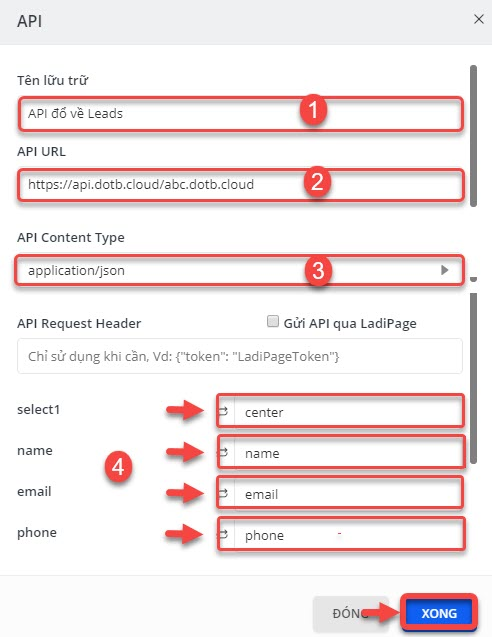

# Tích hợp với Ladipage.vn

> **Bước 1:** Chọn **Lưu Data.**

> **Bước 2:** Chọn **Thêm Mới.**

> **Bước 3:** Đặt tên cấu hình, sau đó nhấn chọn Thêm tài khoản liên kết mới.


****:woman\_gesturing\_ok: **Ghi chú**:

&#x20;**Tên cấu hình**: tên cấu hình nên đặt tên dễ nhớ.


> **Bước 4:** Chọn option là API và sau đó nhấn vào **Thêm Mới.**

> **Bước 5:** Mapping các trường dữ liệu từ form về API. Sau đó nhấn **Xong.**


****:woman\_gesturing\_ok: **Ghi chú**:

1. Tên lưu trữ: Lưu ý: nên đặt tên dể nhớ
2. API URL: [**https://api.dotb.cloud/**](https://api.dotb.cloud/)&#x20;
3. API Content Type: chọn **application/json.**
4. Mapping các trường dữ liệu từ form về API theo mẫu bên dưới.

VD về API URL: ví dụ KH **ABC** English có tên miền sử dụng EMS là **abc.dotb.cloud** thì ==> URL API là: [**https://api.dotb.cloud/abc.dotb.clou**d](https://api.dotb.cloud/abc.dotb.cloud)


> **Bước 6:** Nếu thêm tài khoản liên kết là google sheet thì nhấn vào thêm tài khoản liên kết và chọn Google Sheet. Nếu không thì có thể bỏ qua bước này.


****:woman\_gesturing\_ok: **Ghi chú**:

1. &#x20;Chỉnh sửa
2. Xóa
3. Thêm tài khoản liên kết mới như Google Sheet, mail,...

&#x20;


> **Bước 7:** Cấu hình API đã được set up và nếu có lời nhắn, cảm ơn đến khách hàng chúng ta có thể chọn ở mục số 2. Cuối cùng nhấn chọn **Cập Nhật.**

.jpg>)
