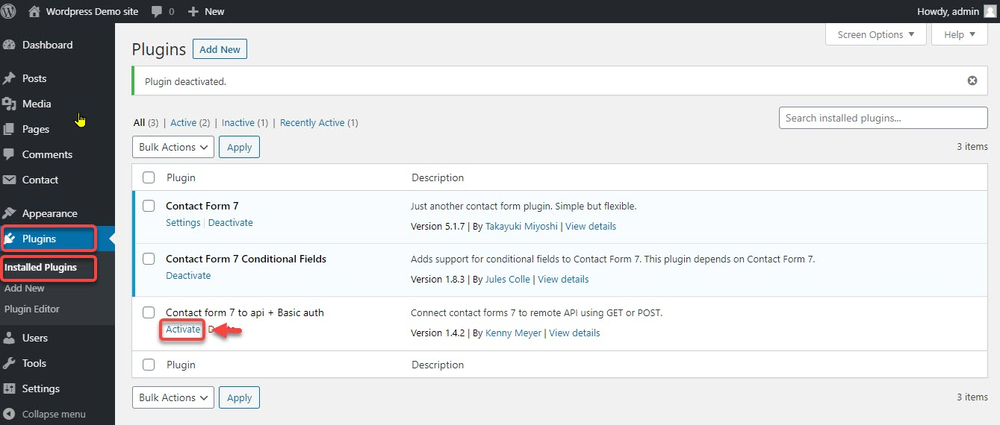
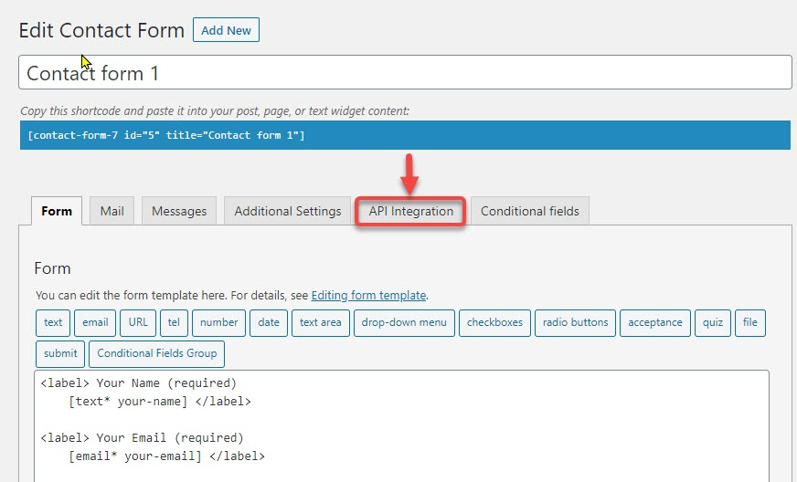
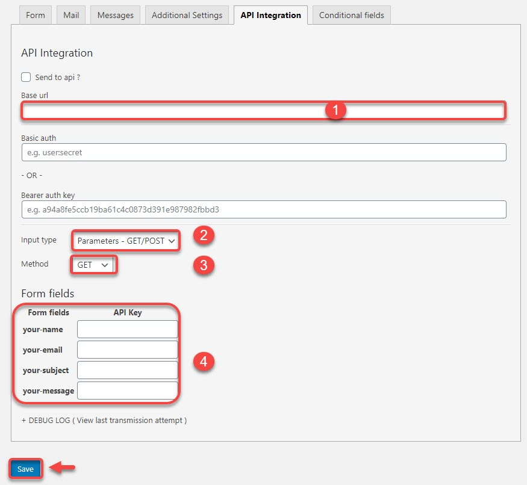
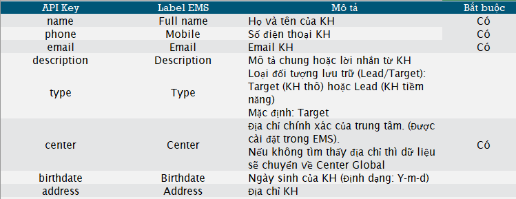

# Tích hợp với Wordpress - Contact Form 7

> **Bước 1**: Vào module **Plugins** chọn **Add New.**

> **Bước 2:** Chọn **Tags** cần tìm là **Contact form 7 TO API**, sau đó nhấn chọn **Install Now.**

> **Bước 3:** Sau đó tiếp tục vào module **Plugins** chọn **Installed Plugins** và chọn phần vừa cài đặt xong nhấn chọn **Active.**

> **Bước 4:** Tiếp đến vào phân hệ Contact, nhấn chọn Contact Forms và chọn form cần cấu hình.

> **Bước 5:** Tại trang Contact Form, nhấn chọn **API Integration**.

> **Bước 6:** Mapping các trường dữ liệu từ form về API. Cuối cùng nhấn **Save**.


****:woman\_gesturing\_ok: **Ghi chú:**

1. API URL: [**https://api.dotb.cloud/**](https://api.dotb.cloud/)&#x20;
2. Input type chọn : **Parameters-GET/POST**  như ảnh.
3. Method: Chọn **GET**.
4. Mapping các trường dữ liệu từ form về API theo mẫu bên dưới.

VD của API URL: ví dụ KH **ABC** English có tên miền sử dụng EMS là **abc.dotb.cloud** thì ==> URL API là: [**https://api.dotb.cloud/abc.dotb.clou**d](https://api.dotb.cloud/abc.dotb.cloud).



Tương tự cho các Plug-in khác của Wordpress như: WFrom, Gravity .... và các CMS khác như Joomla, Druple.

