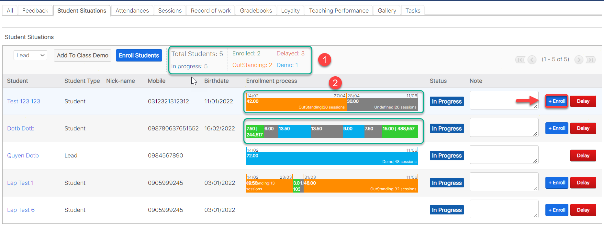
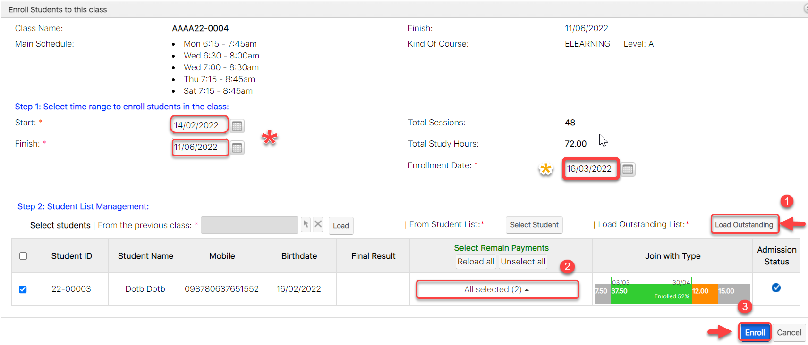
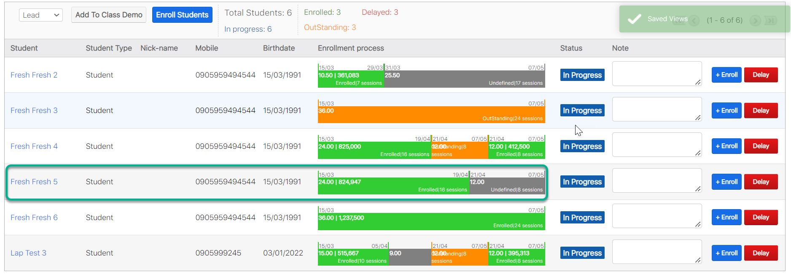

# ☘ Chỉnh sửa (Clear Outstanding)


Với payment học viên mua, bạn chỉ cần chọn thời gian học viên bắt đầu học (Nếu học viên vào học trễ), sau đó chọn Payment học viên sử dụng để ghi danh trong lớp, hệ thống sẽ tự động tính ngày End học viên trong lớp.&#x20;

Nếu Payment học viên mua không đủ so với số giờ học của lớp, Khoảng thời gian còn lại, hệ thống sẽ hiện thị học viên Outstanding. Nếu bạn không muốn thông tin hiển thị Outstanding có thể Remove khoảng thời gian đó của học viên ra khỏi lớp bằng tính năng <mark style="background-color:blue;">**Delay.**</mark>


> **Bước 1:** Ở màn hình danh sách của module **Classes**, chọn lớp cần <mark style="color:orange;">**Clear Outstanding**</mark> học viên vào lớp.

<figure><figcaption></figcaption></figure>

> **Bước 2:** Tại màn hình chi tiết **Classes**, nhấn vào tab Subpanel “**Student Situations**”. Sau đó nhấn chọn "<mark style="color:green;">**Enroll Students**</mark>" hoặc "**Enroll**".


Ghi chú:

1. Thông tin học viên Đang học, Học Demo, Bảo Lưu, Học Nợ trong lớp.
2. Thông tin học viên trong lớp:&#x20;

<mark style="color:green;">**Enrolled**</mark>** (**Màu xanh**)**: Học viên đủ điều kiện add vào lớp (đã đóng đủ hoặc dư học phí).

<mark style="color:orange;">**Outstanding**</mark>** (**Màu Cam**)**: Học viên chưa đủ học phí cho khóa học hoặc add vào lớp cho học nợ.

<mark style="color:blue;">**Demo**</mark> (Màu xanh dương): Học viên học thử trong lớp

Học viên không đăng kí học trong 1 khoảng thời gian (Màu xám)


> **Bước 3:** Chọn <mark style="color:orange;">**Load Outstanding**</mark>** (1), **<mark style="color:orange;">****</mark> hệ thống sẽ load danh sách học viên đang học nợ trong Lớp, tiếp theo chọn payment (2) mà học viên đã mua để enroll vào lớp (mặc định hệ thống sẽ tự lấy payment nếu cùng KOC), có thể  chọn 1 hoặc nhiều học viên để ghi danh học viên (Clear Outstanding). Cuối cùng nhấn vào <mark style="color:green;">**Enroll**</mark> (3) để ghi danh học viên.


****:woman\_gesturing\_ok: **Ghi Chú**:

(\*):  <mark style="color:blue;">**Start/Finish**</mark> : Có thể lựa chọn khoảng thời gian clear outstanding học viên (Nếu muốn)

(\*): <mark style="color:orange;">**Enrollment Date**</mark> : Có thể lựa chọn thời gian thực hiện thao tác Clear Outstanding học viên (Lưu  : Khi chọn thời gian này doanh thu phân bổ sẽ phân bổ tính từ thời điểm bạn chọn thời gian Enrollment học viên ).

:stop\_button: Add thêm học viên hàng loạt, có thể chọn hàng loạt hoặc chọn từng học viên.

3\. Chọn Payment để Enroll học viên (Mặc định hệ thống sẽ tự chọn Payment nếu như KOC của lớp học và KOC của payment cùng chung 1 Chương trình học )



:point\_right: Nếu như Payment có KOC khác với KOC của lớp học, hệ thống sẽ hiện thị thông báo như bên dưới. Nếu chúng ta vẫn sử dụng gói học này để tiếp tục enroll cho học viên, chọn "**Đồng Ý**".


.jpg>)

> **Bước 4:** Màn hình hiển thị thông tin học viên sau khi chỉnh sửa Enroll thành công.

> _Video hướng dẫn xóa khoản học nợ_


