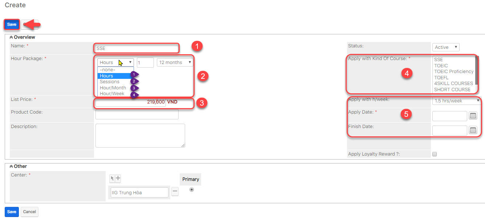

# Quản lí đơn giá học phí

> Bước 1: Đưa chuột vào Menu Course Fees chọn Create Course Fees.

> Bước 2: Tại màn hình tạo đơn giá học phí, nhập đầy đủ các thông tin cần thiết, Click Save để hoàn tất


**Ghi chú:**

1: Tên đơn giá học phí

2: Gói giờ : 

**Hours** : bao nhiêu giờ và gói này hết hạn trong vòng bao nhiêu tháng

**Session** : bao nhiêu buổi và gói này hết hạn trong vòng bao nhiêu buổi

**Hour/month** : bao  nhiêu giờ /tháng và gói này hết hạn trong vòng bao nhiêu tháng

**Hour/week**: bao nhiêu giờ/tuần và gói này hến hạn trong vòng bao nhiêu tuần

3: Đơn giá hoc phí cho 1 giờ hoặc trọn gói

4: Đơn giá học phí áp dụng cho chương trình học nào

5: Số giờ học/tuần và thời gian bắt đầu,kết thúc của khóa học đó


> Bước 3: Hệ thống hiển thị thông tin chi tiết đơn giá học phí khóa học được tạo.

