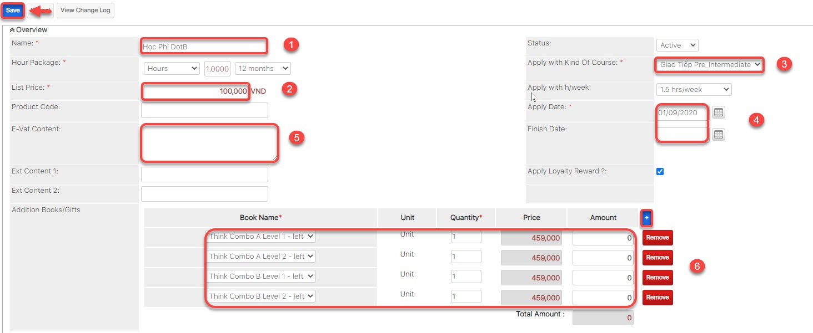
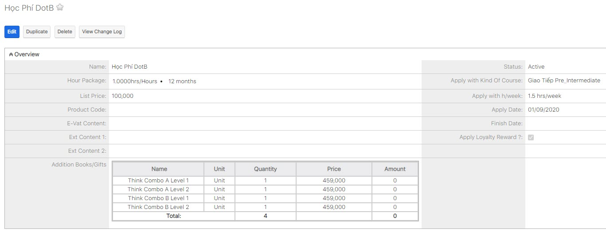
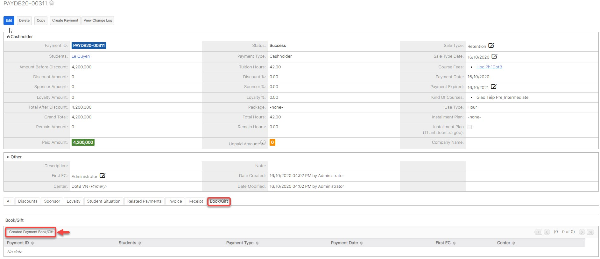
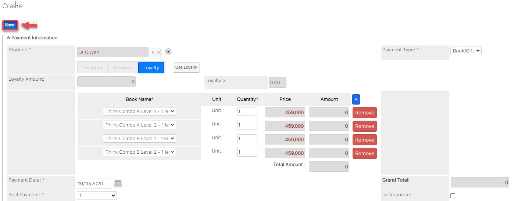
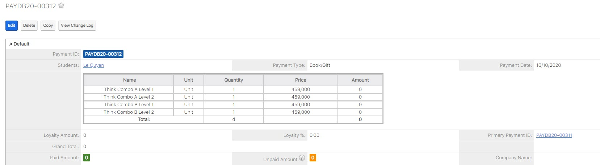
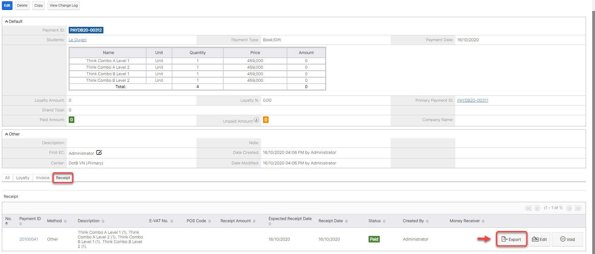

# Quản lí đơn giá học phí \(kèm Sách\)

## Tạo đơn giá học phí \(Kèm sách\)\(Nếu có\)

> Bước 1: Đưa chuột vào thanh module **Course Fees** chọn **Create Course Fees**.

> Bước 2: Tại màn hình tạo đơn giá học phí, nhập đầy đủ các thông tin cần thiết, click **Save** để hoàn tất.


**Ghi chú:**

1: Tên đơn giá học phí

Gói giờ : 

**Hours** : học phí bao nhiêu giờ và được sử dụng trong bao hiêu tháng

**Session** : học phí bao nhiêu buổi và được sử dụng trong bao nhiểu buổi

**Hour/month** : học phí 1 giờ bao nhiêu, học bao nhiêu giờ và gói này được sử dụng trong bao nhiêu tháng

**Hour/week**: học phí 1 giờ bao nhiêu, học bao nhiêu giờ và gói này hết hạn trong vòng bao nhiêu tuần

2: Đơn giá hoc phí cho 1 giờ hoặc trọn gói

3: Đơn giá học phí áp dụng cho chương trình học nào

4: Thời gian bắt đầu,kết thúc của đơn giá học phí đó

5: Thông tin cho đơn giá học phí \(thông tin này sẽ đi kèm khi xuất phiếu thu cho Học viên\).

6.Sách/Giáo trình kèm theo khóa học khi học viên mua với đơn giá tương ứng và bộ sách này sẽ có giá 0VNĐ được xuất kèm theo phiếu thu cho học viên.


> Bước 3: Hệ thống hiển thị thông tin chi tiết đơn giá học phí khóa học được tạo.

## Xuất sách kèm khóa học.

> Bước 1: Khi học viên mua khóa học đã bao gồm sách, nếu muốn xuất sách cho học viên. Vào payment vừa tạo cho học viên, click vào tab **Book/Gift**, chọn **Create Book/Gift**.

> Bước 2: Hệ thống sẽ tạo ra thông tin bộ sách miễn phí đã được tạo ở thông tin đơn giá học phí.

> Bước 3: Thông tin sách sau khi được lưu thành công.

> Bước 4: Xuất phiếu thu kèm theo \(Nếu có\).

