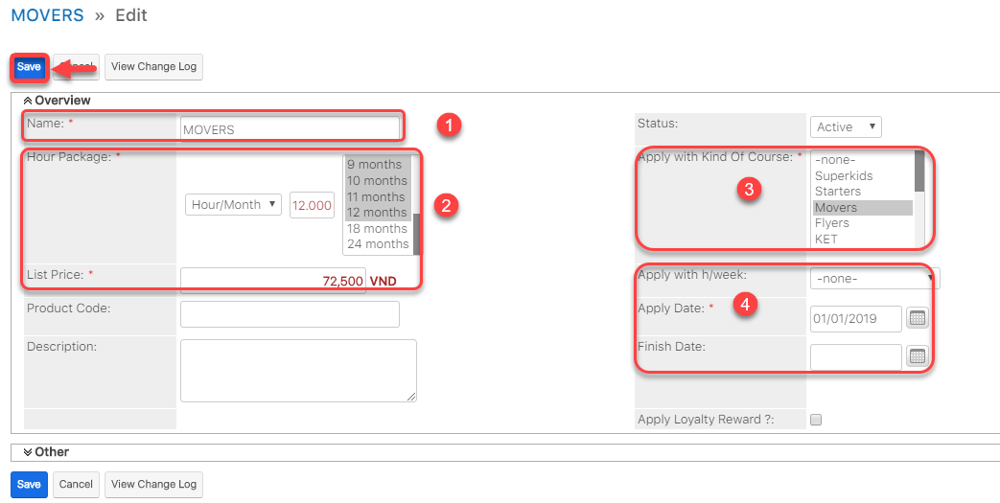
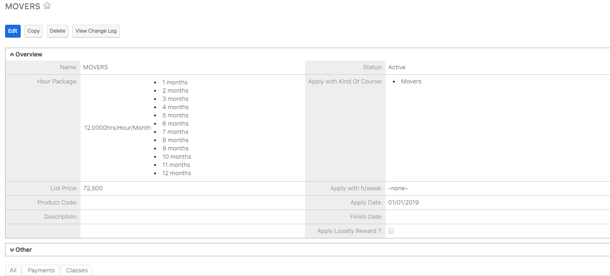

# Quản lí đơn giá học phí

> Bước 1: Đưa chuột vào Menu Course Fees chọn Create Course Fees.

> Bước 2: Tại màn hình tạo đơn giá học phí, nhập đầy đủ các thông tin cần thiết, Click Save để hoàn tất


**Ghi chú:**

1: Tên đơn giá học phí

2: Đơn giá học theo giờ,buổi,giờ/tháng,giờ/tuần

3: Đơn giá này áp dụng cho chương trình học nào 4: Số giờ học/tuần và thời gian bắt đầu,kết thúc của khóa học đó


> Bước 3: Hệ thống hiển thị thông tin chi tiết đơn giá học phí khóa học được tạo.

