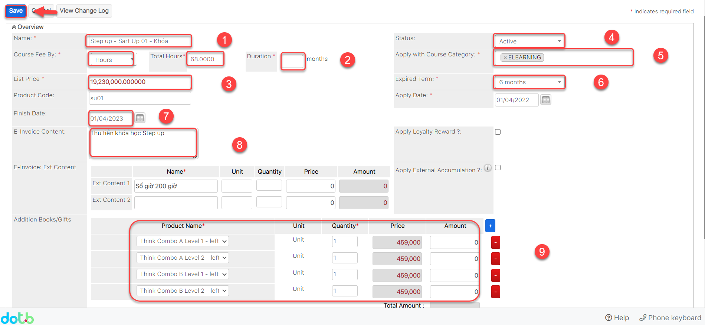
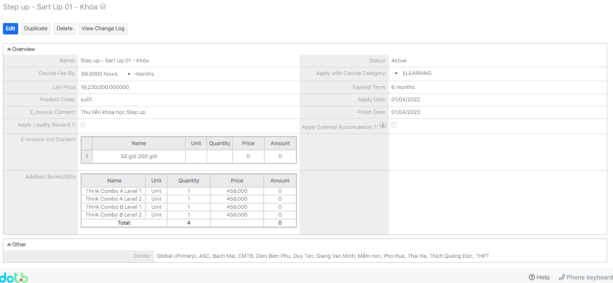
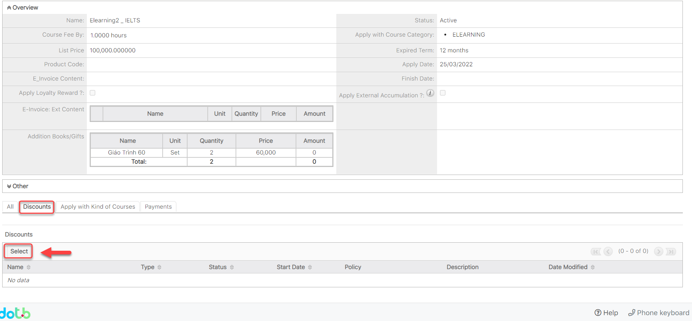
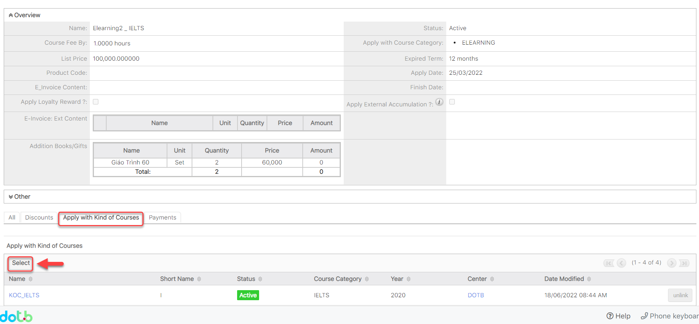

# Tạo đơn giá học phí (Kèm sách)(Nếu có)


**Ở qui trình tạo đơn giá học phí có 3 bước:**

Bước 1: Mở ra màn hình thêm mới Đơn giá học phí

Bước 2: Nhập đầy đủ thông tin cần thiết

Bước 3: Xem chi tiết màn hình Đơn giá học phí vừa tạo


> **Bước 1:** Ở màn hình danh sách của module **Course Fees** ta nhấn vào button **Create Course Fees** để mở ra màn hình thêm mới **Course Fees**.

<figure><figcaption></figcaption></figure>

> Bước 2: Tại màn hình tạo mới đơn giá học phí, nhập đầy đủ các thông tin cần thiết, người dùng lưu ý rằng các trường (field) có chữ **Required** bắt buộc phải nhập thông tin vào, những field khác có thể bỏ qua, sau đó nhấn chọn button **Save** để hoàn tất việc tạo ra một Đơn giá học phí mới.


****:woman\_gesturing\_ok: **Ghi chú:**

1\. Tên thông tin đơn giá học phí.

2\. Cấu hình đơn giá học phí

Gói giờ :&#x20;

**Hours**: học phí bao nhiêu giờ và được sử dụng trong bao hiêu tháng

**Session**: học phí bao nhiêu buổi và được sử dụng trong bao nhiểu buổi

**Hour/month**: học phí 1 giờ bao nhiêu, học bao nhiêu giờ và gói này được sử dụng trong bao nhiêu tháng

**Hour/week**: học phí 1 giờ bao nhiêu, học bao nhiêu giờ và gói này hết hạn trong vòng bao nhiêu tuần

3\. Đơn giá hoc phí cho 1 giờ hoặc trọn gói.

4\. Trạng thái kích hoạt thông tin Đơn giá học phí.

5\. Đơn giá học phí áp dụng cho Loại Chương trình học.

6,7. Thời gian bắt đầu,Thời gian hết hạn của đơn giá học phí đó.

8\. Thông tin cho đơn giá học phí (thông tin này sẽ đi kèm khi xuất phiếu thu cho Học viên).

9\. Sách/Giáo trình kèm theo khóa học khi học viên mua với đơn giá tương ứng và bộ sách này sẽ có giá 0VNĐ được xuất kèm theo phiếu thu cho học viên.


> **Bước 3:** Hệ thống hiển thị thông tin chi tiết đơn giá học phí khóa học vừa được tạo.

> **Bước 4:** Nhấn vào supanel và chọn tab **Discount**/ **Apply with Kind of Courses** và chọn **Select** để Đính kèm chương trình Discount hoặc Chương trình học của gói học phí vừa tạo **(Nếu có).**

