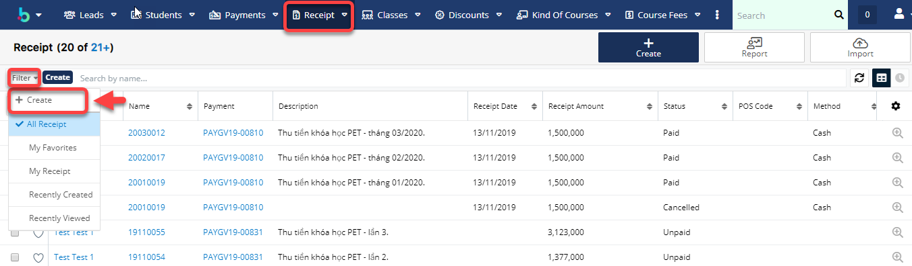
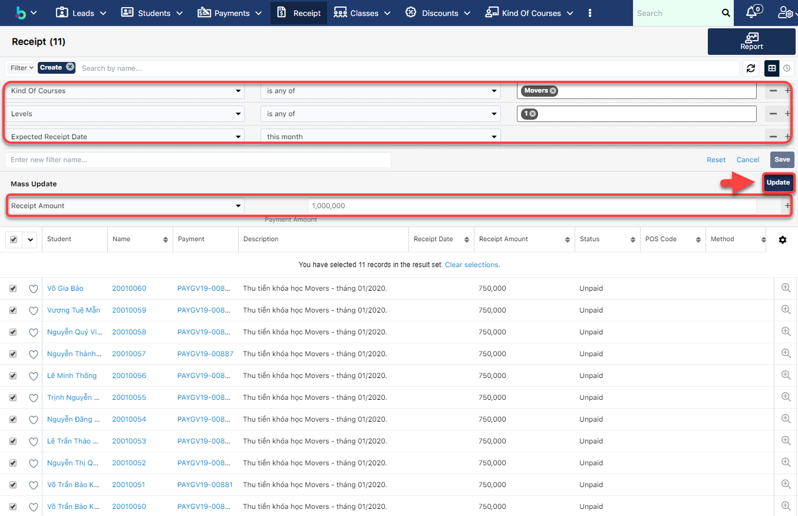
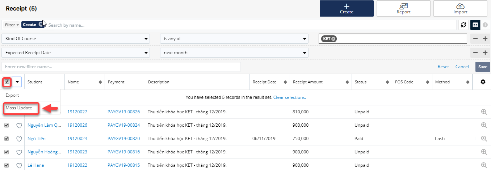
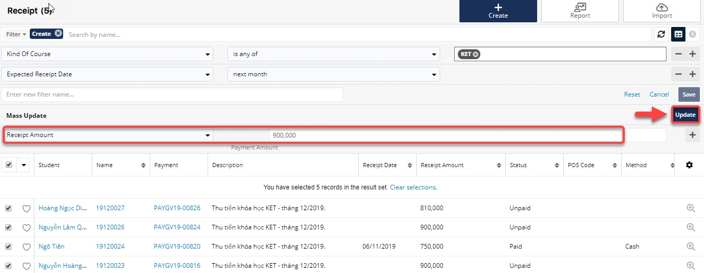
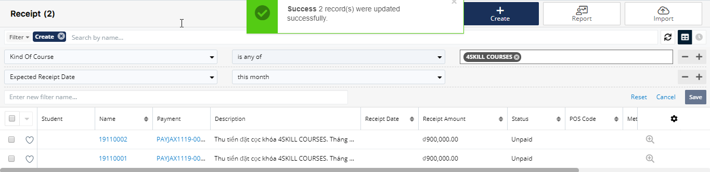

# Quản lí tăng giảm học phí

> Bước 1: Đưa chuột vào module Receipt click vào Filter sau đó click chọn “Create”.

> Bước 2: Sau đó chọn filter là “Kind of Courses” ,level tương ứng ,sau đó chọn tháng cần tăng/giảm học phí.

> Bước 3: Chọn list danh sách học viên cần tăng học phí và chọn Mass Update.

> Bước 4: Sau đó nhập số tiền cần tăng học phí, và click Update.

> Bước 5: Hệ thống hiển thị thông báo số tiền được cập nhật thành công.

