# Quản lí thanh toán

## Tạo Payment

### Học viên ghi danh khi chưa đặt cọc \(Create Enrollment\)

> Bước 1: Đưa chuột vào module Payment click Create Enrollment .

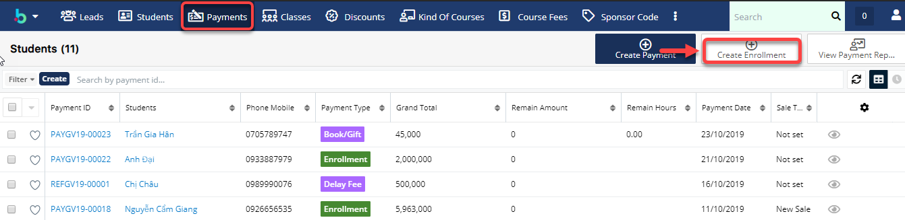

> Bước 2: 
Tại màn hình tạo mới, nhập đầy đủ các thông tin cần thiết, sau đó click **Save** để hoàn tất.

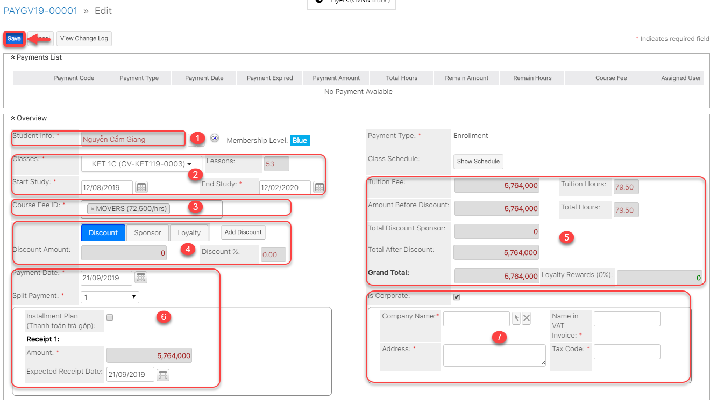


Ghi chú:

**1**: Lựa chọn Student. Các phương pháp lựa chọn Student:

Cách 1: Nhập tên vào ô Textbox sau đó Enter

 


Cách 2: Click vào biểu tượng  , 1 Popup xuất hiện, Tìm kiếm và lựa chọn Học sinh tương ứng.

**2**: Lựa chọn Classes. Có thể nhập tên Class hoặc lựa chọn Class trong danh sách và thời gian bắt đầu và kết thúc của Lớp học.

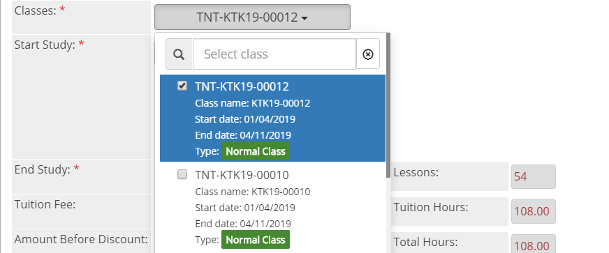 

3: Lựa chọn học phí cho khóa học.

4: Lựa chọn Discount, Sponsor, Loyalty và thông tin Discount ,Sponsor, Loyalty được lựa chọn.

5: Thông tin về số giờ,số tiền của khóa học trước giảm giá và sau giảm giá.

6: Ngày thanh toán và tổng số tiền cần thanh toán cho lần enrollment này,thông tin về số lần thanh toán. 

7: Chọn Corporate nếu cần xuất hóa đơn cho công ty và nhập thông tin công ty.


> Bước 3: Hệ thống hiển thị thông tin chi tiết của Enrollment được tạo.

### Tạo Enrollment khi học viên đã có đặt cọc

> Bước 1: Đưa chuột vào module Payment click Create Enrollment.

> Bước 2: Nhập đầy đủ các thông tin cần thiết. Click Save để hoàn tất.

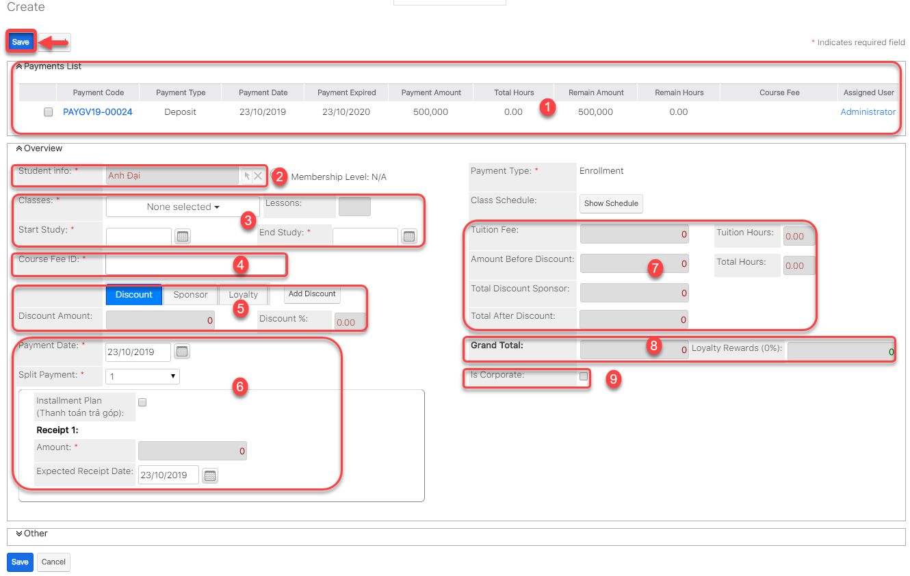


**Ghi chú** :

1: Tại màn hình tạo mới, chọn Payment đã có trước đó \(đã thanh toán tiền đặt cọc trước đó\).

2: Lựa chọn Student. Các phương pháp lựa chọn Student:

    Cách 1: Nhập tên vào ô Textbox sau đó Enter.

 

     Cách 2: 
Click vào biểu tượng  , 1 Popup xuất hiện, Tìm kiếm và lựa chọn Học sinh tương ứng.

3: 
Lựa chọn Classes. Có thể nhập tên Class hoặc lựa chọn Class trong danh sách và thông tin Thời gian bắt đầu và kết thúc của Lớp học.

 

4: Lựa chọn học phí cho khóa học.

5: Lựa chọn Discount, Sponsor, Loyalty và thông tin Discount ,Sponsor, Loyalty được lựa chọn 6: Lựa chọn Sponsor và thông tin Sponsor được lựa chọn.

6: Ngày thanh toán và Thông tin về số lần thanh toán.

7: Thông tin về số giờ,số tiền của khóa học trước giảm giá và sau giảm giá.

8: Tổng số tiền cần thanh toán cho lần enrollment này 

9: Chọn Corporate nếu cần xuất hóa đơn cho công ty và nhập thông tin công ty.


> Bước 3: Hệ thống hiển thị thông tin chi tiết của Enrollment được tạo.

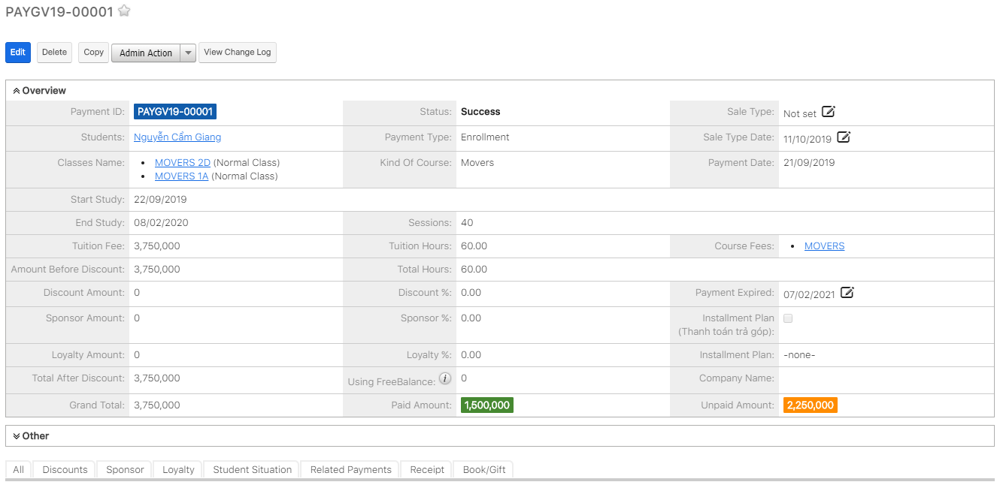

## Tạo Enrollment

### Tạo Payment Deposit \(Ghi nhận Đặt cọc\)

> Bước 1: Đưa chuột vào Menu Payment chọn Create Payment.

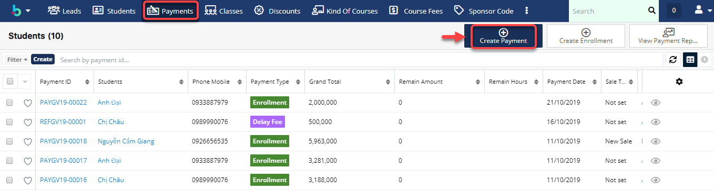

> Bước 2: 
Tại màn hình tạo mới thanh toán Nhập đầy đủ các thông tin mà học viên đặt cọc. Click **Save** để hoàn tất.

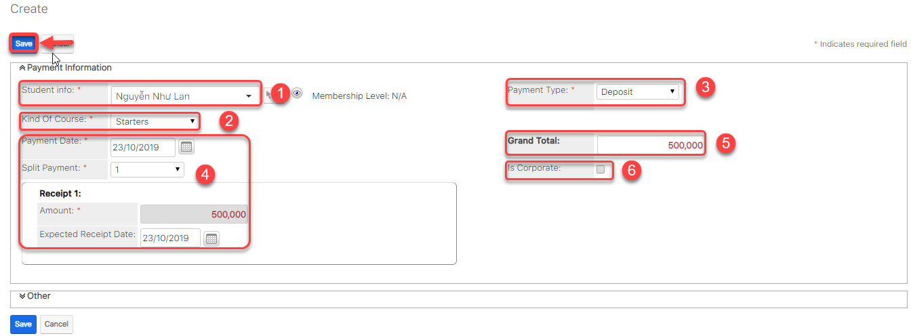


**Ghi chú**:

1: Lựa chọn Student. Các phương pháp lựa chọn Student:

    Cách 1: Nhập tên vào ô Textbox sau đó Enter.

 

     Cách 2: 
Click vào biểu tượng  , 1 Popup xuất hiện, Tìm kiếm và lựa chọn Học sinh tương ứng.

2: Lựa chọn Khóa học

3: Lựa chọn loại Payment là: **Deposit**

4: Lựa chọn ngày thanh toán Payment và Số lần thanh toán

5: Nhập số tiền muốn đặt cọc**.**

6: Chọn xuất hóa đơn cho công ty \(nếu có\) và điền đầy đủ thông tin yêu cầu.


### 
**Tạo Payment PT \(Đóng tiền kiểm tra đầu vào\)** 

> Bước 1: Đưa chuột vào Menu Payment & Enrollment chọn Create Payment.

> Bước 2: 
Tại màn hình tạo mới thanh toán, nhập đầy đủ các thông tin học viên đóng PT. Click **Save** để hoàn tất.

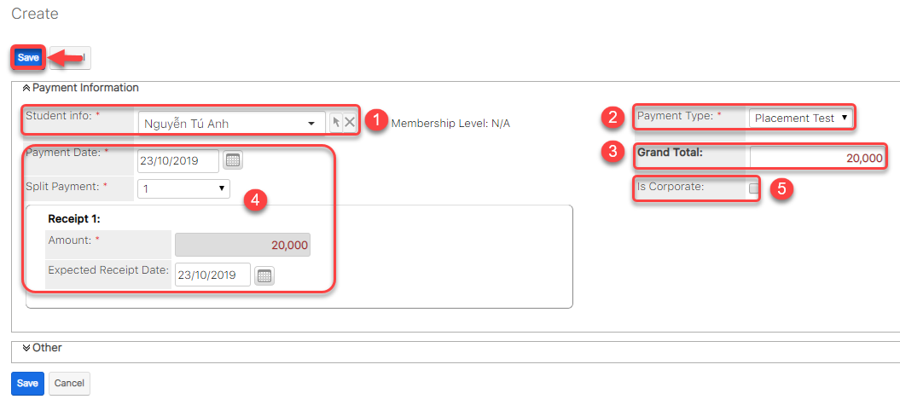


Ghi chú:

1: Lựa chọn Học viên đóng tiền PT.

2: Lựa chọn loại Payment là: **Placement Test.**

3: Nhập số tiền đóng để tham gia kiểm tra.

4: Ngày thanh toán Payment.

5: Chọn xuất hóa đơn cho công ty \(nếu có\) và điền đầy đủ thông tin yêu cầu.


> Bước 3: Hệ thống hiển thị thông tin chi tiết của Payment được tạo.

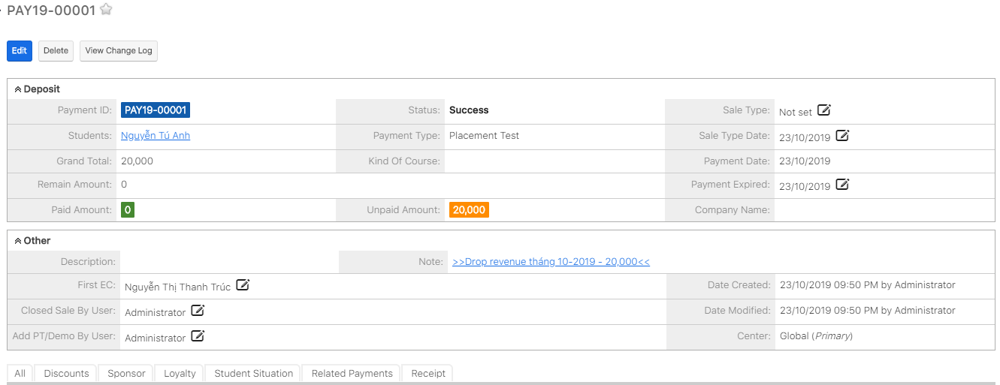

### Tạo Payment Book/Gift \(thu tiền sách\)

> Bước 1: Đưa chuột vào Menu Payment chọn Create Payment.

> Bước 2: Tại màn hình tạo mới thanh toán, nhập đầy đủ các thông tin sách, số lượng mà học viên mua click Save để hoàn tất.

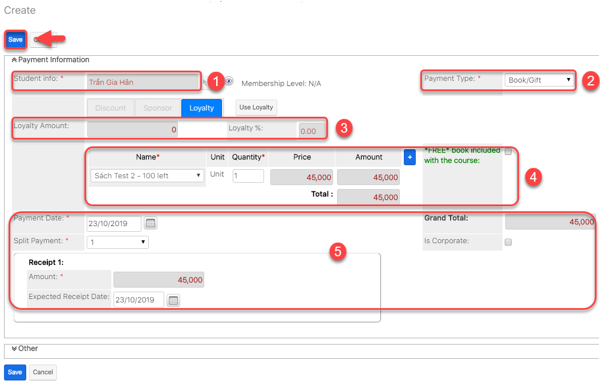


Ghi chú:

1: Lựa chọn Học sinh.

2: Lựa chọn loại Payment là: **Book/Gift**

3: Thêm voucher,discount cho học viên \(Nếu có\)

4: Sách,số lượng mà học viên  đăng kí mua 

5: Thông tin về số lần thanh toán, lựa chọn số lần thanh toán tương ứng


> Bước 3: Hệ thống hiển thị thông tin chi tiết của Payment Book/Gift được tạo.

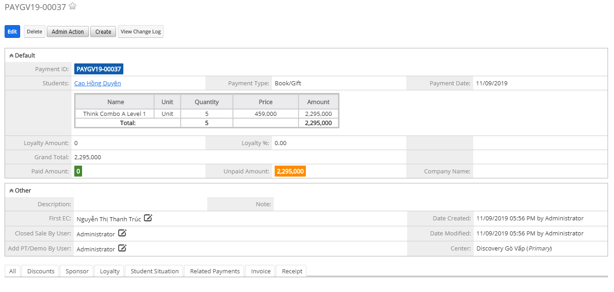

## Thanh toán cho Payment

> Bước 1: Đưa chuột vào module Payment, click chọn Payment muốn thức hiện việc thanh toán.

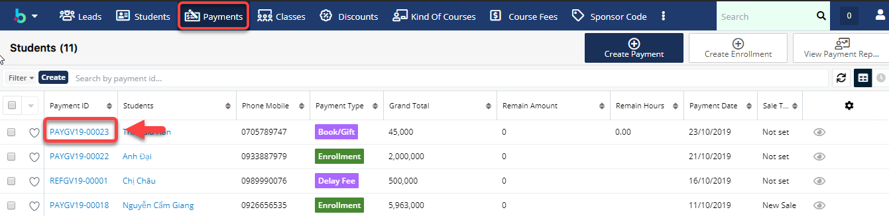

> Bước 2: Tại màn hình chi tiết của Payment, click Tab Subpanel “Receipt”.Sau đó click “Pay” để tiến hành thanh toán cho Payment.

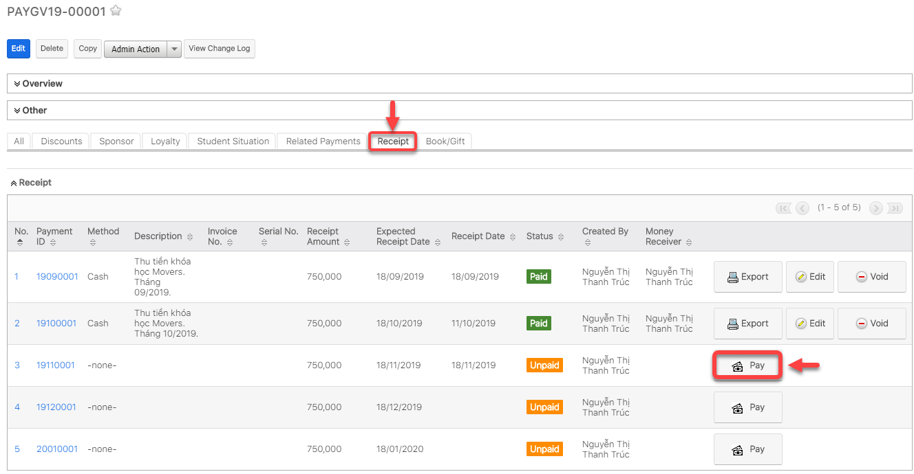

> Bước 3: Click “Pay” để tiến hành thanh toán cho Payment.

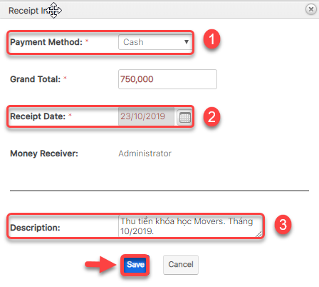


**Ghi chú**:

1: Lựa chọn hình thức thanh toán

2: Chọn ngày thanh toán \(hệ thống set mặc định là ngày hiện tại của hệ thống, người dùng có thể chọn ngày khác\). 

3: Desciption : Nội dung thu tiền của khóa học theo tháng \(User có thể bổ sung thêm nội dung\).


> Bước 4: 
Lựa chọn hình thức thanh toán,nhập nội dung thu tiền, sau đó click **Save** để hoàn tất.

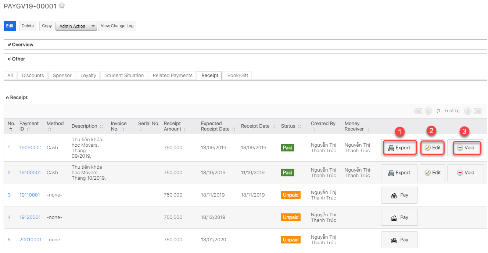


**Ghi chú:**

1: Xuất Phiếu thu

2: Chỉnh sữa Phiếu thu

3: Xóa Phiếu thu, khi thực hiện thiện việc xóa Phiếu thu thì trạng thái của Phiếu thu sẽ chuyển về: Cancel


## Xuất hóa đơn điện tử \(E-invoice\)


**GHI CHÚ:**

* **MÔ TẢ:** Hóa đơn điện tử \(E-invoice\) là tập hợp các thông điệp dữ liệu điện tử về bán hàng hóa, cung ứng dịch vụ, được khởi tạo, lập, gửi, nhận, lưu trữ và quản lý bằng phương tiện điện tử theo quy định của pháp luật về giao dịch điện tử.
* **LƯU Ý:** Chức năng của hóa đơn điện tử chỉ hoạt động khi Đơn vị có sử dụng HT E-invoice và đã được cài đặt lên hệ thống EMS.
* **CHI TIẾT:** Mọi thông tin về cài đặt vui lòng liên hệ bộ phận IT Administrator để được giải đáp.


> Bước 1: Đưa chuột vào module Payment, click chọn Payment muốn thực hiện việc xuất hóa đơn điện tử \(E-invoice\).

> Bước 2: 
Tại màn hình chi tiết của Payment, click Tab Subpanel “Receipt”. Click chuột vào ô **Get E-invoice**, để xuất hóa đơn điện tử cho Payment đó.


**Ghi chú**: **Get E-invoice** khi có thông báo. Thông báo có thể xuất hóa đơn điện tử \(như hình dưới\) chỉ xuất hiện khi đã thanh toán toàn bộ Receipt của Payment đó.


> Bước 3: Kiểm tra, chỉnh sửa thông tin chính xác lần cuối trước khi xuất hóa đơn điện tử. Click OK.


**Ghi chú**:

1:  Họ tên người mua hàng: Họ tên người mua hàng được hiển thị trên hóa đơn điện tử có thể là tên học viên hoặc tên phụ huynh học viên\(nếu có\). Ngoài ra, nếu muốn chỉnh sửa các thông tin này có thể click vào Edit.

2: Tên đơn vị: Tên công ty hoặc Add company\(Nếu học viên muốn xuất hóa đơn doanh nghiệp\).



Lưu ý: Xuất hóa đơn điện tử thành công khi nhận được thông báo như sau:



**Ghi chú**:

1: Export PDF E-invoice: Xuất E-invoice thành file PDF, tự động lưu về máy.

2: Void E-invoice hoặc Void Receipt: Khi Payment chưa được dùng để Enroll học viên vào lớp và thời hạn Void E-invoice trong tháng đó.

3: E-VAT No: Sẽ tự động cập nhật tất cả các Recepit trong 1 Payment.


## Thay đổi được nội dung thu tiền và số tiền cho học viên tháng tiếp theo khi chưa thanh toán

> Bước 1: Đưa chuột vào module Payment, click chọn Payment muốn thức hiện việc thanh toán và xuất phiếu thu.

> Bước 2: 
Tại màn hình chi tiết của Payment, click Tab Subpanel “Receipt”.Sau đó click vào Payement muốn thay đội số tiền thu học viên vào tháng tới \(áp dụng đối với phiếu thu chưa thu tiền học viên ở trạng thái Unpaid\), sau đó click **Edit.**

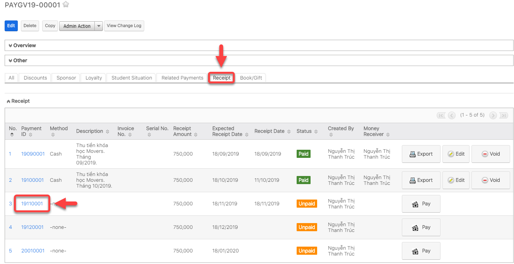

> Bước 3: 
Nhập nội dung thay đổi số tiền thu, ngày thu, sau đó click **Save** để hoàn tất.

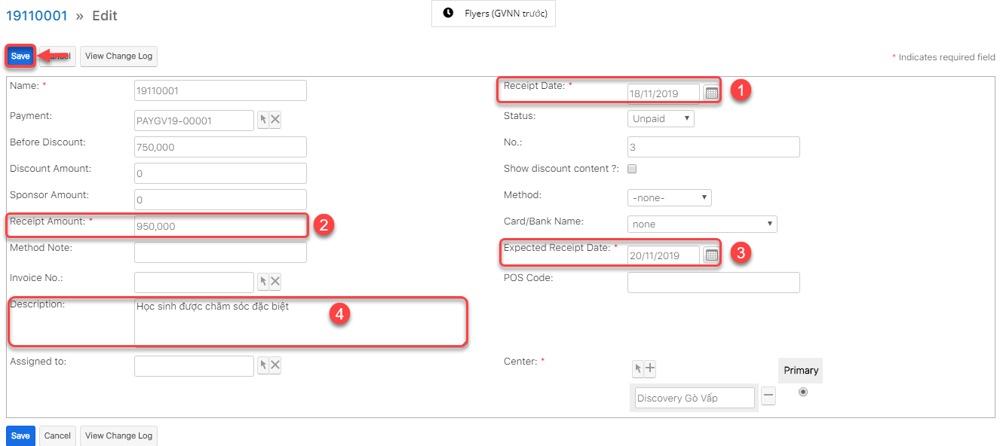


**Ghi chú**:

1: Chọn ngày thông báo thu tiền đến phụ huynh

2: Số tiền thay đổi thu tháng tiếp theo cho học viên

3: Ngày mong muốn phụ huynh có thể thanh toán sớm/trể hơn \(Thông báo gửi đến App\). 

4: Nội dung thay đổi số tiền thu phí học viên tháng tới.


