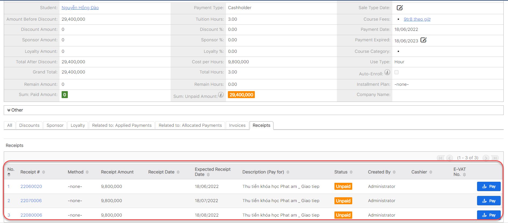

# Quản lí thanh toán

##

##


:dart: Thanh toán trả hàng tháng (Slit Payment)
-----------------------------------------------

> Bước 1: Tạo payment như bình thường và phần **Slit Payment** chọn option **Custom.**

> Bước 2: Sau đó nhập số tháng mà khách hàng muốn thanh toán hành tháng, ví dụ muốn thanh toán trong 3 tháng, mỗi tháng thanh toán 1 lần.


**Ghi chú:**

1. Số tháng thanh toán trong 1 lần.
2. Số lần thanh toán trên tổng Payments.


> Bước 3: Hệ thống sẽ tự động Generate khoảng tiền sau mỗi tháng cần đóng cho khách hàng với  số lần **Custom** được nhập.

## Thanh toán cho Payment

> Bước 1: Đưa chuột vào module Payment, click chọn Payment muốn thức hiện việc thanh toán.

> Bước 2: Tại màn hình chi tiết của Payment, click Tab Subpanel “Receipt”.Sau đó click “Pay” để tiến hành thanh toán cho Payment.

> Bước 3: Click “Pay” để tiến hành thanh toán cho Payment.


****:woman\_gesturing\_ok: **Ghi chú**:

1: Lựa chọn hình thức thanh toán

2: Chọn ngày thanh toán (hệ thống set mặc định là ngày hiện tại của hệ thống, người dùng có thể chọn ngày khác).&#x20;

3: Desciption : Nội dung thu tiền của khóa học theo tháng (User có thể bổ sung thêm nội dung).


> Bước 4:&#x20;
> Lựa chọn hình thức thanh toán,nhập nội dung thu tiền, sau đó click **Save** để hoàn tất.


****:woman\_gesturing\_ok: **Ghi chú:**

1: Xuất Phiếu thu

2: Chỉnh sữa Phiếu thu

3: Xóa Phiếu thu, khi thực hiện thiện việc xóa Phiếu thu thì trạng thái của Phiếu thu sẽ chuyển về: Cancel


## :page\_with\_curl: Xuất hóa đơn điện tử (E-invoice)


****:woman\_gesturing\_ok: **GHI CHÚ:**

* **MÔ TẢ:** Hóa đơn điện tử (E-invoice) là tập hợp các thông điệp dữ liệu điện tử về bán hàng hóa, cung ứng dịch vụ, được khởi tạo, lập, gửi, nhận, lưu trữ và quản lý bằng phương tiện điện tử theo quy định của pháp luật về giao dịch điện tử.
* **LƯU Ý:** Chức năng của hóa đơn điện tử chỉ hoạt động khi Đơn vị có sử dụng HT E-invoice và đã được cài đặt lên hệ thống EMS.
* **CHI TIẾT:** Mọi thông tin về cài đặt vui lòng liên hệ bộ phận IT Administrator để được giải đáp.


> Bước 1: Đưa chuột vào module Payment, click chọn Payment muốn thực hiện việc xuất hóa đơn điện tử (E-invoice).

 (1).png>)

> Bước 2:&#x20;
> Tại màn hình chi tiết của Payment, click Tab Subpanel “Receipt”. Click chuột vào ô màu xanh, để xuất hóa đơn điện tử cho Payment đó.


**Ghi chú**: **Get E-invoice** khi có thông báo. Thông báo có thể xuất hóa đơn điện tử (như hình dưới) chỉ xuất hiện khi đã thanh toán toàn bộ Receipt của Payment đó.


.png>)

> Bước 3: Kiểm tra, chỉnh sửa thông tin chính xác lần cuối trước khi xuất hóa đơn điện tử. Click **OK**.

.png>)


****:woman\_gesturing\_ok: **Ghi chú**:

1:  Họ tên người mua hàng: Họ tên người mua hàng được hiển thị trên hóa đơn điện tử có thể là tên học viên hoặc tên phụ huynh học viên (nếu có). Ngoài ra, nếu muốn chỉnh sửa các thông tin này có thể click vào Edit.

2: Tên đơn vị: Tên công ty hoặc Add Company (Nếu học viên muốn xuất hóa đơn doanh nghiệp).



:man\_raising\_hand: Lưu ý: Xuất hóa đơn điện tử thành công khi nhận được thông báo như sau:


.png>)


****:woman\_gesturing\_ok: **Ghi chú**:

1: Export PDF E-invoice: Xuất E-invoice thành file PDF, tự động lưu về máy.

2: Void E-invoice: Thời hạn Void E-invoice trong tháng.

3: E-VAT No: Sẽ tự động cập nhật tất cả các Receipt trong 1 Payment.


## Void E-invoice

> Bước 1: Click **Void E-invoice**.

.png>)

> Bước 2: Nhập nội dung lý do Void E-invoice. Click Submit.

.png>)

> Bước 3: Void thành công.


****:woman\_gesturing\_ok: **Ghi chú**:

1: Void E-invoice khi hóa đơn xuất sai bất kỳ tiêu thức nào và thời hạn Void E-invoice trong tháng đó. Trường hợp void E-invoice xảy ra vào tháng kế tiếp, liên hệ trực tiếp Phòng kế toán để được hỗ trợ.


## Quản lí Chi

> Bước 1: Click vào dấu 3 chấm, sao đó chọn tính năng **Center Expense**

.jpg>)

> Bước 2: Tại màn hình Chi, click nút tạo (**Create**).

.jpg>)

> Bước 3: Nhập thông tin Chi cho trung tâm, cuối cùng click **Save**.

.jpg>)
