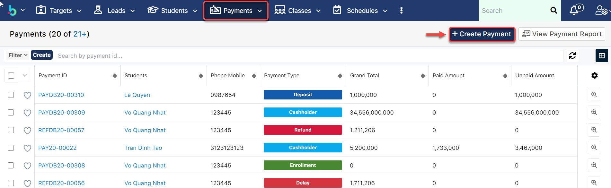
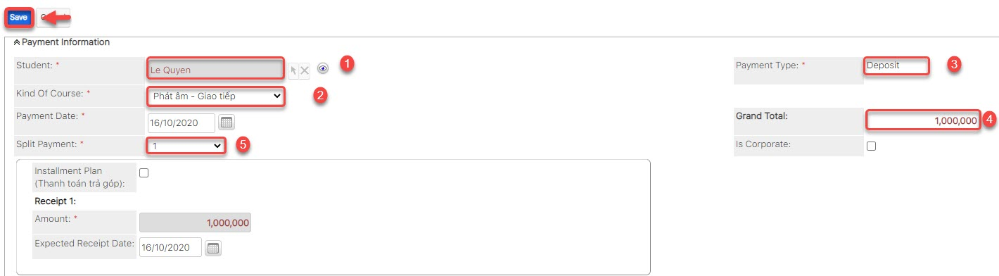

# Loại thanh toán - Payment Type

## Phí mua khóa học - Cashholder

> **Bước 1:** Ở màn hình danh sách của module **Payment** chọn **Create Payment** để mở ra màn hình thêm mới **Payment**.

> Bước 2:&#x20;
> Tại màn hình tạo mới thanh toán nhập đầy đủ các thông tin mà học viên mua khóa học như discount, số giờ mua,... và lưu ý chọn Payment Type là **Cashholder**. Sau đó check vào ô Auto - Enroll để chọn Lớp, Ngày bắt đầu học của học viên, hệ thống sẽ tự động Enroll đưa học viên vào lớp, sau khi đã thu tiền. Cuối cùng click **Save** để hoàn tất.


****:woman\_gesturing\_ok: **Ghi chú:**

1. Lựa chọn học viên.&#x20;
   Nhấn vào biểu tượng , một popup xuất hiện, tìm kiếm và lựa chọn Học viên.
2. &#x20;Lựa chọn **Payment type** là **Cashholder**.
3. Lựa chọn khoá học viên mua.
4. Nhập số giờ học viên mua khóa học (có thể nhập tổng số giờ nếu 2 hoặc 3 khóa cùng KOC)**.**
5. Lựa chọn các Discount/Sponsor (Nếu có).
6. Lựa chọn khoảng tiền đã đặt cọc trước đó để sử dụng.
7. Lựa chọn số lần thanh toán
8. Nhấn **** chọn <mark style="color:green;">**Auto-Enroll**</mark> : Chọn lớp, ngày bắt đầu học của học viên. Hệ thống sẽ tự động add học viên vào lớp, sau khi đã thực hiện thu tiền.


> **Bước 3:** Sau khi Save thành công, hệ thống hiển thị thông tin Payment vừa được tạo ở bên dưới. Cuối cùng tiến hàng thực hiện thu tiền học viên.


**Ghi chú:**

Hướng dẫn cách thức thu tiền: [<mark style="color:yellow;">>></mark> <mark style="color:yellow;"></mark><mark style="color:yellow;">**Tại Đây**</mark> <mark style="color:yellow;"></mark><mark style="color:yellow;"><<</mark>](loai-thanh-toan-payment-type.md#thanh-toan-cho-payment)<mark style="color:yellow;"></mark>


> _Video hướng dẫn quản lý đăng ký học của học viên_



## Phí đặt cọc - Deposit

> **Bước 1:** Ở màn hình danh sách của module **Payment** chọn **Create Payment** để mở ra màn hình thêm mới **Payment**.

> **Bước 2:**&#x20;
> Tại màn hình tạo mới thanh toán nhập đầy đủ các thông tin mà học viên đặt cọc, sau đó nhấn **Save** để hoàn tất.


****:woman\_gesturing\_ok: **Ghi chú:**

1. Lựa chọn học viên.&#x20;
   Nhấn vào biểu tượng , một popup xuất hiện, tìm kiếm và lựa chọn Học viên.
2. Lựa chọn Khóa học
3. Lựa chọn Payment Type là: **Deposit**
4. Nhập số tiền đặt cọc**.**
5. Lựa chọn số lần thanh toán


> _Video hướng dẫn thu tiền đặt cọc_



## Phí kiểm tra đầu vào - Placement Test

> **Bước 1:** Ở màn hình danh sách của module **Payment** chọn **Create Payment** để mở ra màn hình thêm mới **Payment**.

> **Bước 2:**&#x20;
> Tại màn hình tạo mới thanh toán Placement Test, nhập đầy đủ các thông tin học viên đã đóng Placement Test, sau đó nhấn **Save** để hoàn tất.


:woman\_gesturing\_ok: **Ghi chú**:

1. Lựa chọn Học viên đóng tiền Placement Test.
2. Lựa chọn loại Payment là: **Placement Test.**
3. Nhập số tiền đóng để tham gia kiểm tra.
4. Ngày thanh toán Payment.
5. Chọn xuất hóa đơn cho công ty (nếu có) và điền đầy đủ thông tin yêu cầu.


> **Bước 3:** Hệ thống hiển thị thông tin chi tiết của **Payment** được tạo.

## Phí thu tiền sách - Book/Gift

> **Bước 1:** Ở màn hình danh sách của module **Payment** chọn **Create Payment** để mở ra màn hình thêm mới **Payment**.

.png>)

> **Bước 2:** Tại màn hình tạo mới thanh toán, nhập đầy đủ các thông tin sách, số lượng mà học viên mua nhấn Save để hoàn tất.

.png>)


:woman\_gesturing\_ok: **Ghi chú**:

1. Lựa chọn Học Viên.
2. Lựa chọn loại Payment là: **Book/Gift**
3. Sách, số lượng mà học viên đăng kí mua.
4. Thêm Discount/Sponsor/Loyalty cho học viên (Nếu có).&#x20;

<mark style="color:orange;">**(\*)**</mark>: Nếu sách tặng học viên tích chọn option Free Book/Gift.


> **Bước 3:** Hệ thống hiển thị thông tin chi tiết của Payment Book/Gift được tạo.

> _Video hướng dẫn quản lý thanh toán Sách/Quà tặng_


