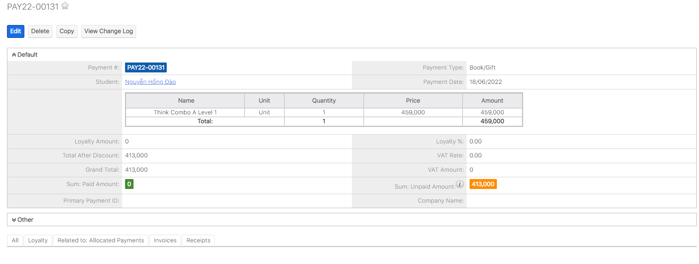

# Phí thu tiền sách - Book/Gift

> **Bước 1:** Ở màn hình danh sách của module **Payment** chọn **Create Payment** để mở ra màn hình thêm mới **Payment**.

.png>)

> **Bước 2:** Tại màn hình tạo mới thanh toán, nhập đầy đủ các thông tin sách, số lượng mà học viên mua nhấn Save để hoàn tất.

.png>)


:woman\_gesturing\_ok: **Ghi chú**:

1. Lựa chọn Học Viên.
2. Lựa chọn loại Payment là: **Book/Gift**
3. Sách, số lượng mà học viên đăng kí mua.
4. Thêm Discount/Sponsor/Loyalty cho học viên (Nếu có).&#x20;

<mark style="color:orange;">**(\*)**</mark> : Nếu sách tặng học viên tích chọn option Free Book/Gift.


> **Bước 3:** Hệ thống hiển thị thông tin chi tiết của Payment Book/Gift được tạo.

> _Video hướng dẫn quản lý thanh toán Sách/Quà tặng_


