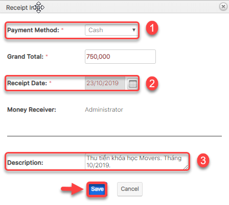
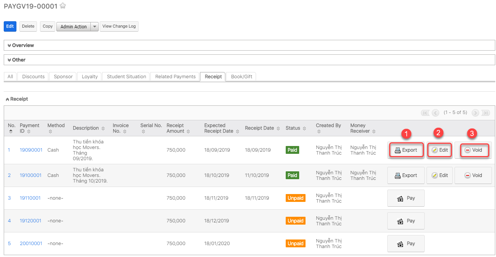

# Thanh toán cho Payment

> **Bước 1:** Ở màn hình danh sách của module Payment, nhấn chọn Payment muốn thực hiện việc thanh toán.

> **Bước 2:** Tại màn hình chi tiết của Payment, chọn tab Subpanel “Receipt”. Sau đó, nhấn “Pay” để tiến hành thanh toán cho Payment.

> **Bước 3:**&#x20;
> Lựa chọn hình thức thanh toán, nhập nội dung thu tiền, sau đó chọn **Save** để hoàn tất.


****:woman\_gesturing\_ok: **Ghi chú**:

1. Lựa chọn hình thức thanh toán
2. Chọn ngày thanh toán (hệ thống set mặc định là ngày hiện tại của hệ thống, người dùng có thể chọn ngày khác).&#x20;
3. Description : Nội dung thu tiền của khóa học theo tháng (User có thể bổ sung thêm nội dung).


> **Bước 4:**&#x20;
> Màn hình thanh toán của Payment được hiển thị.


****:woman\_gesturing\_ok: **Ghi chú:**

1. Xuất phiếu thu
2. Chỉnh sửa phiếu thu
3. Xóa phiếu thu, khi thực hiện thiện việc xóa phiếu thu thì trạng thái của phiếu thu sẽ chuyển về: Cancel

