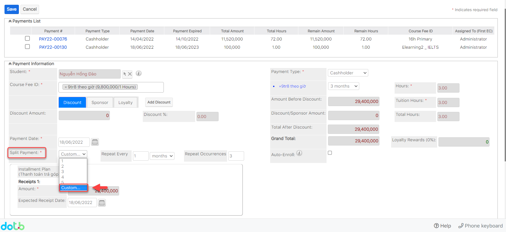
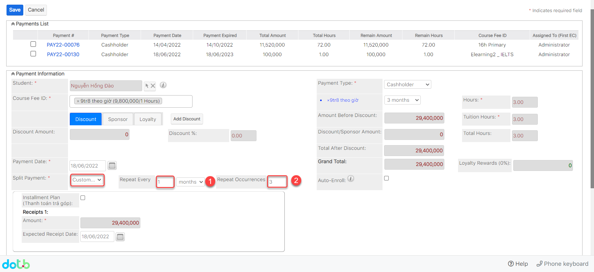
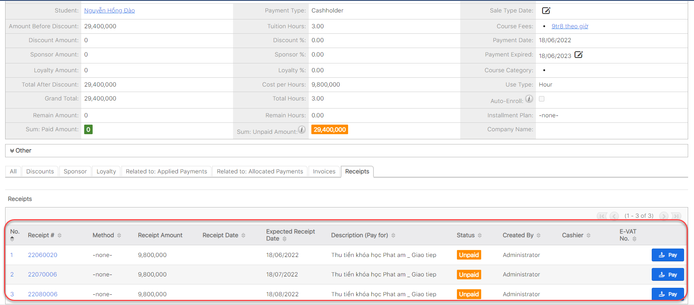

# Thanh toán trả hàng tháng (Slit Payment)

> **Bước 1:** Tạo payment như bình thường và phần **Slit Payment** chọn option **Custom.**

> **Bước 2:** Sau đó nhập số tháng mà khách hàng muốn thanh toán hành tháng, ví dụ muốn thanh toán trong 3 tháng, mỗi tháng thanh toán 1 lần.


**Ghi chú:**

1. Số tháng thanh toán trong 1 lần.
2. Số lần thanh toán trên tổng Payments.


> **Bước 3:** Hệ thống sẽ tự động Generate khoảng tiền sau mỗi tháng cần đóng cho khách hàng với  số lần **Custom** được nhập.

