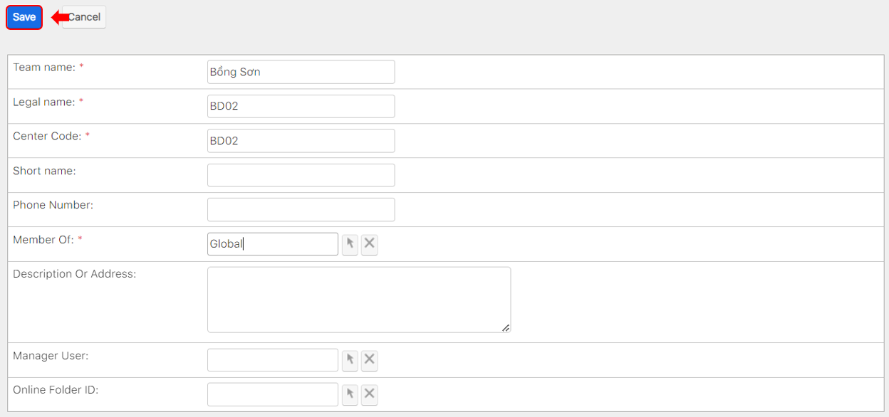

# Xuất hóa đơn điện tử (E-invoice)


****:woman\_gesturing\_ok: Ghi chú:

**Lưu ý:** Chức năng của hóa đơn điện tử chỉ hoạt động khi Đơn vị có sử dụng HT E-invoice và đã được cài đặt lên hệ thống EMS.

**Chi tiết:** Mọi thông tin về cài đặt vui lòng liên hệ bộ phận IT Administrator để được giải đáp.


> **Bước 1:** Ở màn hình danh sách của module **Payment**, chọn **Payment** muốn thực hiện việc xuất hóa đơn điện tử (E-invoice).

<figure><figcaption></figcaption></figure>

> **Bước 2:**&#x20;
> Tại màn hình chi tiết của Payment, chọn tab Subpanel “Receipt”. Nhấn chuột vào ô màu xanh, để xuất hóa đơn điện tử cho Payment đó.

<figure><figcaption></figcaption></figure>


**Ghi chú**: **Get E-invoice** khi có thông báo. Thông báo có thể xuất hóa đơn điện tử (như hình dưới) chỉ xuất hiện khi đã thanh toán toàn bộ Receipt của Payment đó.


.png>)

> **Bước 3:** Kiểm tra, chỉnh sửa thông tin chính xác lần cuối trước khi xuất hóa đơn điện tử, và nhấn **OK**.

<figure><figcaption></figcaption></figure>


****:woman\_gesturing\_ok: **Ghi chú**:

1. Họ tên người mua hàng: Họ tên người mua hàng được hiển thị trên hóa đơn điện tử có thể là tên học viên hoặc tên phụ huynh học viên (nếu có). Ngoài ra, nếu muốn chỉnh sửa các thông tin này có thể click vào Edit.
2. Tên đơn vị: Tên công ty hoặc Add Company (Nếu học viên muốn xuất hóa đơn doanh nghiệp).



:man\_raising\_hand: **Lưu ý:** Xuất hóa đơn điện tử thành công khi nhận được thông báo như sau:


<figure><figcaption></figcaption></figure>


****:woman\_gesturing\_ok: **Ghi chú**:

1. Export PDF E-invoice: Xuất E-invoice thành file PDF, tự động lưu về máy
2. Void E-invoice: Thời hạn Void E-invoice trong tháng.
3. E-VAT No: Sẽ tự động cập nhật tất cả các Receipt trong 1 Payment.


> _Video hướng dẫn Tích hóa đơn điện tử_
