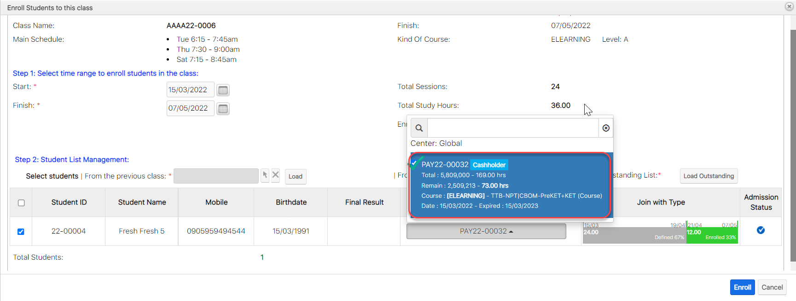

# Thêm học viên vào lớp

:tada:Với payment học viên mua, bạn chỉ cần chọn thời gian học viên bắt đầu học (Nếu học viên vào học trể), sau đó chọn Payment học viên sử dụng để ghi danh trong lớp, hệ thống sẽ tự động tính ngày End học viên trong lớp.&#x20;

:tada:Nếu Payment học viên mua không đủ so với số giờ học của lớp, Khoảng thời gian còn lại, hệ thống sẽ hiện thị học viên Outstanding. Nếu bạn không muốn thông tin hiện thị Outstanding có thể Remove khoảng thời gian đó của học viên ra khỏi lớp bằng tính năng [<mark style="background-color:blue;"><mark style="color:red;">**Delay**<mark style="color:red;"></mark><mark style="background-color:blue;">.</mark>](https://app.gitbook.com/s/-LrHReb9JsrFo3TW8d7S/\~/changes/mKEnCKYJONS9os1Pgid2/tinh-nang-cap-nhat-moi/bao-luu-xoa-hoc-vien)<mark style="background-color:blue;"></mark>


****:postal\_horn:**Lưu ý:**&#x20;

Để Edit lại ngày bắt đầu học của học viên, phải [<mark style="color:red;">**>>Delay<<**</mark>](bao-luu-xoa-hoc-vien.md) học viên ra khỏi lớp, rồi add lại -> Dùng tính năng thêm học viên vào Lớp như hướng dẫn bên dưới :point\_down:.


> **Bước 1:** Đưa chuột vào Module **Classes** , chọn lớp cần thêm học viên vào lớp.

> **Bước 2:** Tại màn hình chi tiết **Classes**, chọn tab Subpanel “**Student Situations**”. Sau đó chọn "**Enroll Students**"

.png>)

> Bước 3: Nhấn vào **Select Student** hoặc chọn học viên từ lớp khác để chọn học viên add vào lớp (có thể chọn 1 hoặc nhiều học viên),chọn ngày bắt đầu, ngày kết thúc để đưa học viên vào lớp (Nếu học viên vào học trể), tiếp theo chọn payment mà học viên đã mua để enroll vào lớp (mặc định hệ thống sẽ tự lấy payment nếu cùng KOC).

.png>)


****:woman\_gesturing\_ok: **Ghi Chú:**

1. Lựa chọn khoảng thời gian thêm học viên vào lớp (Nếu học viên vào học trễ).

:stop\_button: Add thêm học viên hàng loạt, có thể chọn hàng loạt hoặc chọn từng học viên.

2\. Chọn Payment để Enroll học viên (Mặc định hệ thống sẽ tự chọn Payment nếu như KOC của lớp học và KOC của payment cùng chung 1 Chương trình học ).



:point\_right: Nếu như Payment có KOC khác với KOC của lớp học , hệ thống sẽ hiện thị thông báo như bên dưới. Nếu chúng ta vẫn sử dụng gói học này để tiếp tục enroll cho học viên, click "**Đồng Ý**".


.jpg>)


**3. Join with type** :Thông tin học phí của học viên khi thêm vào lớp.

:point\_right: ** **<mark style="color:green;">**Enrolled**</mark>** (Màu xanh)**: Học viên đủ điều kiện add vào lớp (đã đóng đủ hoặc dư học phí).

:point\_right: <mark style="color:orange;">**Outstanding**</mark>** (**Màu Cam**)** : Học viên chưa đủ học phí cho khóa học hoặc add vào lớp cho học nợ.

:point\_right: <mark style="color:blue;">**Demo**</mark> (Màu xanh dương) : Học viên học thử trong lớp

:point\_right:Học viên k đăng kí học trong 1 khoảng thời gian (Màu xám)

**4. Admission Status :**&#x20;

&#x20;:heavy\_multiplication\_x: : Học viên đã có trong lớp, không thể add vào

:heavy\_check\_mark: : Học viên chưa có trong lớp, có thể add vào

5\. Thông tin hiện thị tổng học viên được thêm vào lớp


> **Bước 4:** Sau khi chọn xong học viên củng như Payment enroll học viên vào lớp, click "<mark style="color:green;">Enrol</mark>l" để hoàn tất đưa học viên vào lớp.

.png>)

> **Bước 5:** Màn hình hiển thị thông tin học viên sau khi thêm học viên vào lớp thành công.

.png>)
