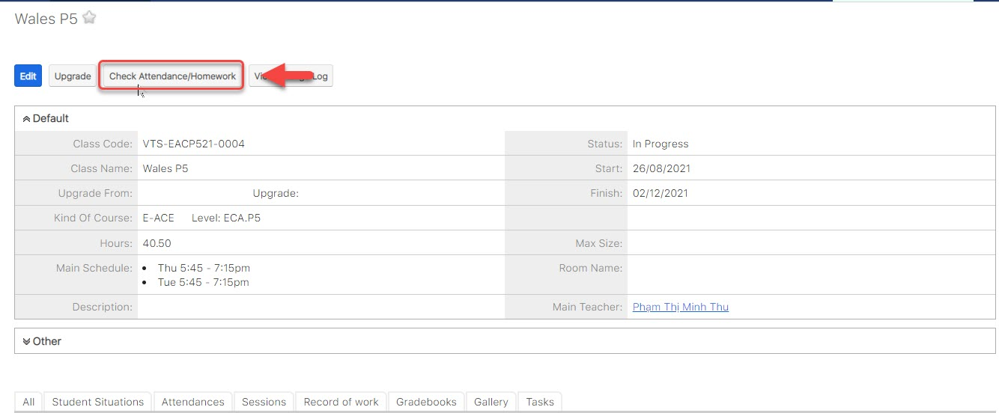
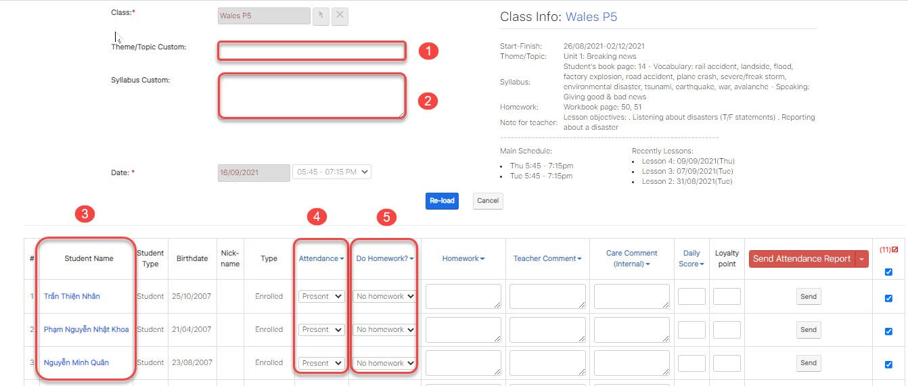

# Điểm danh học viên

> Bước 1: Click chuột vào module Classes sau đó click chọn lớp cần gửi điểm danh.

> Bước 2: Tại màn hình chi tiết của Lớp học, click vào button **Check Attendance/Homework.**

> Bước 3: Tại màn hình Điểm danh, nhập thông tin bài học, điểm danh học viên, nhận xét sau mỗi buổi học.


\*\*\*\*🙆♀ **Ghi chú:**

1: Lớp thực hiện việc Điểm danh

2: Ngày thực hiện Điểm danh

3: Danh sách Học viên

4: Điểm danh cho Học viên

5: Kiểm tra bài tập về nhà của Học viên\(nếu có\)

6: Đánh giá điểm chuyên cần cho Học viên


