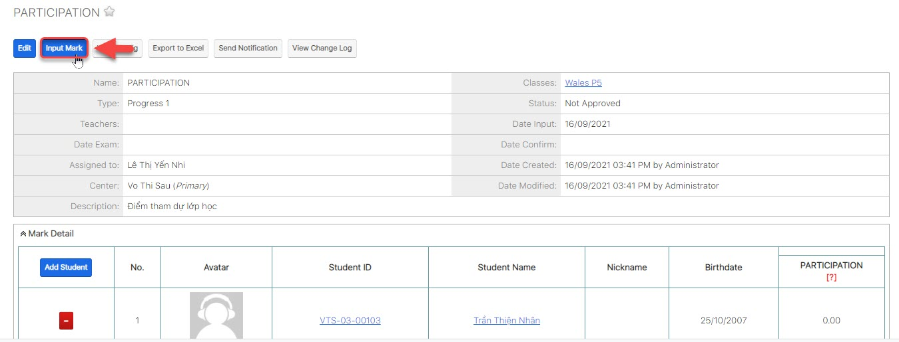
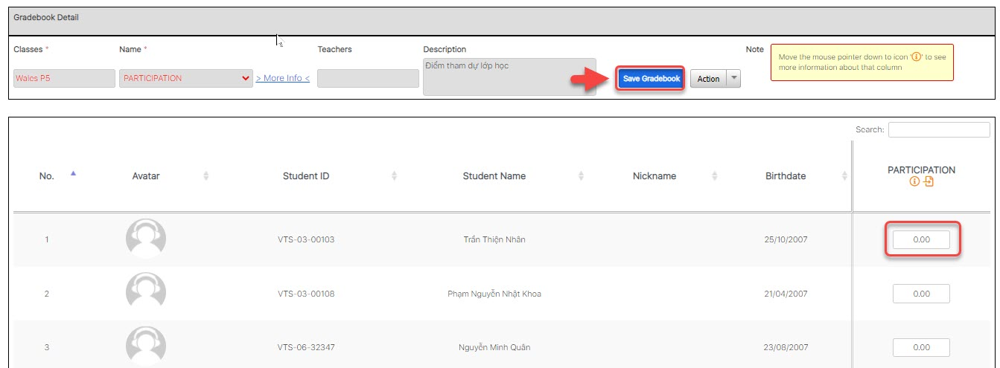

# 🗓 Nhập điểm học tập

> **Bước 1:** Ở màn hình danh sách module **Classes**, sau đó chọn lớp muốn xem bảng điểm/chấm điểm học viên.

.jpg>)

> **Bước 2:** Tại màn hình Lớp học, ở Subpanel phía bên dưới, nhấn vào Tab “**Gradebooks**” sau đó chọn bảng điểm mà bạn cần xem/chấm điểm hoặc thay đổi cấu trúc bảng điểm.

> **Bước 3:** Tại màn hình quản lý bảng điểm, chọn “**Input Mark**”.

> **Bước 4:** Tiếp theo nhập thông tin điểm số, comment học viên. Cuối cùng chọn **Save Gradebook**.


🙆♀ **Ghi chú:**

Nhập điểm học viên (Màu trắng bạn nhập, màu đậm hơn bạn không được nhập)

Lưu ý nếu có Comment: Nhấn vào comment, giáo viên nhập comment cho học viên sau đó nhấn chọn Post để lưu lên hệ thống.​


> _Video hướng dẫn Nhập điểm học tập trên hệ thống_


