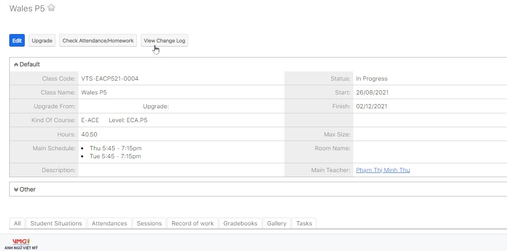

# Thông tin Lớp giảng dạy

> Click chuột vào module Classes, trên màn hình Classes sẽ hiển thị thông tin các lớp được phân công giảng dạy.


**Lưu ý** : Muốn xem thông tin lớp nào thì chỉ cần click chọn tên lớp đó.


> Màn hình hiển thị thông tin của 1 lớp khi click vào xem chi tiết.

