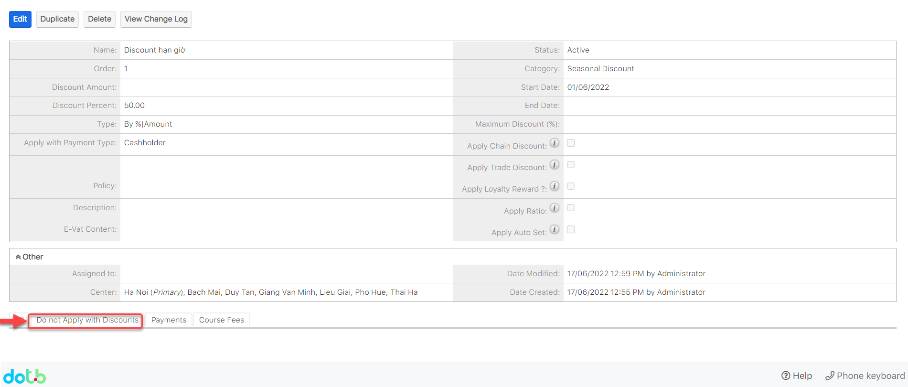
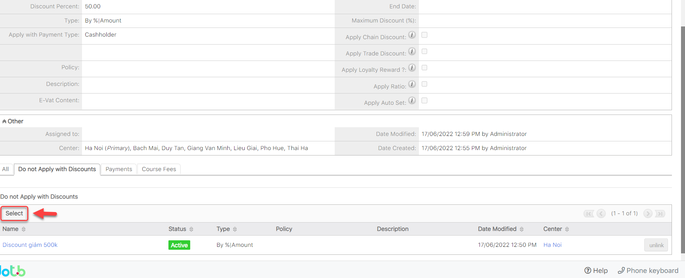

# Áp dụng chiết khấu với Book/Gift

> **Bước 1:** Nhấn chuột vào module **Discount** chọn **Create Discount.**

.png>)

> **Bước 2:** Tại màn hình tạo mới chiết khấu, nhập đầy đủ các thông tin cần thiết. Sau đó click **Save** để hoàn tất.

.png>)


:woman\_gesturing\_ok: **Ghi chú:**

1. Thông tin Discount
2. Số tiền/ Phần Trăm Discount.
3. Discount áp dụng với hình thức Payment Casholder/Book/Gift/All.
4. Ngày bắt đầu,ngày kết thúc discount.

****:man\_raising\_hand: **Lưu ý**: Có thể chỉ nhập số tiền hoặc phần trăm Discount


> **Bước 3:** Hệ thống hiển thị thông tin chi tiết của chiết khấu sau khi tạo thành công.

> **Bước 4:** Sau khi tạo Discount thành công, kéo xuống Subpanel, chọn tab như hình bên dưới, để add Discount không được áp dụng đi kèm với Discount bạn tạo.

> **Bước 5:** Cuối cùng bấm chọn Select để link đến Discount bạn cần không được áp dụng đi kèm với Discount bạn tạo.

