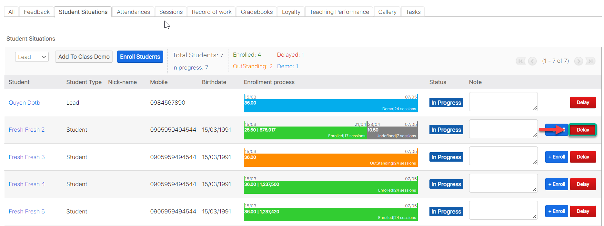
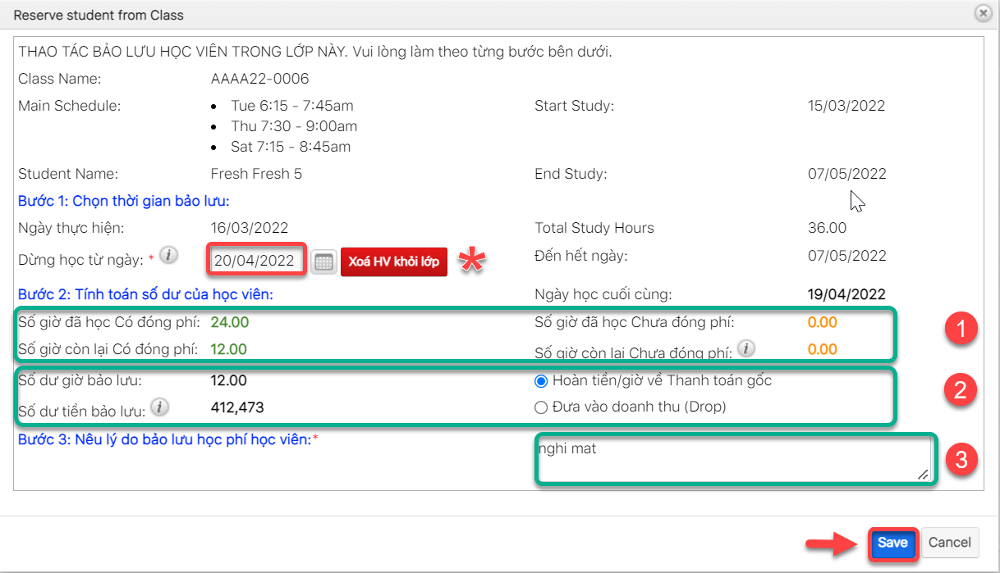

# Bảo Lưu, Xóa học viên

> Bước 1: Đưa chuột vào module Classes , click chọn lớp mà học viên muốn delay.

> Bước 2: Tại màn hình chi tiết Classes, Click vào subpanel chọn tab “Student Situations” sau đó click button Delay.

> Bước 3: Tại màn hình Delay , chọn thời gian mà học viên này bắt đầu **Bảo Lưu (hoặc Xóa học viên)**,:clap: Lưu ý : Ngày dừng học/Ngay xóa học viên >= Ngày bắt đầu học của Lớp, sau đó nhập lí do delay. Cuối cùng click **Save** để hoàn tất.


**Ghi chú:**

**(\*) : Xóa học viên khỏi lớp : Ngày chọn xóa học viên/Ngày dừng học >= Ngày bắt đầu của Lớp.**

1.Thông tin số giờ đã học /Số phi học viên đã học có đóng phí / chưa đóng phí trong Lớp.

2\. Thông tin số giờ học viên bảo lưu/Số tiền còn lại sau bảo lưu.

****:tada:Mặc định số tiền/số giờ học viên bảo lưu sẽ hoàn về thanh toán gốc (Payment học viên sử dụng Enroll trong lớp)

****:tada:Trường hợp lớp học đổi giờ, học phí còn dư sẽ được hiện thị trong phần thông tin Delay, người dùng có thể drop về doanh thu Trung tâm khi check chọn option hoặc, hoặc trả về thanh toán gốc.

