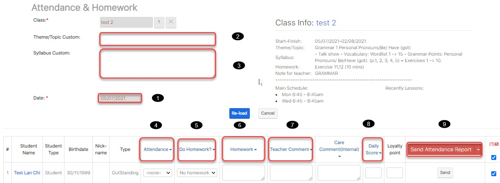

# Gửi kết quả điểm danh, Nội dung Bài Học

> Bước 1: Click chuột vào module Classes sau đó click chọn lớp cần gửi SMS,nội dung bài học, điểm danh đến cho học viên.

> Bước 2: Tại màn hình chi tiết của Lớp học, Click vào button **Attendance & Homework.**

> Bước 3: Tại màn hình Điểm danh, nhập thông tin bài học, điểm danh học viên, nhận xét sau mỗi buổi học, và cuối cùng click chọn **Send Attendance Report** để gửi thông báo đến phụ huynh về buổi học của bé.


\*\*\*\*🙆♀ **Ghi chú**:

1: Ngày thực hiện việc check homework

2: Tên nội dung bài học \(Nhập thông tin khi buổi học khác với chương trình học trong giáo án\)

3: Nội dung bài học

4: Check Attendance cho học viên hàng loạt

5: Check Homework cho học viên hàng loạt.

6: Nhập nội dung bài tập về nhà hàng loạt \(Nếu bài tập về nhà so với giáo án có thay đổi\).

7: Nhập nhận xét giáo viên cho các bé hàng loạt.

8: Đánh giá điểm chuyên cần cho Học viên

9: Gửi thông báo đến App **\(Send Attendance Report**\) về việc đi học,trể,làm bài tập về nhà,comment, điểm daily score của học viên



\*\*\*\*🙋♂ **Lưu ý:** Học viên có màu hồng trong danh sách: Đây là Học viên ko nằm trong buổi của ngày đó Mục đích đưa nó lên để gửi SMS


