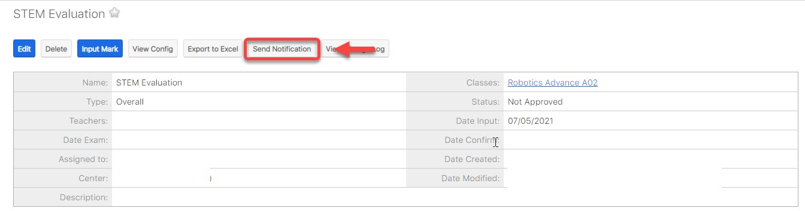

# 📇 Gửi kết quả học tập

> **Bước 1:** Ở màn hình danh sách của module Class chọn View Classes, sau đó chọn lớp muốn xem bảng điểm/chấm điểm học viên.

> **Bước 2:** Tại màn hình Lớp học, nhấn vào Tab “Gradebook” sau đó chọn bảng điểm mà bạn cần xem/chấm điểm hoặc thay đổi cấu trúc bảng điểm.

> **Bước 3:** Tại màn hình quản lý bảng điểm,click “Edit”.

.png>)

> **Bước 4:** Nhấn chọn status "Approved", sau đó chọn Save để gửi kết quả học tập về cho học viên.

.png>)


Lưu ý:

Trường hợp muốn gửi thông báo điểm cho học viên nhiều lần click **Send Notification**.


