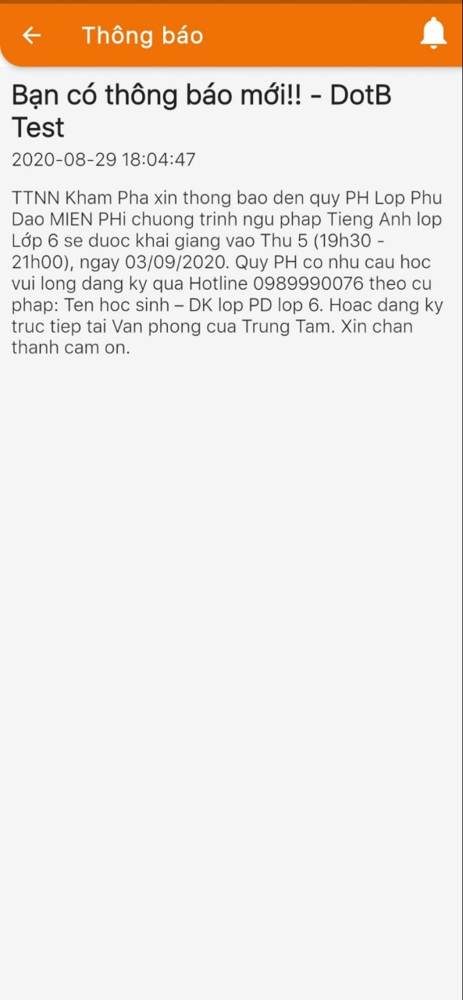

# Gửi thông báo nghỉ học, học bù - Send App Message

> Bước 1: Click chuột vào module Classes sau đó click chọn lớp cần gửi thông báo đến App như lịch học bù lịch khai giảng,..đến cho học viên.

> Bước 2: Tại màn hình chi tiết của Lớp học, Click vào button **Attendance & Homework**

> Bước 3: Tại màn hình điểm danh, click chọn **Send App Mesage** nhập tin nhắn muốn gửi thông báo đến học viên qua app. Sau dó click **Send**


\*\*\*\*🙆♀ **Ghi chú:**

1: Lớp thực hiện việc gửi SMS/Bài tập về nhà,điểm danh

2: Syllabus Custom: nội dung bài giảng của giáo viên \(không phải nội dung dạy theo giáo án\)

3: Nội dung của bài học theo Syllabus như: Lession, Topic, Homework và thông tin các buổi học gần nhất.

4: Ngày của buổi học

5: Daily score: điểm hàng ngày giáo viên chấm cho học viên

6: Loyalty point : Điểm tích lũy của học viên

7: **Send Attendance Report**: gửi thông báo về việc đi học,trể,làm bài tập về nhà,comment, điểm daily score của học viên đến app.

**Send App Messages** : Gửi tin nhắn đến App như lịch khai giảng, học bù, đăng kí học lớp mới...

**Send SMS** : Gửi tin nhắn SMS đến học viên.


> Sau khi gửi thành công , mobile app sẽ nhận được thông báo như hình mẫu bên dưới.

