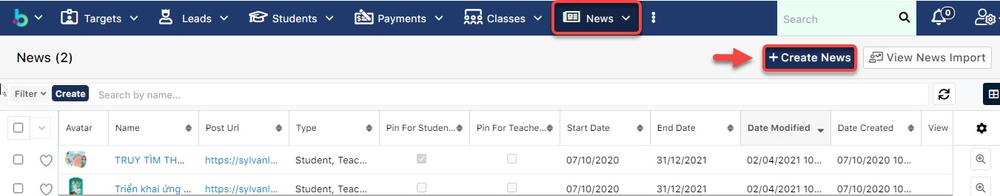
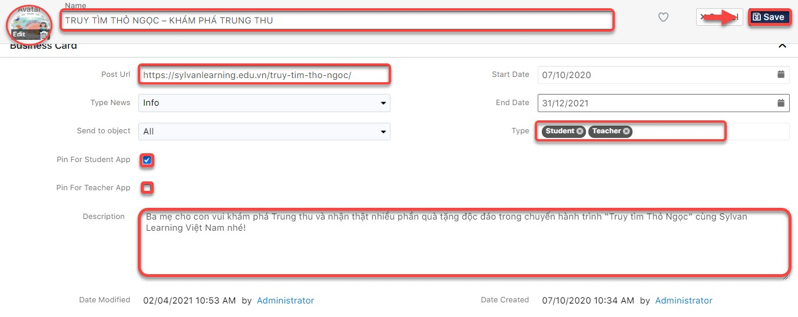

# 📰 Marketing - News

> **Bước 1:** Ở màn hình danh sách của module **News**, chọn **Create News**.&#x20;

> **Bước 2:** Tại màn hình News, nhập thông tin Thông báo sự kiện, hình ảnh và chọn đối tượng được xem News, click **Pin For Student App** để ghim Tin tức trên ứng dụng học viên. Cuối cùng click **Save**.

