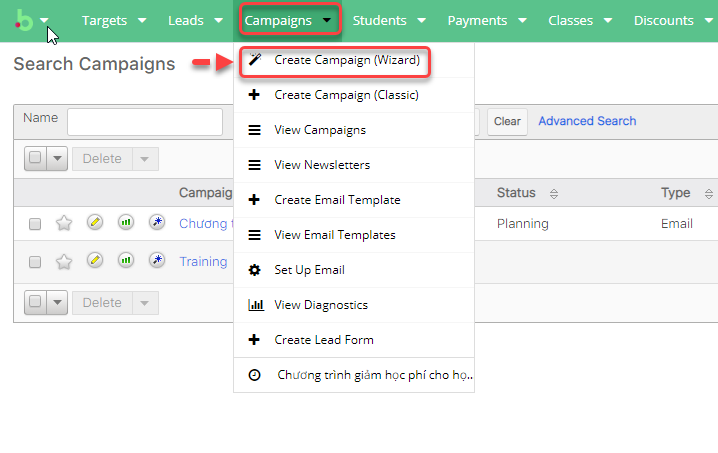
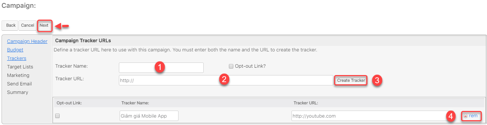
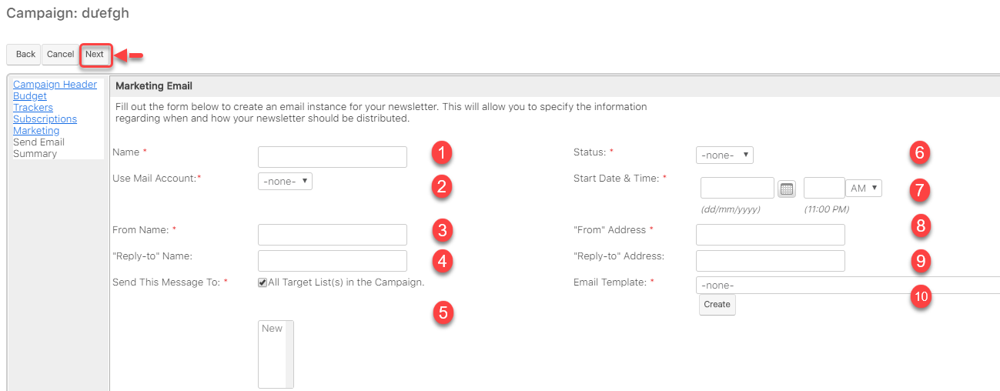

# Nhóm tính năng tiếp thị

## Campaigns Email Marketing

### Tạo Campaigns \(Wizard\)

| Bước 1 | Đưa chuột vào Menu Campaign chọn Create Campaign \(Wizard\). |
| :--- | :--- |

| Bước 2 | Hệ thống hiển thị thông tin danh sách các chiến dịch ,tiến hành các hoạt động chạy chiến dịch như Newsletter, Email,… Ví dụ tạo Campaign loại email: click Email, sau đó click Start. |
| :--- | :--- |



  
**Ghi chú**

1.Newsletter : Gửi email dạng bản tin hàng tháng,tuần,..

2.Email : Gửi Email hàng loạt 

3.Non-email based Campaign : chiến dịch không dựa trên Email. Ví dụ như Quảng cáo,phát tờ rơi,..


| Bước 3 | Nhập đầy đủ các thông tin, sau đó Click Next để tiếp tục. |
| :--- | :--- |

| Bước 4 | Nhập ngân sách để tính ROI. Sau đó Click Next |
| :--- | :--- |

| Bước 5 | Xác định URL theo dõi ở đây để sử dụng với chiến dịch này. Bạn phải nhập cả tên và URL để tạo trình theo dõi, tiếp tục click Create Tracker, sau đó click Next. |
| :--- | :--- |


**Ghi chú**:

1.Tracker Name:Tên chiến dịch theo dõi

2.Tracker URL :Đường dẫn URL theo dõi chiến dịch

3.Create Tracker :Tạo trình  theo dõi 

4.Rem: Xóa trình theo dõi bạn vừa tạo \(bạn có thể tao lại\)


| Bước 6 | Chọn hoặc tạo danh sách mục tiêu \(Target list\) sử dụng với chiến dịch. Email sẽ được gửi đến danh sách này, bấm Create. Sau đó click Save and Continue |
| :--- | :--- |


Ghi chú:

1.Select : Chọn Danh sách mục tiêu tồn tại trong hệ thống 

2.Create: Tạo danh sách mục tiêu mới để gửi Email


| Bước 7 | Cấu hình thời gian gửi Email Marketing, nhập đầy đủ thông tin sau đó click Next. |
| :--- | :--- |

| Bước 8 | Đây là bước cuối cùng. Chọn xem bạn có muốn gửi email dạng kiểm tra hoặc lập lịch gửi email \(Phần 4\) hoặc bạn chọn finish và có thể lên lịch gửi email sau và tiếp tục đến trang tổng quan |
| :--- | :--- |


**Ghi chú**:

1: Finish:hoàn thành thông tin chạy chiến dich 

2: Gửi chiến dịch dạng Test 

3: Lập lịch gửi Email \(**Phần 4**\)


### Tạo Campaigns \(Classic\)

| Bước 1 | Đưa chuột vào Menu Campaign chọn Create Campaign \(Classic\) |
| :--- | :--- |

| Bước 2 | Nhập đầy đủ các thông tin của chiến dịch,sau đó nhấn Save để hoàn tất |
| :--- | :--- |


Ghi chú:

1.Thông tin chiến dịch \(Ngày bắt đầu,kết thúc,trạng thái,…\)

 2. Nhập ngân sách để tính ROI.


| Bước 3 | Sau khi Lưu thành công chiến dịch loại Classic ,tiếp theo tạo Target List,Tracker,Email Makerting \(Tương tự Campaign Wizard\).Cuối cùng lập lịch gửi Email click vào Send Email/Test \(nếu muốn\) |
| :--- | :--- |


Ghi chú:

1:Chỉnh sửa chiến dịch 

2:Gửi chiến dịch để test 

3:Gửi Email 

4:Đánh dấu là đã gửi Email 

5:Tạo danh sách target 

6:Tạo Tracker URL 

7:Tạo mẫu Email Marketing


## Quản lý Danh sách người nhận

### Target

#### Nhập từ file \(Imports Target\)

| Bước 1 | Đưa chuột vào Menu Targets chọn Import Target |
| :--- | :--- |

