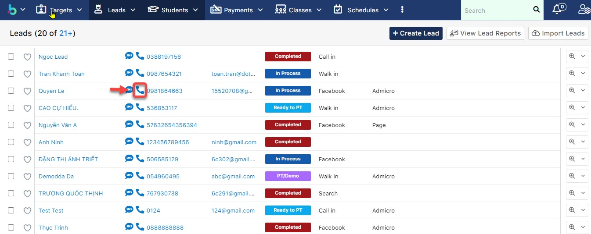

# Chăm sóc Lead qua Call Center (Click to Call)

> _Video Demo Call Center_



> ****:woman\_gesturing\_ok: **Ghi chú :**
>
> :point\_right: Kết quả cuộc gọi nằm trong các option sau sẽ hiện phần Mark Dead Lead :
>
> * Busy/No Answer
> * Invalid Number
> * Out of cover
> * Deny
> * Duplicate
>
> :point\_right: Start Date: Là ngày thực hiện cuộc gọi (Status Completed thì mặc định hệ thống sẽ lấy ngày gọi là ngày tạo, còn status là Schedule thì ng dùng chọn ngày khác để gọi KH nếu KH yêu cầu gọi lại hoặc EC set up gọi lại).
>
> :point\_right: Date Created: Ngày tạo cuộc gọi.

> **Bước 1:** Vào module **Leads/Students** chọn học viên muốn thực hiện cuộc gọi tư vấn, sau đó nhấn vào :telephone\_receiver: .

> **Bước 2:** Màn hình thông tin cuộc gọi hiển thị với trạng thái cuộc gọi. Users nhập các thông tin cuộc gọi và hẹn lịch  gọi lại (Call Back) (nếu có). Cuối cùng nhập nội dung cuộc gọi và nhấn **Save**.


****:woman\_gesturing\_ok: **Ghi chú:**

* **Waiting**: Đang chờ kết nối**.**
* **Ringing**: Đang kết nối
* **Connected**: Đã kết nối được với người dùng đang trong cuộc gọi.
* **Complete**: Kết thúc cuộc gọi.&#x20;


> **Bước 3:** Hệ thống hiện thị thông tin cuộc gọi và nội dung file nghe trao đổi với khách hàng.

<figure><figcaption></figcaption></figure>
