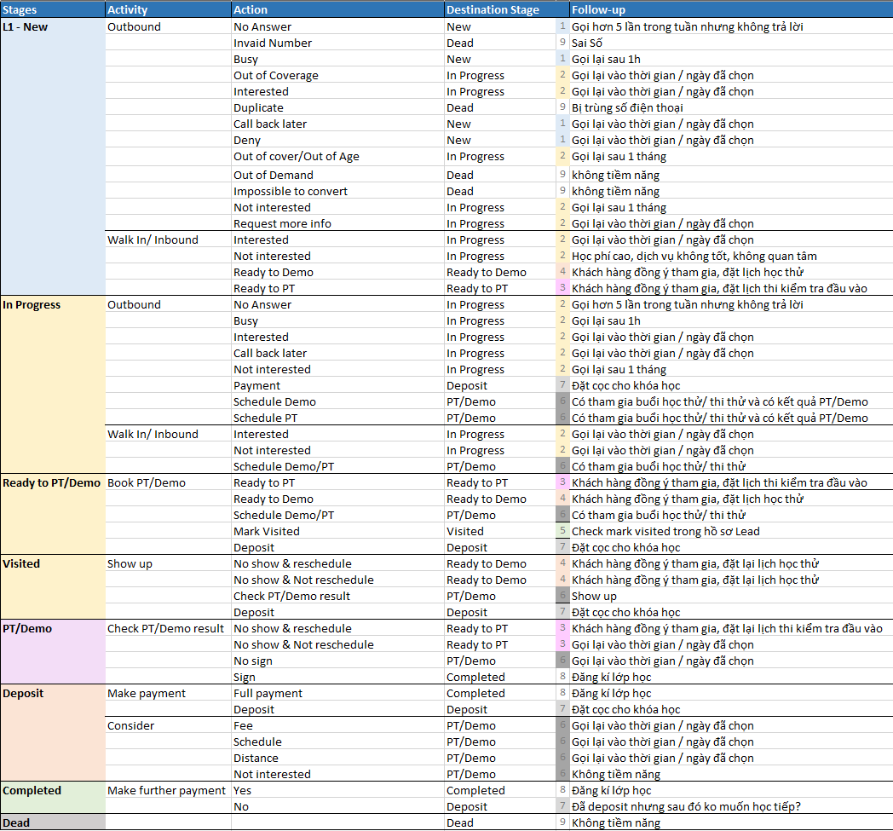

# Chăm sóc Lead qua Call Center

> **Ghi chú :**
>
> Kết quả cuộc gọi nằm trong các option sau sẽ hiện phần Mark Dead Lead :
>
> * Busy/No Answer
> * Invalid Number
> * Out of cover
> * Deny
> * Duplicate
>
> Kết quả cuộc gọi \(Call Result \) sẽ không chuyển từ New -&gt; In Process :
>
> * Deny \(máy bận, khóa máy\)
> * Call Back Later \(không nhấc máy\)
> * Invalid Number\(sai số\).
>
> 👉 Start Date : Là ngày thực hiện cuộc gọi \(Status Completed thì mặc định hệ thống sẽ lấy ngày gọi là ngày tạo, còn status là Schedule thì ng dùng chọn ngày khác để gọi KH nếu KH yêu cầu gọi lại hoặc EC set up gọi lại\) .
>
> 👉 Date Created : Ngày tạo cuộc gọi.

