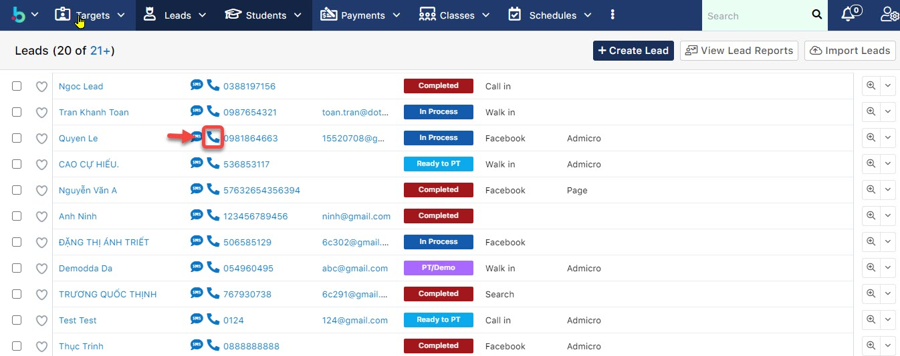
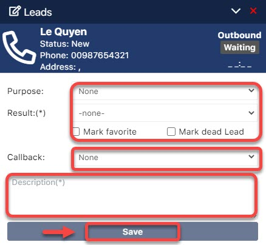
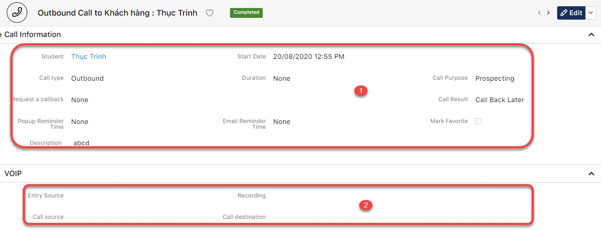

# Click to call

> Bước 1: Vào module Leads/Students chọn học viên muốn thực hiện cuộc gọi tư vấn, sau đó click vào 📞 .

> Bước 2: Màn hình thông tin cuộc gọi hiển thị với trạng thái cuộc gọi. Users input nhanh các thông tin cuộc gọi và hẹn lịch  gọi lại  \(Call Back\) \(nếu có\). Cuối cùng nhập vắn tắt nội dung cuộc gọi và click **Save**.


**Ghi chú:**

Waiting: Đang chờ kết nối**.**

Ringing : Đang kết nối

Connected: Đã kết nối được với người dùng đang trong cuộc gọi.

Complete :Kết thúc cuộc gọi, 


> Bước 3: Hệ thống hiện thị thông tin cuộc gọi và nội dung file nghe trao đổi với khách hàng.

