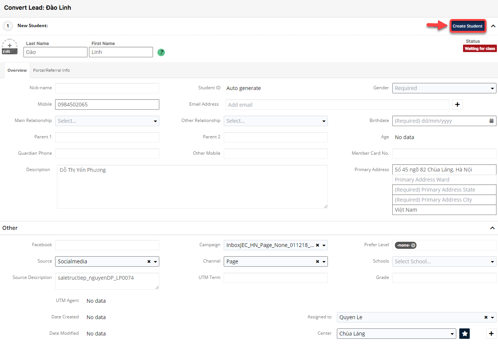
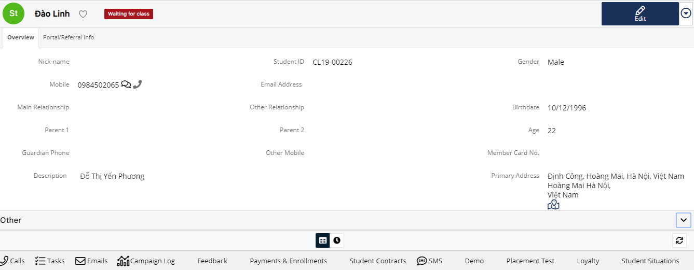

# Chuyển đổi học viên chính thức\(Convert Student\)

> **-Chi tiết  các trạng thái học viên :**
>
> **+ Waiting for class:** Đã được convert lên thành học viên, nhưng chưa có payment nào.
>
> **+Registed :** Đã đăng kí enroll vào lớp, nhưng lớp đó chưa diễn ra.Và khi outstanding thanh toán xong, lớp đag diễn ra quay lại trạng thái In Process.,với lớp Planing thì quay về trạng thái Registed.

> **+ In Progress:** học viên ****đang học trong lớp.
>
> **+ Delay :**  bảo lưu \(hoàn tất học phí mới được bảo lưu\)
>
> **+ Outstanding :** vẫn chưa đóng học phí, nếu đóng hoàn thành trong thời gian đag học sẽ chuyển thành In Progress, nếu sau khi kết thúc vẫn chưa hoàn thành học phí sẽ là Outstanding Và nếu hoàn tất học phí khi lớp học kết thúc sẽ là Finished.
>
> **+ Finished :** Hoàn tất việc học và học phí.

> Bước 1: Click chuột vào module Leads , chọn Lead muốn chuyển đổi thành HV chính thức.

> Bước 2: 
Tại màn hình thông tin chi tiết của Lead, click **Convert to Student** để chuyển đổi HV chính thức.

> Bước 3: Hệ thống chuyển sang màn hình tạo mới Student, nhập thông tin yêu cầu, click “Create Student” hoàn tất chuyển đổi.

> Bước 4: Hệ thống hiển thị thông tin Student mới được tạo. Trạng thái của Student sẽ là Waiting to class. Đồng thời, trạng thái của Leads sẽ được cập nhật là Completed.

