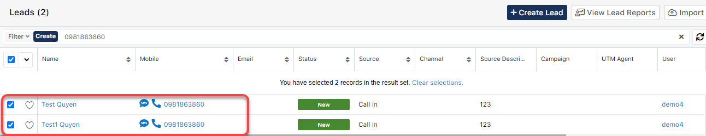

# 🤲 Merge Duplicate

> Bước 1: Chon hồ sơ bị duplicate, ở module bị trùng (tối đa 2 hồ sơ).

> Bước 2: Click vào mũi tên, sau đó chọn **Merge**

.png>)

> Bước 3: Hệ thống sẽ xuất hiện hồ sơ bị duplicate được chọn, sau đó chọn những dữ liệu Primary để qua tab hồ sơ Primary (giữ lại những thông tin chính). Sau đó click **Save**.

.png>)

> Bước 4: Tiếp tục click **Confirm**

.png>)

> Bước 5: Hệ thống báo Merge dữ liệu thành công giữa các hồ sơ bị duplicate được chọn

.png>)
