# Lead

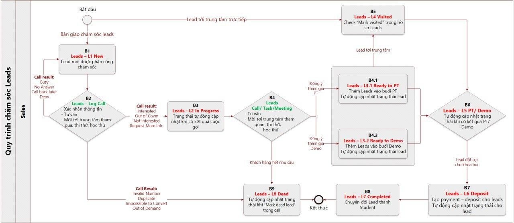

## Tạo Lead

> Bước 1: Đưa chuột vào Menu Leads chọn Create Lead hoặc click vào module Leads để Create Lead.

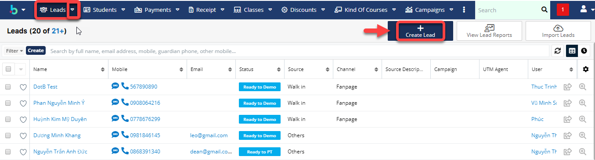

> Bước 2: Tại màn hình tạo mới Lead, nhập đầy đủ các thông tin cần thiết, Sau đó Click Save để Hoàn tất việc tạo ra 1 Lead mới.

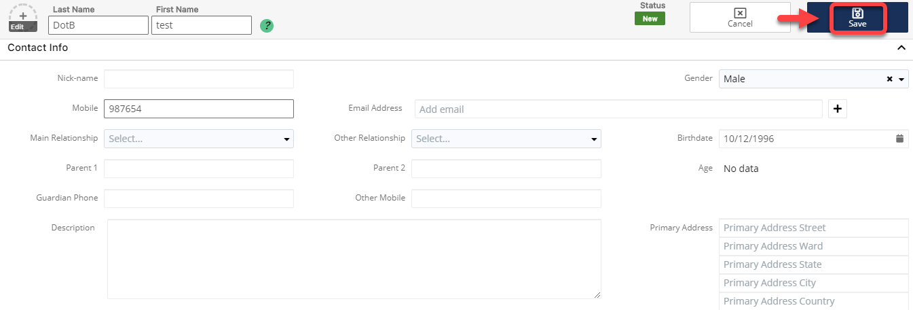

> Bước 3: Hệ thống hiển thị thông tin chi tiết của Lead được tạo. Lúc này trạng thái của Lead là New.

## Import Leads

> Bước 1: Đưa chuột vào Module Leads chọn Import Leads hoặc click vào module Leads để Imports Lead.

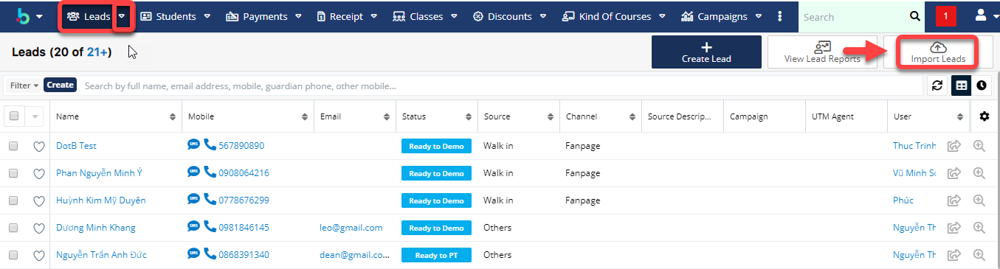

> Bước 2: Click **Next.**

> Bước 3: 
 Tải mẫu File Import \(nếu chưa có\), sau đó đưa file lên hệ thống click vào Choose File.Sau đó click **Next**.

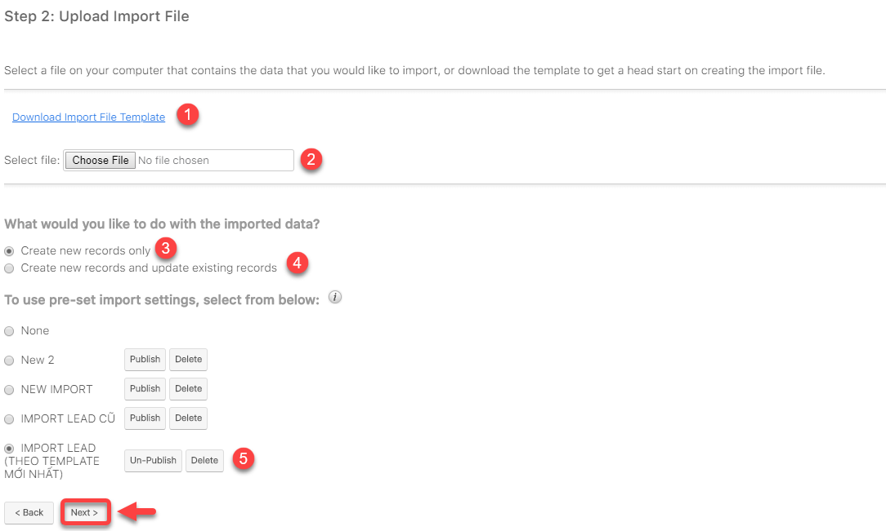


**Chú thích** :

1 : Dowload file Import mẫu \(nếu chưa có\)

2 : Lựa chọn file để Import dữ liệu

3 : Click chọn tạo leads mới từ dữ liệu được import

4 : Click chọn tạo và cập nhật leads.

5 : Chọn template import dữ liệu vào hệ thống \(bắt buộc chọn theo template đã cho\)

Lưu ý : 

* File Template dùng để Import dữ liệu Leads vào hệ thống.
* Các cột có tô màu là những cột bắt buộc phải nhập dữ liệu \( các cột còn lại có thể có hoặc không \) Dữ liệu phải chính xác thì hệ thống mới Import học viên vào đúng\)


> Bước 4: Xác nhận các thuộc tính, Pre-set Import Setting. Click Next

> Bước 5: Xác nhận việc ánh xạ các thuộc tính. Click Next.

> Bước 6: Xác nhận việc kiểm tra trùng. Sau đó Click Tiến hành nhập dữ liệu để bắt đầu Import dữ liệu vào hệ thống.

> Bước 7: Kết quả sau khi Import.


**Ghi chú:** 

1 : Click vào để quay lại bước nhập trước đó.

2 : Click vào để tiến hành Import thêm dữ liệu .

3 : Click vào để hoàn tất việc Import hệ thống sẽ tự động chuyển về màn hình danh sách HVTN


## Chỉnh sửa Lead

> Bước 1: Đưa chuột vào module Leads chọn học viên cần sửa thông tin.

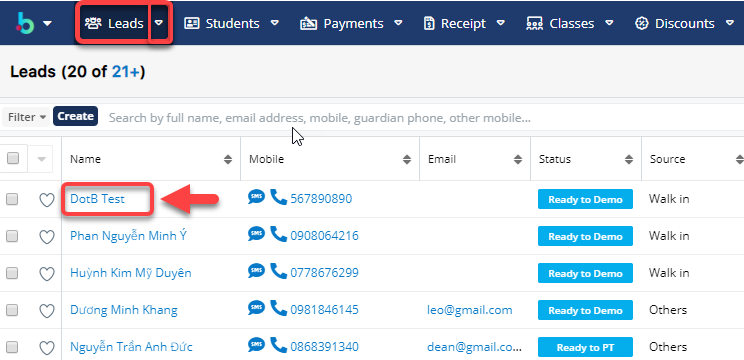

> Bước 2: Tại màn hình View Lead,click Edit và nhập thông tin cần sửa, click Save để hoàn tất việc sửa 1 Leads.

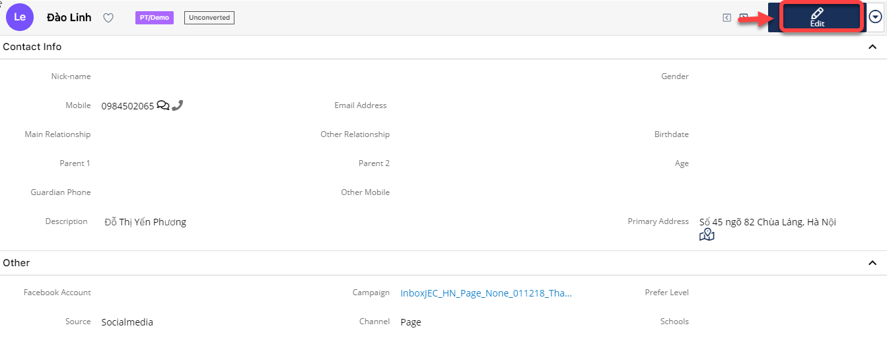

> Bước 3: Hệ thống hiển thị thông tin chi tiết của Leads vừa được chỉnh sửa.

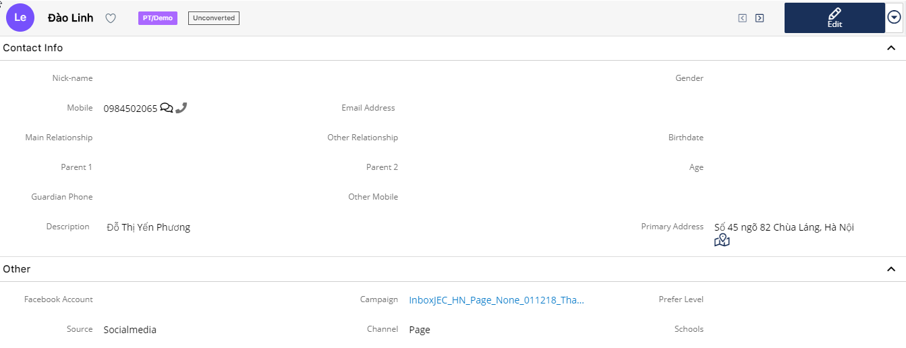

## Cảnh báo trùng dữ liệu

> Khi nhập dữ liệu vào bị trùng thông tin như số điện thoại hoặc Email ,hệ thống sẽ cảnh báo người dùng bị trùng dữ liệu,bạn có thể bỏ qua click cancel hoặc nhập lại thông tin click Go Back.

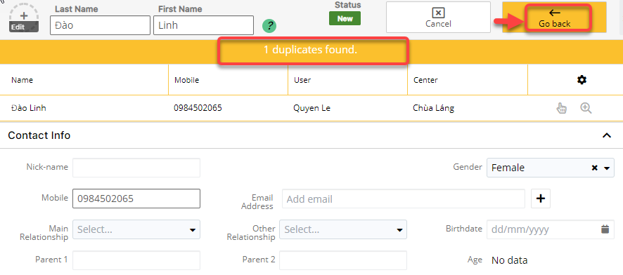

## Chăm sóc Lead \(Tạo Log Call\)

### Cách 1

> Bước 1 : Đưa chuột vào module **Calls**, sau đó click chọn **Create Call**.

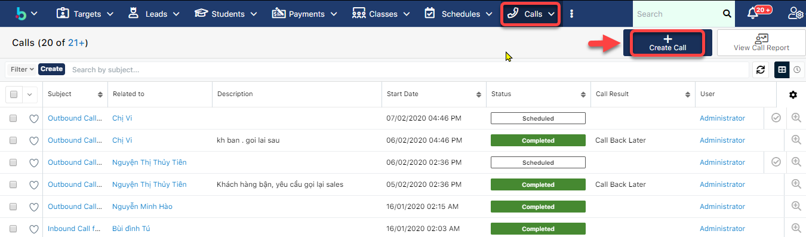

> Bước 2: Tại màn hình tạo Log Call, nhập thông tin , sau đó click **Save** để lưu lại.

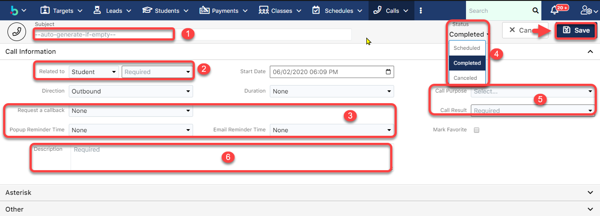


Ghi chú:

1: Nội dung cuộc gọi

2: Đối tượng thực hiện cuộc gọi

3: Đặt lịch nhắc nhở gọi lại \(qua email hoặc Pop-up\).

4: Trạng thái của cuộc gọi 

+ Scheduled : Lên lịch đặt hẹn nhắc nhở cuộc gọi qua Email hoặc dạng Pop-up \(gọi lai hoặc nhắc gọi vào ngày set up\) \(3\)

+Completed : Cuộc gọi đã được thực hiện , record lại nội dung cuộc gọi

+Cancel : Hủy bỏ cuộc gọi

5: Trạng thái, kết quả của cuộc gọi.

6: Description của cuộc gọi \(Users có thể note chi tiết vào phần này\).


> Bước 3: Hệ thống hiển thị thông tin chi tiết của log call vừa được tạo, đồng thời cũng thể hiện trạng thái của Lead lúc này là In Process.

### Cách 2

> Bước 1: Đưa chuột vào module **Students/Leads**, chọn học viên thực hiện cuộc gọi.

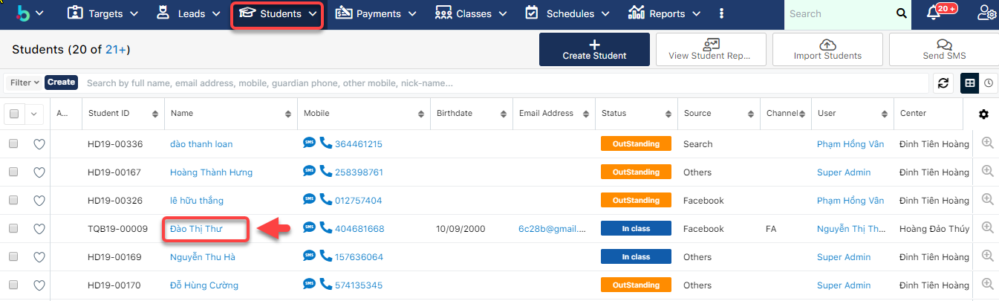

> Bước 2: Tại màn hình hồ sơ học viên, dưới subpanel click vào **Calls** , sau đó click vào dấu \(**+**\).

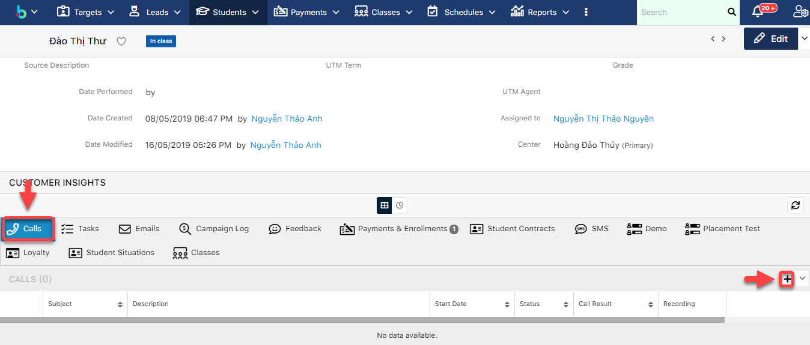

> Bước 3: Tại màn hình tạo Log Call, nhập thông tin , sau đó click **Save** để lưu lại.


**Ghi chú**:

1: Nội dung cuộc gọi

2: Đối tượng thực hiện cuộc gọi

3: Đặt lịch nhắc nhở gọi lại \(qua email hoặc Pop-up\).

4: Trạng thái của cuộc gọi.

+ Scheduled : Lên lịch đặt hẹn nhắc nhở cuộc gọi qua Email hoặc dạng Pop-up \(gọi lai hoặc nhắc gọi vào ngày set up\) \(3\)

+Completed : Cuộc gọi đã được thực hiện , record lại nội dung cuộc gọi

+Cancel : Hủy bỏ cuộc gọi

5: Trạng thái, kết quả của cuộc gọi.

6: Description của cuộc gọi \(Users có thể note chi tiết vào phần này\).


> Bước 3: Hệ thống hiển thị thông tin chi tiết của Log call vừa được tạo, đồng thời cũng thể hiện trạng thái của Lead lúc này là In Process.

## **Phân bổ Leads\(theo trạng thái\) cho người phụ trách**

> Bước 1: Click chuột vào module Leads, click Create để tạo bộ lọc Leads theo trạng thái.

> Bước 2: Tại màn hình, nhập nội dung cần lọc như hình, chọn trạng thái Leads cần phân bổ người phụ trách.

> Bước 3: Hệ thống hiển thị thông tin danh sách Leads có trạng thái cần để phân bổ người phụ trách, chọn tất cả.

Bước 4: Click Mass Updated để phân bổ cho người phụ trách.

Bước 5: Chọn Assigned to để phân bổ người phụ trách, chọn tên người cần phân bổ và nhấn Update.

