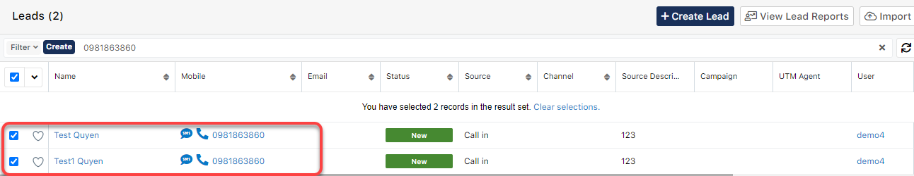

# Leads

.png>)

> ****:point\_right: **Chi tiết các trạng thái Học Viên Tiềm Năng**
>
> **+ New** : Leads mới được assign chưa được chưa chăm sóc&#x20;
>
> **+ In Process** : Đã có tương tác, gọi điện, tư vấn ****&#x20;
>
> **+ Ready to PT** :Lead đồng ý tham gia lịch thi thử, thi đầu vào.&#x20;
>
> **+ Ready to Demo** :Lead đồng ý tham gia học thử, tham quan trung tâm&#x20;
>
> **+ PT/Demo** :Lead có tham gia buổi thi thử, học thử&#x20;
>
> **+ Completed** : Đã chuyển Lead lên thành Student&#x20;
>
> **+ Dead** : Không có tiềm năng

## Tạo Lead

> Bước 1: Đưa chuột vào Menu Leads chọn Create Lead hoặc click vào module Leads để **Create Lead**.

> Bước 2: Tại màn hình tạo mới Lead, nhập đầy đủ các thông tin cần thiết, sau đó click Save để hoàn tất việc tạo ra 1 Lead mới.

> Bước 3: Hệ thống hiển thị thông tin chi tiết của Lead được tạo. Lúc này trạng thái của Lead là New tức Lead này vẫn chưa được chăm sóc và tương tác.

.png>)

## :inbox\_tray: Import Leads

> Bước 1: Đưa chuột vào Module **Leads** chọn **Import Leads**.

> Bước 2: Click **Next.**

.png>)

> Bước 3:&#x20;
> &#x20;Tải mẫu File Import (nếu chưa có), sau đó đưa file lên hệ thống click vào **Choose File**.Sau đó click **Next**.


****:woman\_gesturing\_ok: **Chú thích** :

1 : Dowload file Import mẫu (nếu chưa có)

2 : Lựa chọn file để Import dữ liệu

3 : Click chọn tạo leads mới từ dữ liệu được import

4 : Click chọn tạo và cập nhật leads.

5 : Chọn template import dữ liệu vào hệ thống (bắt buộc chọn theo template đã cho)

****:man\_raising\_hand: **Lưu ý** :&#x20;

* File Template dùng để Import dữ liệu Leads vào hệ thống.
* Các cột có tô màu là những cột bắt buộc phải nhập dữ liệu ( các cột còn lại có thể có hoặc không ) Dữ liệu phải chính xác thì hệ thống mới Import học viên vào đúng)


> Bước 4: Xác nhận các thuộc tính, Pre-set Import Setting. Click **Next.**

.png>)

> Bước 5: Xác nhận việc ánh xạ các thuộc tính. Click **Next**.

.png>)

> Bước 6: Xác nhận việc kiểm tra trùng, và việc check trùng này do người dùng qui định cho hệ thống lúc Import, có thể check trùng họ tên hoặc số điên thoại,... ở cột "Filed to check" . Sau đó click "Import Now" để hệ thống tiến hành Import dữ liệu vào hệ thống.

.png>)

> Bước 7: Kết quả sau khi Import.

.png>)


****:woman\_gesturing\_ok: **Ghi chú**:

1: Import Again: Import lại danh sách khách hàng (Nếu muốn)

2: Exit : Thoát ra màn hình Overview của module Targets

3: Add to Targets List : Thêm danh sách khách hàng vừa được import vào hệ thống vào Tareget List để chạy Campains hoặc gửi email,..


## Chỉnh sửa Lead

> Bước 1: Đưa chuột vào module Leads chọn học viên cần sửa thông tin.

> Bước 2: Tại màn hình View Lead, click Edit và nhập thông tin cần sửa, click **Save** để hoàn tất việc Edit 1 Lead.

> Bước 3: Hệ thống hiển thị thông tin chi tiết của Leads vừa được chỉnh sửa.

## Cảnh báo trùng dữ liệu

> Khi nhập dữ liệu vào bị trùng thông tin về số điện thoại và họ tên ,hệ thống sẽ cảnh báo người dùng bị trùng dữ liệu,bạn có thể bỏ qua click cancel hoặc nhập lại thông tin click **Go Back**.

## Chăm sóc Lead (Tạo Log Call)

### Cách 1: Tạo Log call từ module Calls

> Bước 1 : Đưa chuột vào module **Calls**, sau đó click chọn **Create Call**.

> Bước 2: Tại màn hình tạo Log Call, nhập thông tin , sau đó click **Save** để lưu lại.


****:woman\_gesturing\_ok: **Ghi chú**:

1: Nội dung cuộc gọi (Subject)

2: Đối tượng thực hiện cuộc gọi có thể là **Targets/Leads/Students**.

3: Đặt lịch nhắc nhở gọi (**Request Callback)** va người dùng có thể đặt lịch cho hệ thống thông báo qua Email hoặc **Popup reminder** trước 5 hoặc 10 phút.

4: Trạng thái của cuộc gọi&#x20;

\+ **Scheduled** : Lên lịch đặt hẹn nhắc nhở cuộc gọi qua Email hoặc dạng Pop-up (gọi lai hoặc nhắc gọi vào ngày set up) (3)

\+**Completed** : Cuộc gọi đã được thực hiện (Người dùng đã gọi xong và ghi chú lại nội dung cuộc gọi)

\+**Cancel** : Hủy bỏ cuộc gọi đa được set up remind.

5: Trạng thái, kết quả của cuộc gọi.

6: Description của cuộc gọi (Users có thể note chi tiết vào phần này).


> Bước 3: Hệ thống hiển thị thông tin chi tiết của log call vừa được tạo, đồng thời trạng thái của Leads củng được thay đổi, tuy nhiên kết quả cuộc gọi nằm trong các lựa chọn bên dưới thì trạng thái của Lead sẽ **không chuyển thành In Process**
>
> > * **Deny** (máy bận, khóa máy)
> > * **Call Back Later** (không nhấc máy)
> > * **Invalid Number**(sai số).
> > * **Busy/No Answers** (Máy bận/ Không trả lời)

.png>)

### Cách 2 : Tạo Log Call từ Profile của học viên

> Bước 1: Đưa chuột vào module **Students/Leads**, chọn học viên thực hiện cuộc gọi.

> Bước 2: Tại màn hình hồ sơ học viên, dưới subpanel click vào **Calls** , sau đó click vào dấu (+).

> Bước 3: Tại màn hình tạo Log Call, nhập thông tin , sau đó click **Save** để lưu lại.


****:woman\_gesturing\_ok: **Ghi chú**:

1: Nội dung cuộc gọi (Subject)

2: Đối tượng thực hiện cuộc gọi có thể là **Targets/Leads/Students**.

3: Đặt lịch nhắc nhở gọi (**Request Callback)** va người dùng có thể đặt lịch cho hệ thống thông báo qua Email hoặc **Popup reminder** trước 5 hoặc 10 phút.

4: Trạng thái của cuộc gọi&#x20;

\+ **Scheduled** : Lên lịch đặt hẹn nhắc nhở cuộc gọi qua Email hoặc dạng Pop-up (gọi lai hoặc nhắc gọi vào ngày set up) (3)

\+**Completed** : Cuộc gọi đã được thực hiện (Người dùng đã gọi xong và ghi chú lại nội dung cuộc gọi)

\+**Cancel** : Hủy bỏ cuộc gọi đa được set up remind.

5: Trạng thái, kết quả của cuộc gọi.

6: Description của cuộc gọi (Users có thể note chi tiết vào phần này).


> Bước 3: Hệ thống hiển thị thông tin chi tiết của log call vừa được tạo, đồng thời trạng thái của Leads củng được thay đổi, tuy nhiên kết quả cuộc gọi nằm trong các lựa chọn bên dưới thì trạng thái của Lead sẽ **không chuyển thành In Process**
>
> > **Deny** (máy bận, khóa máy)
> >
> > **Call Back Later** (không nhấc máy)
> >
> > **Invalid Number**(sai số).

.png>)

## **Phân bổ Leads(theo trạng thái) cho người phụ trách**

> Bước 1: Click chuột vào module Leads, click Create để tạo bộ lọc Leads theo trạng thái.

.png>)

> Bước 2: Tại màn hình, nhập nội dung cần lọc như hình, chọn trạng thái Leads cần phân bổ người phụ trách.

.png>)

> Bước 3: Hệ thống hiển thị thông tin danh sách Leads có trạng thái cần để phân bổ người phụ trách, chọn tất cả.

.png>)

Bước 4: Click Mass Updated để phân bổ cho người phụ trách.

.png>)

Bước 5: Chọn Assigned to để phân bổ người phụ trách, chọn tên người cần phân bổ. Nếu muốn assign nhiều record (hơn 20 record) theo điều kiện lọc thì làm theo hướng dẫn đánh số trong hình và sau cùng click **Update**.

## Merge Duplicate

> Bước 1: Chon hồ sơ bị duplicate, ở module bị trùng (tối đa 2 hồ sơ).

> Bước 2: Click vào mũi tên, sau đó chọn **Merge**

.png>)

> Bước 3: Hệ thống sẽ xuất hiện hồ sơ bị duplicate được chọn, sau đó chọn những dữ liệu Primary để qua tab hồ sơ Primary (giữ lại những thông tin chính). Sau đó click **Save**.

.png>)

> Bước 4: Tiếp tục click **Confirm**

.png>)

> Bước 5: Hệ thống báo Merge dữ liệu thành công giữa các hồ sơ bị duplicate được chọn

.png>)

