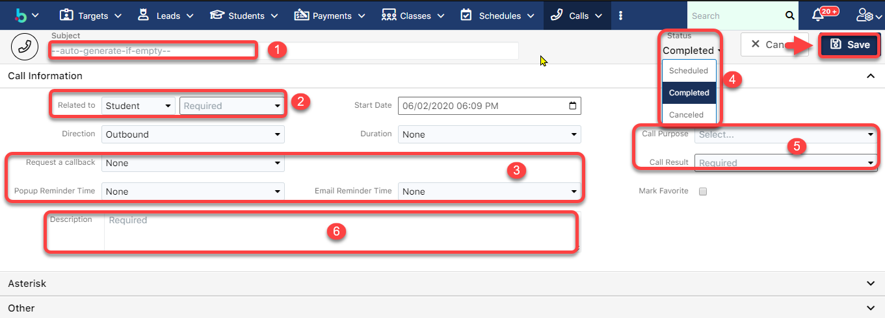

# Tạo Log Call từ Profile của học viên


**Ở qui trình tạo Log Call từ Profile của học viên có 3 bước:**

Bước 1: Mở ra màn hình chi tiết của Leads/Students

Bước 2: Nhập đầy đủ thông tin cần thiết

Bước 3: Xem chi tiết màn hình Lead vừa tạo


> **Bước 1:** Ở màn hình danh sách của module **Students/Leads**, chọn học viên thực hiện cuộc gọi.

<figure><figcaption></figcaption></figure>

> **Bước 2:** Tại màn hình hồ sơ học viên, dưới subpanel nhấn vào **Calls**, sau đó nhấn vào dấu (+).

<figure><figcaption></figcaption></figure>

> **Bước 3:** Tại màn hình tạo Log Call, nhập thông tin, sau đó chọn **Save** để lưu lại.


****:woman\_gesturing\_ok: **Ghi chú**:

1. Nội dung cuộc gọi (Subject)
2. Đối tượng thực hiện cuộc gọi: **Targets/Leads/Students**.
3. Đặt lịch nhắc nhở gọi (**Request Callback)** va người dùng có thể đặt lịch cho hệ thống thông báo qua Email hoặc **Popup reminder** trước 5 hoặc 10 phút.
4. Trạng thái của cuộc gọi&#x20;

\+ **Scheduled** : Lên lịch đặt hẹn nhắc nhở cuộc gọi qua Email hoặc dạng Pop-up (gọi lai hoặc nhắc gọi vào ngày set up) (3)

\+ **Completed** : Cuộc gọi đã được thực hiện (Người dùng đã gọi xong và ghi chú lại nội dung cuộc gọi)

\+ **Cancel** : Hủy bỏ cuộc gọi đa được set up remind.

5\. Trạng thái, kết quả của cuộc gọi.

6\. Description của cuộc gọi (Users có thể note chi tiết vào phần này).


> **Bước 3:** Hệ thống hiển thị thông tin chi tiết của log call vừa được tạo, đồng thời trạng thái của Leads cũng được thay đổi, tuy nhiên kết quả cuộc gọi nằm trong các lựa chọn bên dưới thì trạng thái sẽ **không chuyển thành In Process**
>
> * **Deny** (máy bận, khóa máy)
> * **Call Back Later** (không nhấc máy)
> * **Invalid Number**(sai số).

<figure><figcaption></figcaption></figure>
