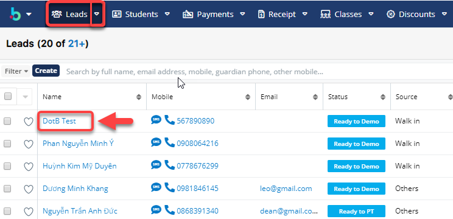
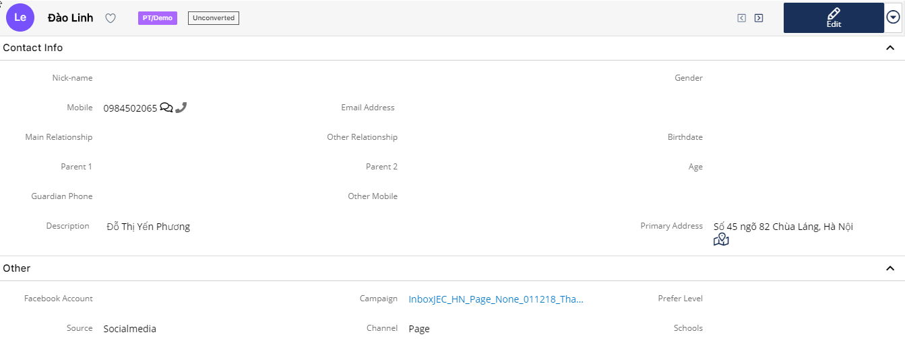

# 📄 Chỉnh sửa Leads

> Bước 1: Đưa chuột vào module **Leads** chọn học viên cần sửa thông tin.

> Bước 2: Tại màn hình thông tin của **Leads**, click **Edit** và nhập thông tin cần chỉnh sửa sau đó click **Save** để hoàn tất việc chỉnh sửa một **Leads**.

> Bước 3: Hệ thống hiển thị thông tin chi tiết của **Leads** vừa được chỉnh sửa.

##
