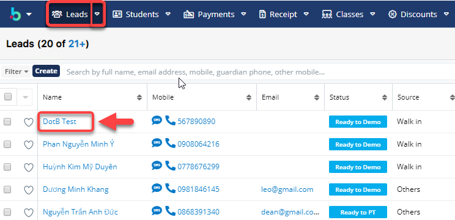
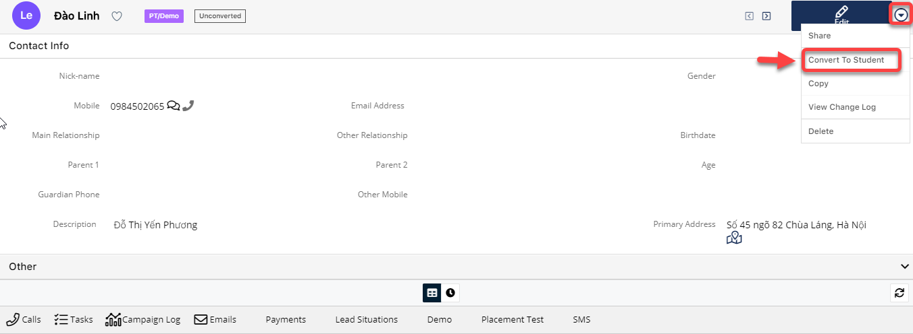
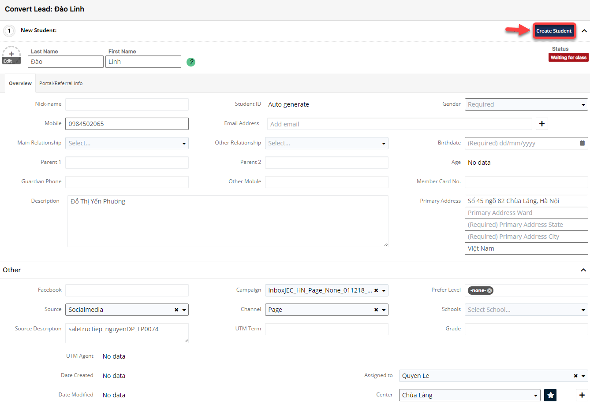

# 📼 Convert từ Lead thành Student

> Bước 1: Click chuột vào module Leads , chọn Lead muốn chuyển đổi thành HV chính thức.

> Bước 2:&#x20;
> Tại màn hình thông tin chi tiết của Lead, click **Convert to Student** để chuyển đổi HV chính thức.

> Bước 3: Hệ thống chuyển sang màn hình tạo mới Student, nhập thông tin yêu cầu, click “Create Student” hoàn tất chuyển đổi.

> Bước 4: Hệ thống hiển thị thông tin Student mới được tạo. Trạng thái của Student sẽ là Waiting to class. Đồng thời, trạng thái của Leads sẽ được cập nhật là Converted.

> _Video hướng dẫn Convert từ Lead thành Student_


