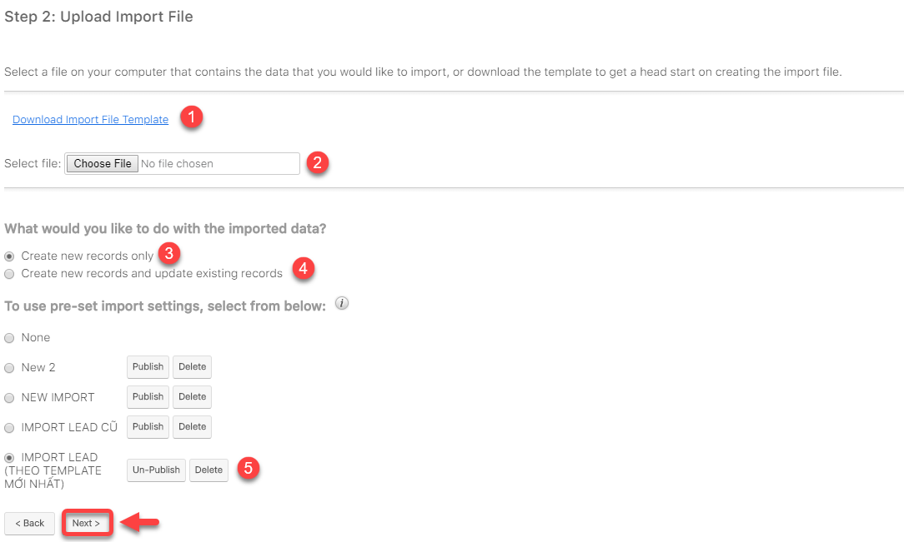

# Import Leads


**Ở qui trình Import Leads có 6 bước:**

Bước 1: Mở ra màn hình Import Leads

Bước 2: Import danh sách khách hàng thô

Bước 3: Tải mẫu import file excel&#x20;

Bước 4: Xác nhận các thuộc tính

Bước 5: Kiểm tra việc ánh xạ dữ liệu

Bước 6: Kiểm tra trùng dữ liệu

Bước 7: Kết quả sau khi import Leads


> **Bước 1:** Ở màn hình danh sách của module **Leads,** ta nhấn vào **** button **Import Leads** để **** cho phép người dùng Import data từ local.

> **Bước 2:** Import danh sách khách hàng thô từ file excel theo hướng dẫn trực tiếp từ hệ thống.

.png>)

> **Bước 3:**
> Tải mẫu File Import (nếu chưa có), sau đó đưa file lên hệ thống nhấn vào **Choose File**. Sau đó nhấn **Next**.


****:woman\_gesturing\_ok: **Chú thích** :

1. Download file Import mẫu (nếu chưa có)
2. Lựa chọn file để Import dữ liệu
3. Click chọn tạo Leads mới từ dữ liệu được Import
4. Click chọn tạo và cập nhật leads.
5. Chọn template Import dữ liệu vào hệ thống (bắt buộc chọn theo template đã cho)

****:man\_raising\_hand: **Lưu ý** :&#x20;

* File Template dùng để Import dữ liệu Leads vào hệ thống.
* Các cột có tô màu là những cột bắt buộc phải nhập dữ liệu (các cột còn lại có thể có hoặc không). Dữ liệu phải chính xác thì hệ thống mới Import học viên vào đúng.


> **Bước 4:** Xác nhận các thuộc tính, Pre-set Import Setting. Tiếp tục **Next.**

.png>)

> **Bước 5:** Xác nhận việc ánh xạ các thuộc tính. Tiếp tục nhấn **Next**.

.png>)

> **Bước 6:** Xác nhận việc kiểm tra trùng và việc kiểm tra trùng này do người dùng qui định cho hệ thống lúc Import, có thể kiểm tra trùng họ tên hoặc số điên thoại,... ở cột "Filed to check". Sau đó nhấn "Import Now" để hệ thống tiến hành Import dữ liệu vào hệ thống.

.png>)

> **Bước 7:** Kết quả sau khi Import.

.png>)


****:woman\_gesturing\_ok: **Ghi chú**:

1. Import Again: Import lại danh sách khách hàng (Nếu muốn)
2. Exit: Thoát ra màn hình Overview của module Targets
3. Add to Targets List: Thêm danh sách khách hàng vừa được import vào hệ thống vào Target List để chạy Campaigns hoặc gửi email,...


> _Video hướng dẫn Import Leads_


