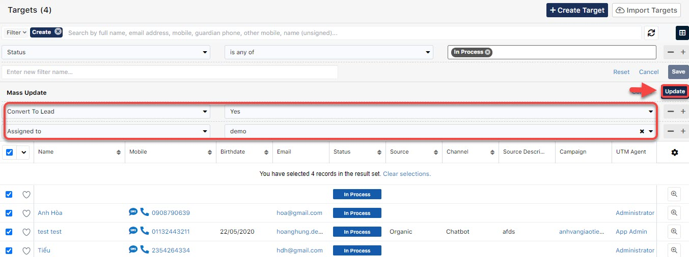
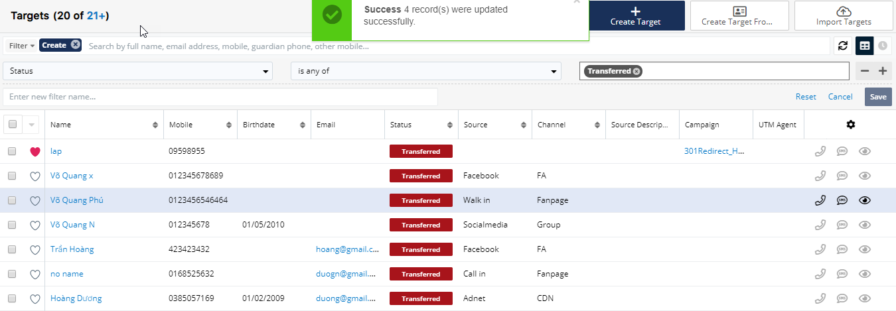

# 💫 Convert Target

> Bước 1: Lọc dữ liệu của Target ở trạng thái **In Process (**Tức dữ liệu này đã được xác thực**).** Tại action menu bên trái click chọn **Mass Update**.

.png>)

> Bước 2:  Tiếp theo chọn **Convert to Lead** là Yes (data sẽ được chuyển sang module Leads và bàn giao lại cho EC), tại filer này có thể chọn thêm người [**Assign to**](https://help.dotb.vn/tuyen-sinh-ban-hang/target#phan-bo-nguoi-phu-trach) , sau đó chúng ta click **Update**.

> Bước 3: Hệ thống sẽ thông báo Update thành công và chuyển dữ liệu về Leads.

##
