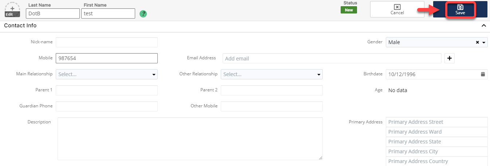

# 🎯 Tạo Lead

> Bước 1: Đưa chuột vào Menu Leads chọn Create Lead hoặc click vào module Leads để **Create Lead**.

> Bước 2: Tại màn hình tạo mới Lead, nhập đầy đủ các thông tin cần thiết, sau đó click Save để hoàn tất việc tạo ra 1 Lead mới.

> Bước 3: Hệ thống hiển thị thông tin chi tiết của Lead được tạo. Lúc này trạng thái của Lead là New tức Lead này vẫn chưa được chăm sóc và tương tác.

 (1).png>)
