# Quản lí thi đầu vào, học thử \(PT/Demo\)

## PT/Demo

### Tạo buổi PT cho học viên

> Bước 1: Click vào module Schedules, sau đó click Create PT.

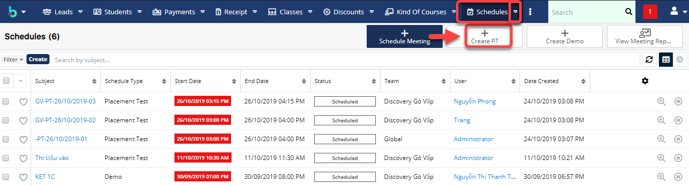

> Bước 2: Tại màn hình tạo mới buổi PT, nhập đầy đủ các thông tin cần thiết, Click Save để hoàn tất.

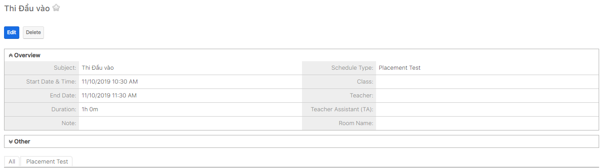

> Bước 3: Hệ thống hiển thị thông tin chi tiết buổi PT được tạo.

### Tạo buổi Demo cho hoc viên

> Bước 1: Click chuột vào module Schedule chọn Create Demo.

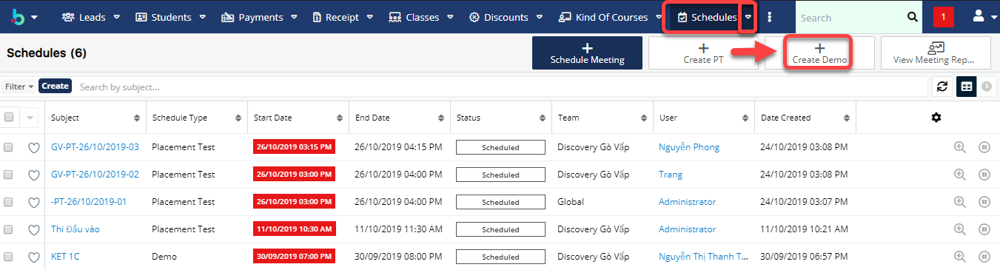

> Bước 2: Tại màn hình tạo mới buổi Demo, nhập đầy đủ các thông tin cần thiết, Click Save để hoàn tất.

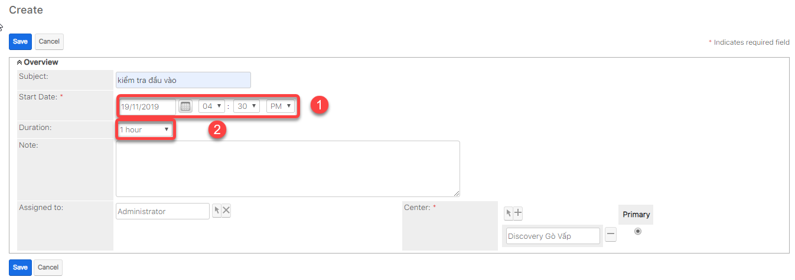

> Bước 3: Hệ thống hiển thị thông tin chi tiết buổi Demo được tạo.

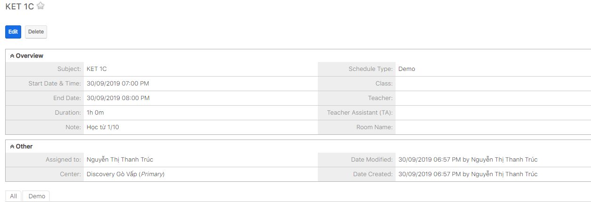

### Thêm hoc viên vào buổi PT

> Bước 1: Click chuột vào module Schedule , click chọn buổi PT cần thêm học viên .

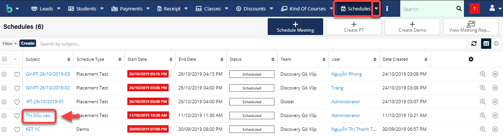

> Bước 2: Tại màn hình chi tiết của buổi PT, Click tab Subpanel “Placement Test”.Sau đó chọn học viên cần Add vào buổi PT.

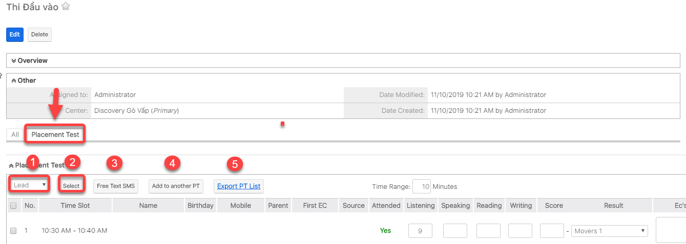


Ghi chú:

1: Lựa chọn loại Học viên: Lead hoặc Student

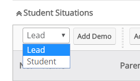 

2: Click Select để chọn Học viên .

3: Gửi SMS cho học viên nhắc nhở thì PT

4: Thêm vào buổi PT khác 5: Xuất danh sách học viên tham gia buổi PT.


> Bước 3: Kết quả sau khi thêm thành công Học viên vào buổi PT.

### Thêm học viên vào buổi Demo

> Bước 1: Click chuột vào module Classes chọn lớp cần đưa học viên vào buổi demo.

> Bước 2: Tại màn hình chi tiết Classes, click tab subpanel “Student Situations” , lựa chọn loại Học viên, Click Add để tiến hành thêm Học viên vào buổi Demo.

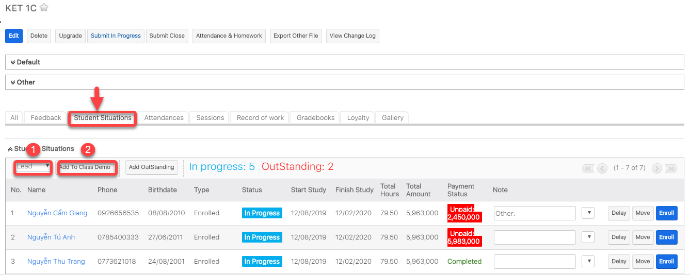


Ghi chú:

1: Lựa chọn loại Học viên: Lead hoặc Student

 

2: click **Add Demo** để chọn học viên

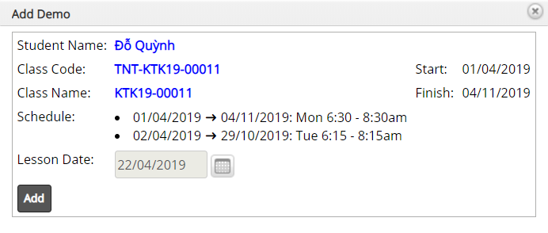 


> Bước 3: Hệ thống hiển thị thông tin học viên sau khi được thêm vào lớp Demo thành công.

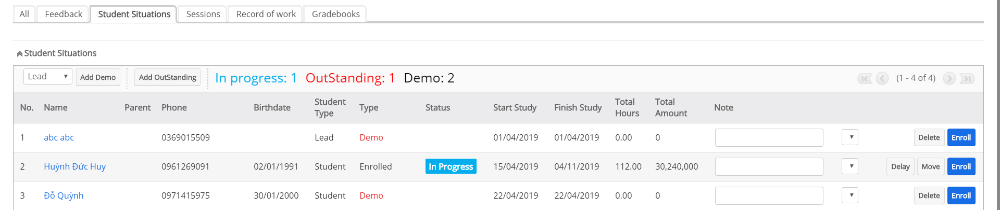

## Thu phí thi thử

> Bươc 1: Đưa chuột vào Menu Payment & Enrollment chọn Create Payment.

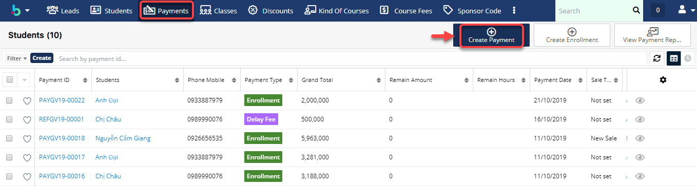

> Bước 2: 
 Tại màn hình tạo mới thanh toán, nhập đầy đủ các thông tin học viên đóng PT. Click **Save** để hoàn tất.

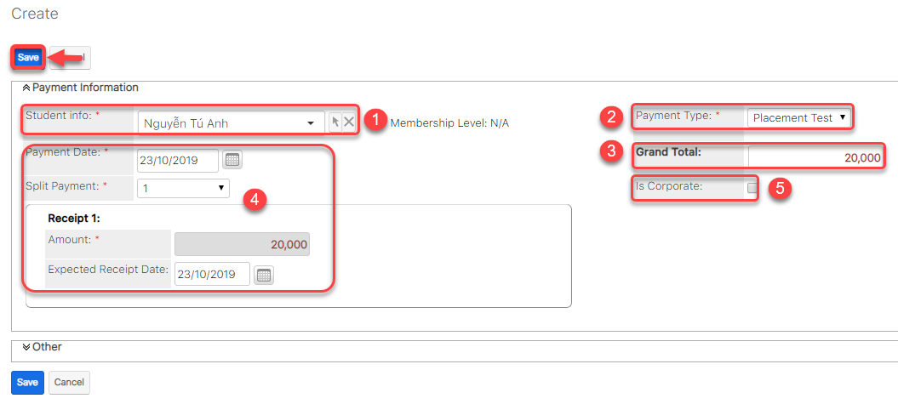

> Bước 3: Hệ thống hiển thị thông tin chi tiết của Payment được tạo.

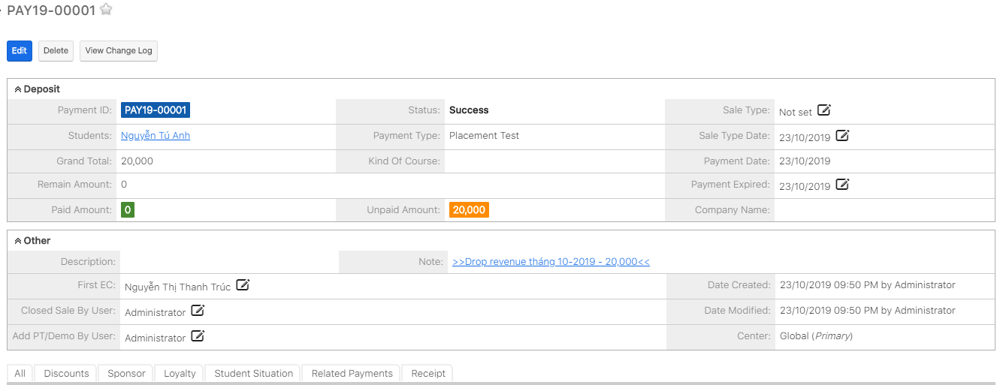

## Quản lí Kết Quả PT của học viên

> Bước 1: Đưa chuột vào menu Schedules ,chọn buổi PT cần chấm điểm cho học viên.

> Bước 2: 
Tại màn hình thông tin buổi PT,click vào tab **Placement Test**,sau đó nhập điểm cho học viên \(nếu học viên có tham gia buổi PT\).

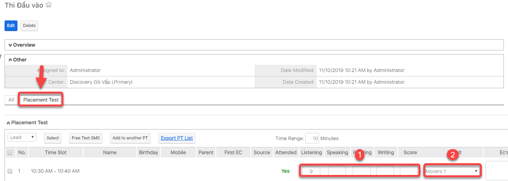

