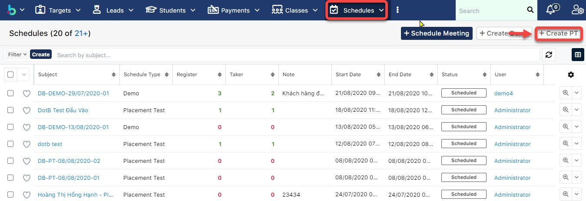
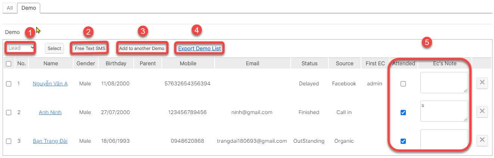

# Quản lí thi đầu vào, học thử (PT/Demo)

## :pencil: Placement Test/Demo

### Tạo buổi PT cho học viên

> Bước 1: Click vào module Schedules, tại màn hình Overview của Schedule người dùng có thể nhìn thấy được tổng qua có bao nhiêu học viên đăng kí PT/Demo , bao nhiêu học viên đã tham gia buổi PT/Đemo đó. Và để tạo buổi Placement Test (PT), click Create PT.

> Bước 2: Tại màn hình tạo mới buổi PT, nhập  các thông tin cần thiết như Subject (1), về thời gian của buổi PT(2), nếu buổi PT này có xếp giáo viên hoặc phòng thì có thể input vào thông tin thêm(3), sau đó click **Save** để hoàn tất.

> Bước 3: Hệ thống hiển thị thông tin chi tiết buổi PT được tạo.

### Tạo buổi Demo cho hoc viên

> Bước 1: Demo là các buổi học thử được mở cho học viên,hệ thống sẽ quản lí học viên có đến trung tâm tham dự buổi học hay không học và cách tạo tương tự như tạo PT, tại màn hình overview Schedule chọn Create Demo.

> Bước 2: Tại màn hình tạo mới buổi Demo, nhập  các thông tin cần thiết như Subject (1), về thời gian của buổi PT(2), nếu buổi PT này có xếp giáo viên hoặc phòng thì có thể input vào thông tin thêm(3), sau đó click **Save** để hoàn tất.

> Bước 3: Hệ thống hiển thị thông tin chi tiết buổi Demo được tạo.

### Thêm hoc viên vào buổi PT

> Bước 1: Click chuột vào module Schedule , click chọn buổi PT cần thêm học viên.&#x20;

.jpg>)

> Bước 2: Tại màn hình chi tiết của buổi PT, Click tab Subpanel “Placement Test”.Sau đó chọn học viên cần Add vào buổi PT.


Ghi chú:

1: Lựa chọn loại Học viên: Lead hoặc Student

&#x20;

2: Click Select để chọn Học viên .

3: Gửi SMS cho học viên nhắc nhở thì PT

4: Thêm vào buổi PT khác (Nếu buổi PT hôm đó học viên Cancel)

5: Xuất danh sách học viên tham gia buổi PT.


> Bước 3: Kết quả sau khi thêm thành công Học viên vào buổi PT. Đồng thời, trạng thái của Leads sẽ được cập nhật là Ready to PT.

.png>)

### Thêm học viên vào buổi Demo

> Bước 1: Click chuột vào module Classes chọn lớp cần đưa học viên vào buổi demo.

.jpg>)

> Bước 2: Tại màn hình chi tiết của buổi PT, Click tab Subpanel “Demo”.Sau đó chọn học viên cần Add vào buổi Demo.


Ghi chú:

1: Lựa chọn loại Học viên: Lead hoặc Student

&#x20;



2: Gửi SMS cho học viên nhắc nhở thì PT

3: Thêm vào buổi Demo khác (Nếu buổi PT hôm đó học viên Cancel)

4: Xuất danh sách học viên tham gia buổi Demo.

5.Kết quả tham gia buổi trail (có hoặc không đến tham gia) và những Note của EC.


Bước 3: Hệ thống hiển thị thông tin học viên sau khi được thêm vào lớp Demo thành công. Đồng thời, trạng thái của Leads sẽ được cập nhật là Ready to Demo.

.jpg>)

## :cd: Thu phí thi thử

> Bươc 1: Đưa chuột vào Menu Payment & Enrollment chọn Create Payment.

> Bước 2:&#x20;
> &#x20;Tại màn hình tạo mới thanh toán, nhập đầy đủ các thông tin học viên đóng PT. Click **Save** để hoàn tất.

> Bước 3: Hệ thống hiển thị thông tin chi tiết của Payment được tạo.

## :clipboard: Quản lí Kết Quả PT của học viên

> Bước 1: Đưa chuột vào menu Schedules ,chọn buổi PT cần chấm điểm cho học viên.

.jpg>)

> Bước 2:&#x20;
> Tại màn hình thông tin buổi PT,click vào tab **Placement Test**,sau đó nhập điểm cho học viên (nếu học viên có tham gia buổi PT). Đồng thời, trạng thái của Leads sẽ được cập nhật là PT/Demo.

