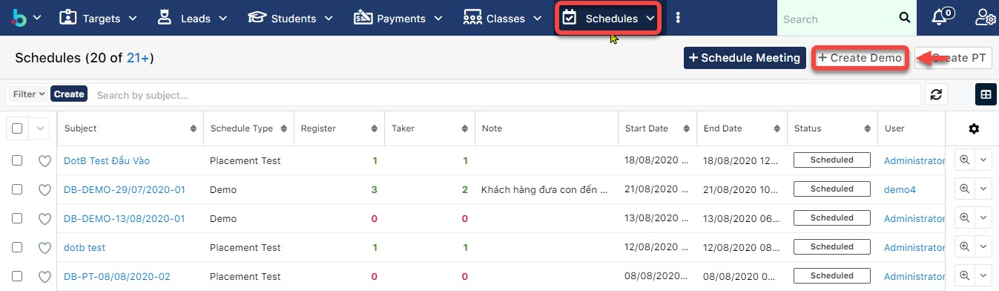
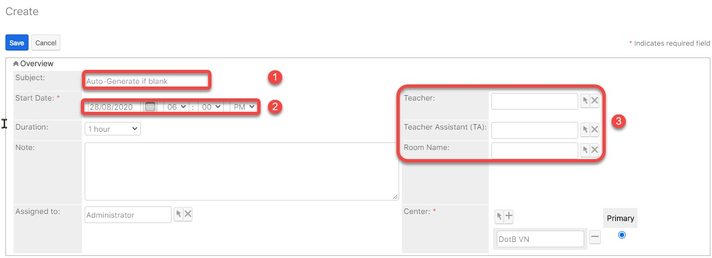
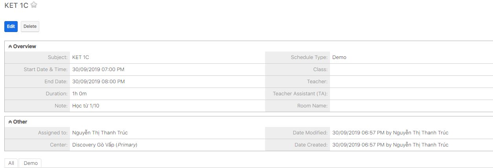

# Tạo buổi Demo cho học viên

> **Bước 1:** Demo là các buổi học thử được mở cho học viên,hệ thống sẽ quản lí học viên có đến trung tâm tham dự buổi học hay không học và cách tạo tương tự như tạo PT, tại màn hình overview Schedule chọn Create Demo.

> **Bước 2:** Tại màn hình tạo mới buổi Demo, nhập  các thông tin cần thiết như Subject (1), về thời gian của buổi PT(2), nếu buổi PT này có xếp giáo viên hoặc phòng thì có thể input vào thông tin thêm(3), sau đó click **Save** để hoàn tất.

> **Bước 3:** Hệ thống hiển thị thông tin chi tiết buổi Demo được tạo.

> _Video hướng dẫn tạo buổi Demo cho học viên_


