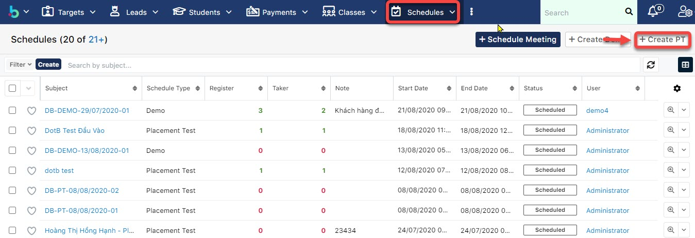
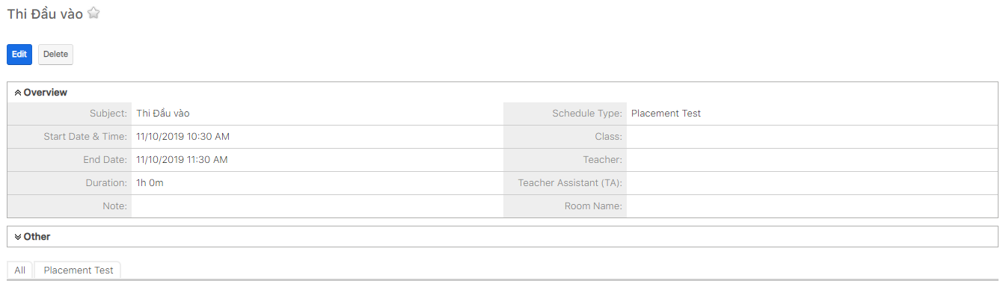

# Tạo buổi PT cho học viên

> **Bước 1:** Nhấn vào phân hệ **Schedules**, tại màn hình Overview của Schedule người dùng có thể nhìn thấy được tổng quan có bao nhiêu học viên đăng kí PT/Demo, bao nhiêu học viên đã tham gia buổi PT/Demo đó. Để tạo buổi Placement Test (PT), nhấn chọn Create PT.

> **Bước 2:** Tại màn hình tạo mới buổi PT, nhập  các thông tin cần thiết như Subject (1), về thời gian của buổi PT(2), nếu buổi PT này có xếp giáo viên hoặc phòng thì có thể nhập vào thông tin thêm(3), sau đó chọn **Save** để hoàn tất.

> **Bước 3:** Hệ thống hiển thị thông tin chi tiết buổi PT vừa được tạo.

> _Video hướng dẫn tạo buổi PT cho học viên_


