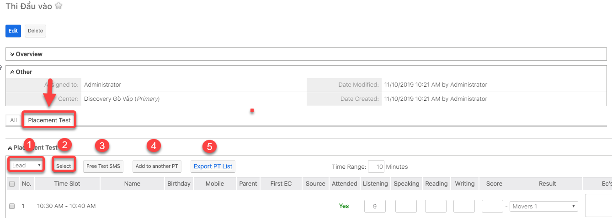

# Thêm học viên vào buổi PT

> **Bước 1:** Trỏ chuột vào module Schedules, chọn buổi PT cần thêm học viên.&#x20;

.jpg>)

> **Bước 2:** Tại màn hình chi tiết của buổi PT, nhấn chọn tab Subpanel “Placement Test”. Sau đó chọn học viên cần Add vào buổi PT.


Ghi chú:

1. Lựa chọn loại Học viên: Lead hoặc Student

&#x20;

2\. Chọn Select để chọn Học viên.

3\. Gửi SMS cho học viên nhắc nhở thì PT.

4\. Thêm vào buổi PT khác (Nếu buổi PT hôm đó học viên Cancel).

5\. Xuất danh sách học viên tham gia buổi PT.


> **Bước 3:** Kết quả sau khi thêm thành công Học viên vào buổi PT. Đồng thời, trạng thái của Leads sẽ được cập nhật là Ready to PT.

.png>)
