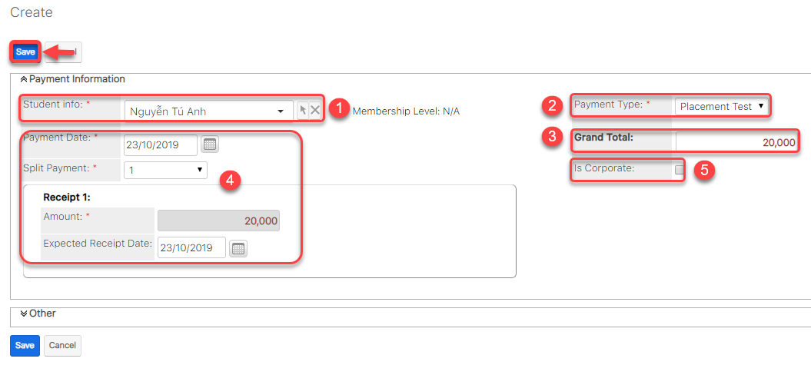
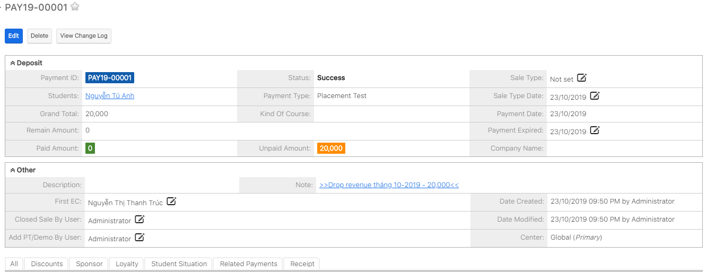

# Thu phí học thử

> **Bước 1:** Đưa chuột vào Menu **Payments** chọn **Create Payment**.

> **Bước 2:**&#x20;
> Tại màn hình tạo mới thanh toán, nhập đầy đủ các thông tin học viên đóng PT. Chọn **Save** để hoàn tất.

> **Bước 3:** Hệ thống hiển thị thông tin chi tiết của Payment được tạo.

